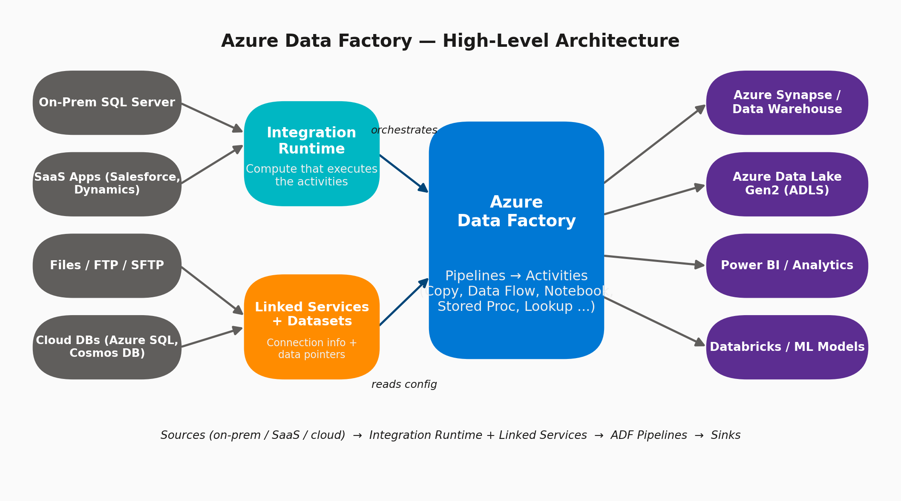
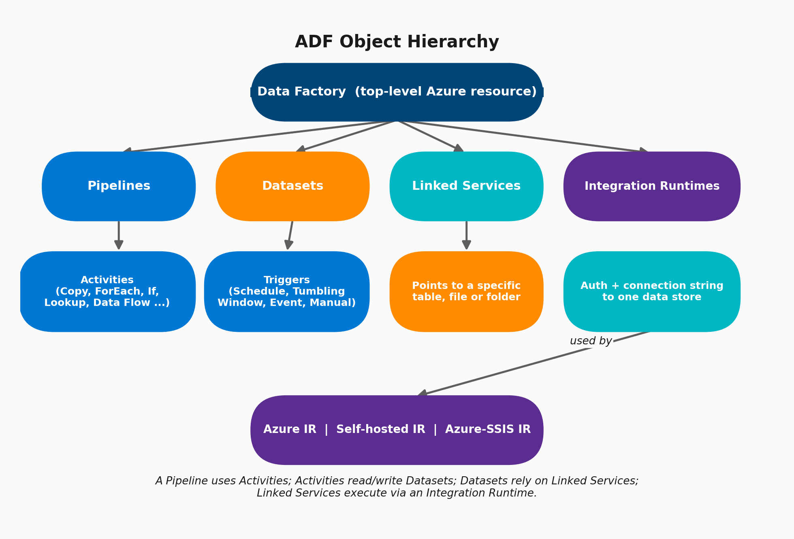

# 01 · What is Azure Data Factory? (Core Architecture)

> **Module:** Fundamentals · **Level:** Beginner · **Reading time:** ~10 min
> **Tags:** `#architecture` `#core-concepts` `#interview-must-know`

---

## 🎯 TL;DR (say this in an interview)

> "Azure Data Factory (ADF) is Microsoft's cloud-native, serverless **data integration / ETL-ELT orchestration service**. It doesn't store or process data itself — it **orchestrates** movement and transformation of data between systems by connecting to sources and sinks via Linked Services, defining data shape via Datasets, and running the actual work (Copy, Data Flow, notebooks, stored procs, etc.) as Activities inside Pipelines, executed on an Integration Runtime."

The one-line mental model interviewers want to hear:

```
ADF = Orchestration + Connectivity layer, NOT a compute/storage engine.
Compute happens elsewhere (Azure IR clusters, Databricks, SQL DB, Synapse, etc.)
```

---

## 1. Why Does ADF Exist?

Before cloud data platforms, enterprises used **SSIS** (SQL Server Integration Services) for on-prem ETL. As data moved to the cloud and became distributed across SaaS apps, files, APIs, and multiple cloud regions, teams needed a **fully managed, serverless orchestrator** that could:

- Connect to 100+ heterogeneous sources (on-prem, SaaS, cloud) without managing servers
- Schedule and monitor pipelines centrally with retries, alerting, and lineage
- Scale elastically without capacity planning
- Support both **code-free (visual)** and **code-first (JSON/ARM/Bicep, SDK)** development

## 2. High-Level Architecture



Data flows left → right:

1. **Sources** — on-prem databases, SaaS apps, files, cloud databases.
2. **Integration Runtime (IR)** — the compute that actually executes activities (see [Topic 05](05-integration-runtime.md)).
3. **Linked Services + Datasets** — connection info and data pointers (see [Topic 02](02-linked-services.md), [Topic 03](03-datasets.md)).
4. **ADF itself** — hosts Pipelines made of Activities that orchestrate the movement/transformation.
5. **Sinks** — Synapse, ADLS, Power BI, Databricks, etc.

## 3. The Object Model (Hierarchy)



| Object | What it is | Analogy |
|---|---|---|
| **Data Factory** | The top-level Azure resource / container for everything below | The "project" |
| **Pipeline** | A logical grouping of activities that together perform a task | A "workflow" |
| **Activity** | A single step/unit of work inside a pipeline (Copy, ForEach, Lookup, Data Flow, Notebook...) | A "task" |
| **Dataset** | A named view/pointer to data sitting inside a data store | A "table/file reference" |
| **Linked Service** | Connection string + auth to a data store or compute | A "connection string object" |
| **Integration Runtime** | The compute infra that executes activities / moves data | The "engine" |
| **Trigger** | What causes a pipeline to run (schedule, event, manual) | The "cron job" |

## 4. Key Configuration Options You Must Know

When you create a Data Factory resource itself, these are the choices that matter:

| Setting | Options | Why it matters |
|---|---|---|
| **Version** | V2 (V1 is retired) | Always V2 today |
| **Region** | Any Azure region | Co-locate with your data stores to minimize latency & egress cost |
| **Git integration** | Azure DevOps Git / GitHub | Enables CI/CD, PR review, version history — **almost always configure this in real projects** |
| **Managed Virtual Network** | Enabled / Disabled | Enables private endpoints for Azure IR to reach PaaS resources securely, without a self-hosted IR |
| **Managed Identity** | System-assigned / User-assigned | Used for keyless auth to Key Vault, ADLS, Synapse, etc. (best practice over connection strings) |
| **Public network access** | Enabled / Disabled | Disable + use Private Endpoint for production/regulated workloads |

## 5. ADF vs Other Tools (Interview Comparison Table)

| Tool | Best for | Relationship to ADF |
|---|---|---|
| **SSIS** | Legacy on-prem ETL | Can be "lifted & shifted" to run inside ADF via Azure-SSIS IR |
| **Azure Synapse Pipelines** | Same engine as ADF, embedded inside Synapse workspace | Near-identical UX; choose based on whether you're already in Synapse |
| **Databricks** | Heavy Spark-based transformation, ML | ADF **orchestrates** Databricks notebooks; Databricks does the heavy compute |
| **Dataflow (GCP)/Apache Beam** | GCP equivalent | Same orchestration idea, different cloud |
| **Airflow / Cloud Composer** | Code-first DAG orchestration | ADF is more low-code/visual; Airflow is more flexible/code-first |

## 6. Common Interview Questions

**Q1. Is ADF an ETL tool or an ELT tool?**
Both — ADF's Copy Activity does simple E-L (extract-load), and Mapping Data Flows do full ETL with Spark under the hood. For heavy transforms, most modern designs favor ELT: land raw data first (Bronze), then transform in-place (Silver/Gold) using Data Flows, Databricks, or Synapse/BigQuery SQL.

**Q2. What actually executes an Activity — ADF or something else?**
The **Integration Runtime**. ADF's control plane just schedules/monitors; the IR (Azure-managed cluster, Self-hosted VM, or Azure-SSIS cluster) does the actual data movement/compute.

**Q3. Can ADF transform data without Databricks?**
Yes — **Mapping Data Flows** run on a Spark cluster ADF spins up and manages behind the scenes (you don't manage the cluster), so no code and no external Databricks needed.

**Q4. How does ADF pricing work at a high level?**
Pay-per-use across: pipeline orchestration (per activity run), data movement (per DIU-hour), Data Flow execution (per vCore-hour of the underlying Spark cluster), and Integration Runtime usage. **No idle/reserved cost** for Azure IR (serverless); Self-hosted IR only costs the VM you run it on.

## 7. Common Pitfalls / Gotchas

- ❌ Thinking ADF stores data — it never does; it only orchestrates movement.
- ❌ Forgetting Git integration until mid-project — retrofitting is painful; set it up on day one.
- ❌ Using Azure IR when the source is on-prem/behind a firewall — you need a **Self-hosted IR** for that (see [Topic 05](05-integration-runtime.md)).
- ❌ Hardcoding connection strings in Linked Services instead of using Key Vault + Managed Identity.

---

⬅ Back to [Fundamentals index](README.md) | Next ➡ [02 · Linked Services](02-linked-services.md)
