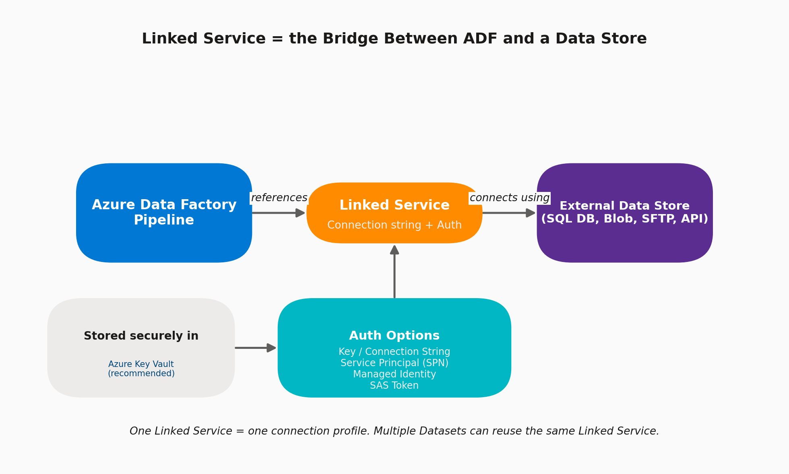

# 02 · Linked Services

> **Module:** Fundamentals · **Level:** Beginner · **Reading time:** ~8 min
> **Tags:** `#connectivity` `#security` `#interview-must-know`

---

## 🎯 TL;DR

> "A Linked Service is essentially a **connection string object with authentication attached**. It tells ADF *how* and *where* to connect to a specific data store or compute service. Datasets and Activities reference a Linked Service; they never embed credentials themselves."

## 1. The Concept

Think of it like a **named, reusable connection profile**:

- One Linked Service = one connection to one system (e.g., `LS_AzureSqlDB_Sales`).
- Multiple Datasets can point to different tables/files but reuse the **same** Linked Service.
- Linked Services are also used for **compute** targets, not just data stores — e.g., a Linked Service to Azure Databricks, HDInsight, or Azure Batch to run activities there.

## 2. What You Configure When Creating a Linked Service

| Field | Description |
|---|---|
| **Name** | Unique identifier, e.g. `LS_ADLS_Bronze` |
| **Type/connector** | 100+ built-in connectors: Azure SQL DB, Blob, ADLS Gen2, Synapse, Snowflake, Salesforce, REST, SAP, Oracle, SFTP, etc. |
| **Integration Runtime** | Which IR executes activities using this Linked Service (Azure IR / Self-hosted IR) |
| **Authentication method** | See table below |
| **Connect via integration runtime** | Required when source is behind a firewall / on-prem |
| **Parameters** | Make the Linked Service dynamic (e.g., parametrize server name across Dev/Test/Prod) |

## 3. Authentication Options (Config You Must Choose)

| Auth Method | When to Use | Notes |
|---|---|---|
| **Account Key / Connection String** | Quick dev/test | Least secure; avoid in production |
| **SQL Authentication** (user/password) | Simple SQL DB access | Store password in Key Vault, not inline |
| **Service Principal (SPN)** | App-to-app auth, CI/CD scenarios | Needs App Registration + client secret/cert |
| **Managed Identity (System/User-assigned)** | **Best practice** for Azure-to-Azure auth | No secrets to manage/rotate; grant RBAC role (e.g., *Storage Blob Data Contributor*) to the ADF's identity |
| **SAS Token** | Time-boxed, scoped access to Storage | Good for external partner access |
| **Azure Key Vault reference** | Wraps any of the above | Store the secret **once** in Key Vault; Linked Service just references it |

> 🔐 **Best-practice config:** Linked Service → Azure Key Vault Linked Service → secret name → actual target Linked Service pulls the secret at runtime. This means **rotating a password requires zero pipeline redeployment.**

## 4. Step-by-Step: Creating a Linked Service to Azure SQL DB (Key Vault + Managed Identity)

1. Create a **Key Vault Linked Service** first (`LS_KeyVault_Prod`), authenticated via ADF's Managed Identity.
2. Grant ADF's Managed Identity the **Key Vault Secrets User** role on the Key Vault (Access Policies or RBAC).
3. Create the **Azure SQL Database Linked Service**:
   - Connection: server name, database name.
   - Authentication type: **Azure Key Vault**.
   - Point to `LS_KeyVault_Prod` and the secret name holding the SQL password (or use **Managed Identity** auth directly against SQL DB, which is even better — no secret at all).
4. Test connection.

## 5. Interview Questions

**Q1. What's the difference between a Linked Service and a Dataset?**
Linked Service = *how to connect* (server, auth). Dataset = *what data* within that connection (which table/file, schema, format). One Linked Service → many Datasets.

**Q2. Can one Linked Service be used by multiple pipelines/datasets?**
Yes — that's the point. Reuse is a first-class design goal to avoid duplicated connection config.

**Q3. How do you avoid storing secrets in ADF at all?**
Use **Managed Identity** wherever the target supports Azure AD auth (ADLS Gen2, Synapse, Azure SQL DB, Key Vault). For third-party/non-Azure systems, store the secret in Key Vault and reference it.

**Q4. What happens if the data store is on-prem?**
The Linked Service must specify a **Self-hosted Integration Runtime** in the "Connect via integration runtime" field, since Azure IR cannot reach private networks.

## 6. Common Pitfalls

- ❌ Creating a new Linked Service per Dataset instead of reusing one per system.
- ❌ Embedding plaintext passwords instead of Key Vault references.
- ❌ Forgetting to grant the Managed Identity the right **RBAC role** on the target resource (a very common "Access Denied" root cause).
- ❌ Not parametrizing the Linked Service, causing 3 nearly-identical Linked Services for Dev/Test/Prod instead of one parametrized one driven by pipeline parameters/global parameters.

---

⬅ [01 · What is ADF](01-what-is-adf.md) | ⬅ Back to [Fundamentals index](README.md) | Next ➡ [03 · Datasets](03-datasets.md)
