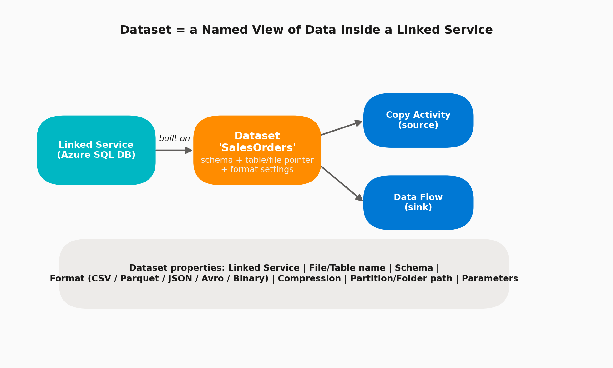

# 03 · Datasets

> **Module:** Fundamentals · **Level:** Beginner · **Reading time:** ~7 min
> **Tags:** `#data-modeling` `#schema` `#interview-must-know`

---

## 🎯 TL;DR

> "A Dataset is a **named view of data** sitting inside a data store that a Linked Service points to — it defines the schema, structure/format, and location (table name, file path, container) that Activities read from or write to."

## 1. The Concept



A Dataset **does not hold data** — it's metadata: a pointer + shape description. In interviews, contrast it clearly with a Linked Service:

| | Linked Service | Dataset |
|---|---|---|
| Answers | "How do I connect?" | "What data, exactly?" |
| Contains | Server, auth, IR | Table/file name, schema, format |
| Reused by | Multiple Datasets | Multiple Activities |

## 2. What You Configure on a Dataset

| Field | Description |
|---|---|
| **Linked Service** | Which connection this dataset belongs to |
| **Location/path** | Table name, container/folder, file name pattern |
| **Format** | Delimited text (CSV/TSV), JSON, Parquet, Avro, ORC, Binary, XML |
| **Schema** | Column names/types — can be imported from the source or left schema-less for schema drift scenarios |
| **Compression** | GZip, Snappy, Deflate, BZip2, ZipDeflate, None |
| **Partition/folder path parameters** | Dynamic paths like `/year={year}/month={month}/day={day}` |
| **Parameters** | Make the dataset generic/reusable (e.g., `TableName` parameter used across 50 tables) |

## 3. Format-Specific Options Worth Knowing

- **Delimited Text (CSV):** column delimiter, row delimiter, quote char, escape char, first-row-as-header, encoding, null value string.
- **Parquet/Avro/ORC:** columnar formats — best for analytics performance; support schema evolution and predicate pushdown; **preferred for Bronze/Silver lake layers**.
- **JSON:** document root, nested arrays handling (flatten via Data Flow "Flatten" transformation).
- **Binary:** used for pure file copy (e.g., images, zipped archives) with no schema interpretation.

## 4. Parametrized (Generic) Datasets — The Real-World Pattern

Instead of creating 50 datasets for 50 tables, real projects create **one generic dataset** with parameters:

```json
{
  "name": "DS_Generic_AzureSql",
  "properties": {
    "linkedServiceName": { "referenceName": "LS_AzureSqlDB", "type": "LinkedServiceReference" },
    "parameters": {
      "SchemaName": { "type": "string" },
      "TableName": { "type": "string" }
    },
    "typeProperties": {
      "schema": { "value": "@dataset().SchemaName", "type": "Expression" },
      "table": { "value": "@dataset().TableName", "type": "Expression" }
    }
  }
}
```

A single **ForEach** activity over a metadata table can then drive this one dataset across all 50 tables — this is the core idea behind **metadata-driven pipelines** (a very common enterprise interview scenario).

## 5. Interview Questions

**Q1. Why would you leave a Dataset "schema-less"?**
To support **schema drift** — when source columns change over time (added/removed) without breaking the pipeline. Useful for landing raw/Bronze data as-is.

**Q2. When would you use Parquet over CSV for a Dataset?**
Parquet is columnar, compressed, and supports predicate pushdown — far faster and cheaper for analytical reads in Synapse/BigQuery/Databricks. CSV is simpler but larger and slower for big data.

**Q3. How do you make one Dataset work for 100 tables?**
Parametrize the Dataset (schema/table name as parameters) and drive values from pipeline parameters or a control/metadata table via ForEach — avoids dataset sprawl.

**Q4. What's the difference between a Dataset used as source vs. sink in a Copy Activity?**
Same Dataset object *can* be used as both; the Copy Activity settings (not the Dataset) define read vs. write behavior (e.g., write behavior: insert/upsert/overwrite for the sink side).

## 6. Common Pitfalls

- ❌ Creating a new Dataset per table (dataset sprawl) instead of parametrizing.
- ❌ Hardcoding folder paths instead of using dynamic partition expressions (`@formatDateTime(utcnow(),'yyyy/MM/dd')`).
- ❌ Importing schema once and never refreshing it — breaks silently when source schema changes.
- ❌ Using CSV for large analytical datasets where Parquet would be dramatically faster/cheaper.

---

⬅ [02 · Linked Services](02-linked-services.md) | ⬅ Back to [Fundamentals index](README.md) | Next ➡ [04 · Pipelines & Activities](04-pipelines-and-activities.md)
