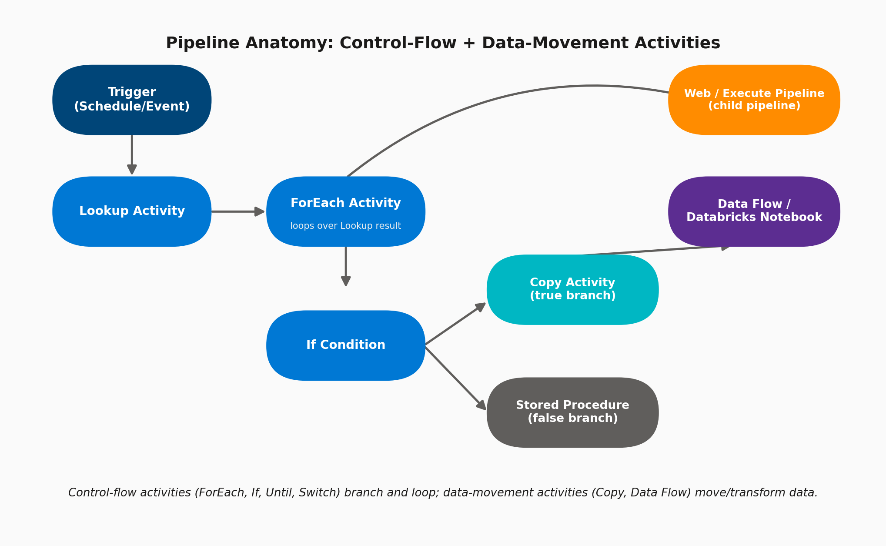

# 04 · Pipelines & Activities Overview

> **Module:** Fundamentals · **Level:** Beginner–Intermediate · **Reading time:** ~10 min
> **Tags:** `#orchestration` `#control-flow` `#interview-must-know`

---

## 🎯 TL;DR

> "A **Pipeline** is a logical grouping of **Activities** that together perform a unit of work. Activities fall into three families: **Data movement** (Copy), **Data transformation** (Data Flow, Databricks Notebook, Stored Procedure), and **Control flow** (ForEach, If, Until, Switch, Lookup, Wait, Execute Pipeline)."

## 1. Pipeline Anatomy

A typical enterprise pipeline pattern:

1. **Trigger** fires the pipeline (schedule/event/manual).
2. **Lookup Activity** reads a control/metadata table (e.g., list of tables to process).
3. **ForEach Activity** iterates over that list.
4. Inside the loop: **If Condition** branches logic (e.g., full load vs incremental load).
5. **Copy Activity** or **Data Flow** does the actual data movement/transform.
6. **Execute Pipeline** activity can call a reusable child pipeline (modular design).

## 2. Activity Categories (Know This Table Cold)

| Category | Activities | Purpose |
|---|---|---|
| **Data movement** | Copy Activity | Move data between 100+ source/sink connector pairs |
| **Data transformation** | Mapping Data Flow, Wrangling Data Flow, Databricks Notebook/Jar/Python, HDInsight, Azure Function, Stored Procedure | Transform data (code-free or code-first) |
| **Control flow** | ForEach, If Condition, Until, Switch, Lookup, Wait, Filter, Set/Append Variable, Execute Pipeline, Web Activity, Get Metadata, Validation | Branch, loop, orchestrate, and pass data between activities |

## 3. Key Configuration Options on a Pipeline

| Setting | Description |
|---|---|
| **Parameters** | Inputs passed at pipeline invocation (e.g., `pDate`, `pEnvironment`) |
| **Variables** | Internal state used during pipeline execution (Set/Append Variable activities) |
| **Concurrency** | Max number of simultaneous runs of this pipeline |
| **Annotations** | Tags for filtering/monitoring pipelines in bulk |
| **Activity-level: Timeout / Retry / Retry interval** | Resilience config per activity — critical for production pipelines |
| **Activity-level: "Secure output/input"** | Masks sensitive values from monitoring logs |
| **Dependency conditions** | Success / Failure / Completion / Skipped — controls the arrows between activities |

## 4. Copy Activity — The Workhorse (Deep Dive)

The Copy Activity alone accounts for the majority of real-world ADF usage. Key settings:

- **Source / Sink** — each references a Dataset.
- **DIU (Data Integration Units)** — controls parallel compute power for the copy (Auto or 2–256); higher DIU = faster but pricier.
- **Parallel copies** — degree of parallelism reading from the source.
- **Fault tolerance** — skip incompatible rows and log them instead of failing the whole copy.
- **Write behavior (sink)** — Insert / Upsert / Overwrite (varies by sink type).
- **Staging** — for Synapse, use PolyBase/COPY command via Blob staging for high-throughput loads.
- **Column mapping** — explicit source→sink column mapping, or schema drift-tolerant mapping.

## 5. Control Flow Deep Dive: ForEach + If (Very Common Interview Scenario)

**Scenario:** "Design a pipeline that ingests 50 tables listed in a control table, applying incremental load only for tables flagged `IsIncremental = true`."

1. **Lookup Activity** → query control table → returns array of table configs.
2. **ForEach Activity** (set `Sequential` or `Batch Count` for parallelism) → iterates the array.
3. Inside ForEach → **If Condition**: `@equals(item().IsIncremental, true)`
   - **True:** Copy Activity with a watermark-based incremental query (`WHERE ModifiedDate > @{pipeline().parameters.LastWatermark}`)
   - **False:** Copy Activity with full truncate-and-load
4. **Stored Procedure Activity** at the end updates the watermark/control table with the new high-water mark.

This is the canonical **metadata-driven / config-driven ETL** pattern that senior interviewers look for.

## 6. Interview Questions

**Q1. What's the difference between ForEach and Until?**
`ForEach` iterates a fixed, known array. `Until` loops based on a condition re-evaluated each iteration (like a while-loop) — used for polling scenarios (e.g., "wait until a file lands").

**Q2. How do you pass data between activities?**
Via **`@activity('ActivityName').output`** expressions, and via pipeline **Variables** (Set/Append Variable activities) for accumulating state across iterations.

**Q3. How do you make a pipeline idempotent?**
Design so re-running produces the same end-state: use **upsert/merge** instead of blind insert, watermark-based incremental filters instead of "since last run time" wall-clock logic, and truncate-and-load patterns for dimension tables.

**Q4. What's the difference between a Copy Activity and a Mapping Data Flow?**
Copy Activity = move data with light transformation (column mapping, type conversion). Mapping Data Flow = full transformation engine (joins, aggregations, pivots, lookups, conditional splits) running on a Spark cluster ADF manages for you.

## 7. Common Pitfalls

- ❌ Nesting ForEach inside ForEach (not supported directly — must call a child pipeline via Execute Pipeline instead).
- ❌ Running ForEach in "Sequential" mode by default and wondering why it's slow — set **Batch Count** for parallel iterations when order doesn't matter.
- ❌ Not setting **Retry/Retry Interval** on activities calling flaky external APIs.
- ❌ Building giant monolithic pipelines instead of modular ones connected via Execute Pipeline (hurts reusability & debugging).

---

⬅ [03 · Datasets](03-datasets.md) | ⬅ Back to [Fundamentals index](README.md) | Next ➡ [05 · Integration Runtime](05-integration-runtime.md)
