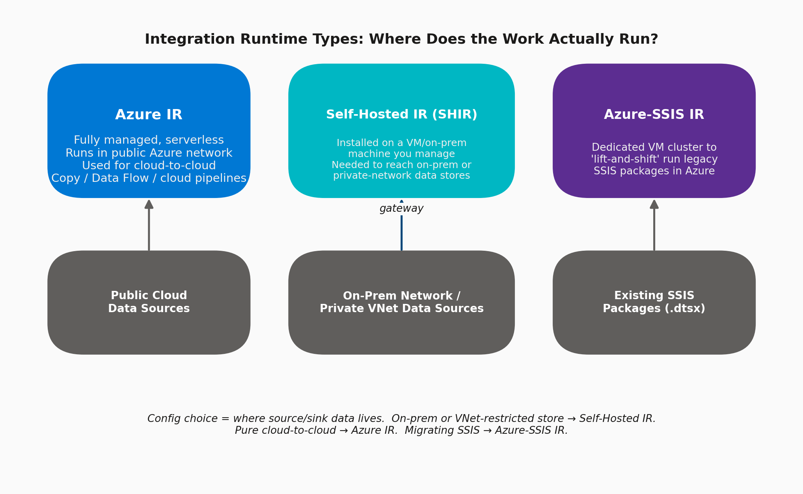

# 05 · Integration Runtime (IR) Types

> **Module:** Fundamentals · **Level:** Beginner–Intermediate · **Reading time:** ~9 min
> **Tags:** `#compute` `#networking` `#interview-must-know`

---

## 🎯 TL;DR

> "The Integration Runtime is the **compute infrastructure** ADF uses to actually execute activities and move data. There are 3 types: **Azure IR** (serverless, public network), **Self-hosted IR** (you install it on a VM to reach on-prem/private networks), and **Azure-SSIS IR** (a managed VM cluster purpose-built to run legacy SSIS packages)."

## 1. The Three Types

| IR Type | Managed By | Runs Where | Used For |
|---|---|---|---|
| **Azure IR** | Microsoft (fully serverless) | Multi-tenant Azure infra, in a chosen region | Cloud-to-cloud Copy, Data Flow execution, pipeline orchestration |
| **Self-hosted IR (SHIR)** | You (install agent on a VM) | Your on-prem network or a VNet | Reaching data stores behind a firewall/private network (on-prem SQL Server, internal file shares) |
| **Azure-SSIS IR** | Microsoft (dedicated VM cluster you size) | Azure, dedicated to you | Lift-and-shift execution of existing SSIS `.dtsx` packages without rewriting them |

## 2. Azure IR — Key Configuration Options

| Setting | Options | Notes |
|---|---|---|
| **Region** | Auto-Resolve or specific region | Auto-Resolve picks the Data Factory's region or the sink's region heuristically; pin explicitly for data residency/compliance requirements |
| **Compute type (Data Flow only)** | General Purpose / Memory Optimized / Compute Optimized | Choose based on transformation type (joins/aggregations need memory-optimized) |
| **Core count** | 8 to 256+ | Data Flow Spark cluster size |
| **Time to live (TTL)** | 0–60 min | Keeps the Data Flow cluster "warm" between runs to avoid cold-start (~5 min) cost on every run |

## 3. Self-Hosted IR — Key Configuration Options

| Setting | Description |
|---|---|
| **Node** | Install the Self-hosted IR agent (Windows service) on a VM that has network access to the on-prem source |
| **High availability** | Register 2–4 nodes for the same logical Self-hosted IR for failover and load-balancing |
| **Authentication key** | Generated in ADF portal, used to register the node during install |
| **Outbound connectivity** | Node needs outbound HTTPS (443) to Azure — no inbound ports need to be opened |
| **Proxy settings** | Configurable if the on-prem network requires an HTTP proxy |
| **Sizing** | CPU/RAM sized to expected concurrent copy volume — Microsoft recommends 8-core/16GB+ machines for production loads |

### Step-by-Step: Setting up a Self-hosted IR

1. In ADF Studio → **Manage → Integration Runtimes → New → Self-hosted**.
2. Name it (e.g., `SHIR-OnPrem-Prod`), copy the generated **Auth Key**.
3. On the on-prem/VNet VM, download and install the **"Microsoft Integration Runtime"** installer.
4. Paste the Auth Key during setup to register the node.
5. (Recommended) Install a **second node** on another VM and register it with the same key for HA.
6. Back in ADF, create a Linked Service to the on-prem source and set **"Connect via integration runtime"** to this Self-hosted IR.

## 4. Azure-SSIS IR — Key Configuration Options

| Setting | Options |
|---|---|
| **Node size** | Standard_A4_v2 up to Standard_D-series, scaled by workload |
| **Node count** | 1–10 nodes (parallel package execution) |
| **Edition** | Standard / Enterprise (Enterprise unlocks CDC components, Analysis Services tasks, etc.) |
| **SSISDB location** | Azure SQL DB or Managed Instance — stores the SSIS catalog |
| **VNet integration** | Required if SSIS packages need to reach on-prem/VNet resources |
| **Custom setup** | PowerShell script + 3rd-party component installs (e.g., custom connectors) run at IR startup |

## 5. Interview Questions

**Q1. Your source is an on-prem SQL Server behind a corporate firewall. What IR do you use?**
**Self-hosted IR** — install the agent on a machine inside that network (or with a VPN/ExpressRoute path to it); Azure IR cannot reach private networks.

**Q2. Does the Self-hosted IR need inbound firewall rules opened?**
No — it only needs **outbound** HTTPS to Azure. This is a key security selling point often asked in interviews.

**Q3. How do you achieve high availability for Self-hosted IR?**
Register multiple nodes (2–4) against the same logical Self-hosted IR — ADF automatically load-balances and fails over between them.

**Q4. Can Azure IR reach a data store inside a customer's private VNet without a Self-hosted IR?**
Yes, via **Managed Virtual Network + Private Endpoints** on the Data Factory itself — this avoids the operational overhead of managing a Self-hosted IR VM, but only works for Azure PaaS resources, not on-prem.

**Q5. Why would you keep a Data Flow's Azure IR "warm" (TTL > 0)?**
Data Flow clusters have a ~5 minute cold-start. For pipelines that run frequently (e.g., every 15 min), setting TTL avoids paying that cold-start cost on every run, at the expense of keeping the cluster billed during idle time.

## 6. Common Pitfalls

- ❌ Trying to connect Azure IR directly to an on-prem source — always fails; needs Self-hosted IR.
- ❌ Running a single Self-hosted IR node in production with no HA — single point of failure.
- ❌ Under-sizing the Self-hosted IR VM, causing throughput bottlenecks that look like "ADF is slow" but are actually VM CPU/network-bound.
- ❌ Forgetting Managed VNet + Private Endpoints as an alternative to Self-hosted IR when the target is an Azure PaaS resource — simpler and lower-maintenance.

---

⬅ [04 · Pipelines & Activities](04-pipelines-and-activities.md) | ⬅ Back to [Fundamentals index](README.md) | Next ➡ *(Module 02 coming soon)*
