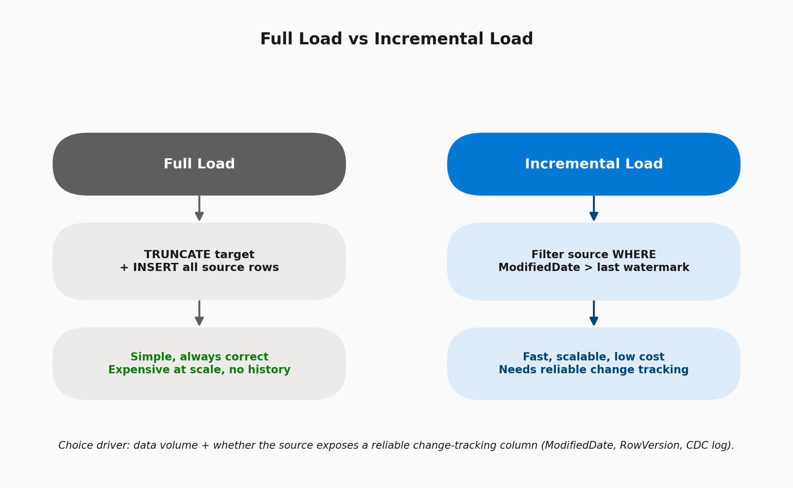

# 06 · Incremental Load Patterns

> **Module:** Core Scenarios · **Level:** Intermediate · **Reading time:** ~9 min
> **Tags:** `#etl-patterns` `#performance` `#interview-must-know`

---

## 🎯 TL;DR

> "Full load reloads everything every run — simple but expensive and slow at scale. Incremental load only moves rows that changed since the last run, using a **watermark column, CDC, or a delta/change-tracking feature** on the source. Real enterprise pipelines almost always use incremental load for large fact tables, and full load only for small dimension/reference tables."

## 1. Full Load vs Incremental Load

| | Full Load | Incremental Load |
|---|---|---|
| **Mechanism** | Truncate target, re-insert everything | Filter source for changed/new rows only |
| **Simplicity** | Very simple, no state to manage | Needs a control table / watermark tracking |
| **Cost & speed** | Expensive & slow as data grows | Fast, scales with change volume, not total volume |
| **Best for** | Small dimension/reference tables (<1M rows) | Large fact/transaction tables |
| **Risk** | Low (always correct) | Higher — depends on source's change-tracking reliability |

## 2. The Four Main Incremental Techniques

| Technique | How it works | When to use |
|---|---|---|
| **Watermark column** | Filter `WHERE ModifiedDate > @lastWatermark` | Source has a reliable last-modified timestamp/rowversion column |
| **Native CDC (Change Data Capture)** | SQL Server/Oracle CDC logs track inserts/updates/deletes at the engine level | Source is SQL Server/Oracle with CDC enabled — captures deletes too (watermark can't) |
| **Change Tracking (SQL Server)** | Lightweight, version-based tracking, less overhead than full CDC | Need change tracking without CDC's log overhead |
| **Delta Lake / merge-based** | Land all data into a Delta table, use `MERGE` to upsert into curated layer | Databricks/Synapse Lakehouse architectures |

## 3. Configuration Options in ADF

| Setting | Where | Purpose |
|---|---|---|
| **Source query with dynamic filter** | Copy Activity → Source → Query (not just table name) | `SELECT * FROM Sales WHERE ModifiedDate > '@{activity('LookupOldWatermark').output.firstRow.WatermarkValue}'` |
| **Query / Stored procedure as source** | Copy Activity source type | Push filtering to the database engine instead of pulling all rows and filtering client-side |
| **Sink write behavior** | Copy Activity → Sink | Insert (append-only staging) vs Upsert (needs key columns configured) |
| **Control table** | Any SQL DB / ADLS table you design | Stores `TableName`, `WatermarkColumn`, `LastWatermarkValue` per source |
| **Partition option (large tables)** | Copy Activity → Source → Partition option | Dynamic range/physical partitions to parallelize the read of a huge incremental batch |

## 4. Handling Deletes (The Classic Gotcha)

Watermark-based filtering **cannot detect deletes** — a deleted row simply stops appearing in the query, with no signal. Solutions:

- Use **native CDC**, which explicitly captures delete operations.
- Use **soft deletes** on the source (an `IsDeleted` flag + `ModifiedDate` update) if you control the source schema.
- Periodically run a **full reconciliation** load (e.g., weekly) to catch drift, alongside daily incrementals.

## 5. Interview Questions

**Q1. How would you design incremental load for a table with no reliable timestamp column?**
Options: enable native CDC/Change Tracking if it's SQL Server/Oracle; ask upstream to add a `ModifiedDate` trigger; or fall back to full load with a hash-comparison (compare row hashes to detect changes) if volume allows.

**Q2. Why not just filter on "yesterday's date" instead of a watermark from a control table?**
Wall-clock-based filters break on pipeline failures/reruns (you'd miss data during downtime) and don't handle late-arriving data. A **watermark persisted after successful completion** is idempotent and self-healing on reruns.

**Q3. How do you avoid missing rows that were being written exactly when the watermark query ran?**
Use a **safety buffer** (e.g., only advance the watermark to `MAX(ModifiedDate) - 5 minutes`), or wrap the read in a transaction-consistent snapshot if the source DB supports it.

**Q4. What's the performance benefit of pushing the filter into the source query vs. copying all rows and filtering in ADF?**
Filtering at the source means only the delta rows travel across the network — dramatically less data movement, lower DIU cost, and faster runs.

## 6. Common Pitfalls

- ❌ Filtering with a wall-clock date instead of a persisted watermark — breaks on reruns/failures.
- ❌ Forgetting deletes entirely — silent data drift between source and target.
- ❌ Advancing the watermark **before** confirming the load succeeded (should update watermark only after successful commit).
- ❌ Not adding a safety buffer, causing missed rows from in-flight transactions at query time.

---

⬅ [Module 01 · Fundamentals](../01-fundamentals/README.md) | ⬅ Back to [Core Scenarios index](README.md) | Next ➡ [07 · Watermark-Based CDC](02-watermark-cdc.md)
