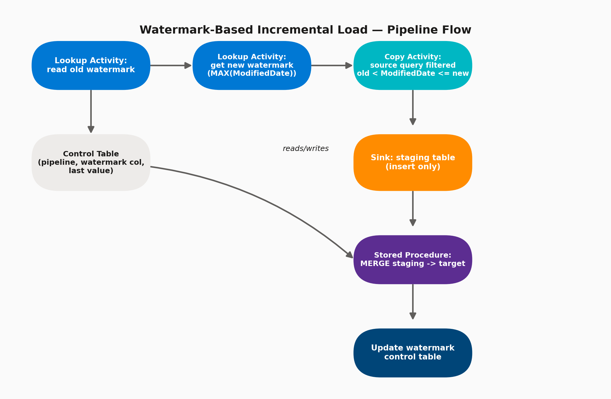

# 07 · Watermark-Based CDC — End-to-End Build

> **Module:** Core Scenarios · **Level:** Intermediate · **Reading time:** ~10 min
> **Tags:** `#etl-patterns` `#hands-on-scenario` `#interview-must-know`

---

## 🎯 TL;DR

> "A watermark-based CDC pipeline reads the last processed value from a control table, pulls only rows newer than that value from the source, lands them in staging, merges staging into the target, and — critically — only updates the control table's watermark **after** the merge succeeds."

## 1. End-to-End Pipeline Flow



## 2. Step-by-Step Build

**Step 1 — Create the control table** (in Azure SQL DB or any metadata store):

```sql
CREATE TABLE dbo.WatermarkControl (
    TableName        VARCHAR(100) PRIMARY KEY,
    WatermarkColumn  VARCHAR(100),
    LastWatermarkValue DATETIME2
);
INSERT INTO dbo.WatermarkControl VALUES ('SalesOrders', 'ModifiedDate', '1900-01-01');
```

**Step 2 — Lookup Activity #1: read old watermark**
Query: `SELECT LastWatermarkValue FROM dbo.WatermarkControl WHERE TableName = 'SalesOrders'`
→ Enable **"First row only"**.

**Step 3 — Lookup Activity #2: get new watermark from source**
Query: `SELECT MAX(ModifiedDate) AS NewWatermarkValue FROM SalesOrders`

**Step 4 — Copy Activity: pull the delta**
Source query (dynamic content):
```sql
SELECT * FROM SalesOrders
WHERE ModifiedDate > '@{activity('LookupOldWatermark').output.firstRow.LastWatermarkValue}'
  AND ModifiedDate <= '@{activity('LookupNewWatermark').output.firstRow.NewWatermarkValue}'
```
Sink: a **staging table** (truncate-and-load each run, insert-only).

**Step 5 — Stored Procedure Activity: MERGE staging into target**
```sql
MERGE dbo.SalesOrders_Target AS T
USING dbo.SalesOrders_Staging AS S
ON T.OrderID = S.OrderID
WHEN MATCHED THEN UPDATE SET T.Amount = S.Amount, T.ModifiedDate = S.ModifiedDate
WHEN NOT MATCHED THEN INSERT (OrderID, Amount, ModifiedDate) VALUES (S.OrderID, S.Amount, S.ModifiedDate);
```

**Step 6 — Stored Procedure / Set Variable Activity: update the control table**
```sql
UPDATE dbo.WatermarkControl
SET LastWatermarkValue = '@{activity('LookupNewWatermark').output.firstRow.NewWatermarkValue}'
WHERE TableName = 'SalesOrders';
```
This step must run **last**, with a "success" dependency on the MERGE step — never advance the watermark before the merge is confirmed.

## 3. Configuration Options to Get Right

| Setting | Recommendation |
|---|---|
| **Dependency condition between Copy → Stored Proc** | "Succeeded" only — don't merge partial/failed copies |
| **Staging table strategy** | Truncate before each run (Pre-copy script in Copy Activity sink settings) to avoid duplicate accumulation |
| **Isolation level on MERGE** | Use a transaction; consider `READ COMMITTED SNAPSHOT` on the target to avoid blocking readers during merge |
| **Watermark data type** | Prefer `DATETIME2` or `ROWVERSION`(binary, monotonic) over plain `DATETIME` to avoid precision-related missed rows |
| **Parametrize table name** | Use pipeline parameters so the same pipeline handles many tables (combine with [Metadata-Driven Pipelines](03-metadata-driven-pipelines.md)) |

## 4. Interview Questions

**Q1. Why use a staging table instead of copying straight into the target?**
Isolates the raw incoming delta from the target table, allows validation/dedup before merge, and avoids partial writes corrupting the target if the copy fails mid-way — the merge step is the only thing that touches the target.

**Q2. What happens if the MERGE fails after the Copy succeeds?**
The watermark is **not yet updated** (it only updates after MERGE succeeds), so the next run safely reprocesses the same window — the design is naturally idempotent as long as the MERGE logic itself is idempotent (keyed upsert, not blind insert).

**Q3. How would you extend this to also capture deletes?**
Either enable native CDC on the source (captures delete operations explicitly) or implement soft-deletes with an `IsDeleted` flag that gets included in the `ModifiedDate` filter.

**Q4. How do you test this pipeline safely without touching production data volumes?**
Point the control table's watermark at a wide historical range on a Dev/Test copy of the source, run once to confirm the initial backfill logic, then re-run to confirm the second run picks up **zero new rows** (proves idempotency).

## 5. Common Pitfalls

- ❌ Updating the watermark control table **before** confirming the merge succeeded.
- ❌ Using `>=` instead of `>` on the lower bound, causing duplicate reprocessing of the boundary row.
- ❌ Not truncating the staging table between runs, causing it to balloon and slow down every subsequent MERGE.
- ❌ Hardcoding table name/connection instead of parametrizing — forces one pipeline copy per table.

---

⬅ [06 · Incremental Load Patterns](01-incremental-load-patterns.md) | ⬅ Back to [Core Scenarios index](README.md) | Next ➡ [08 · Metadata-Driven Pipelines](03-metadata-driven-pipelines.md)
