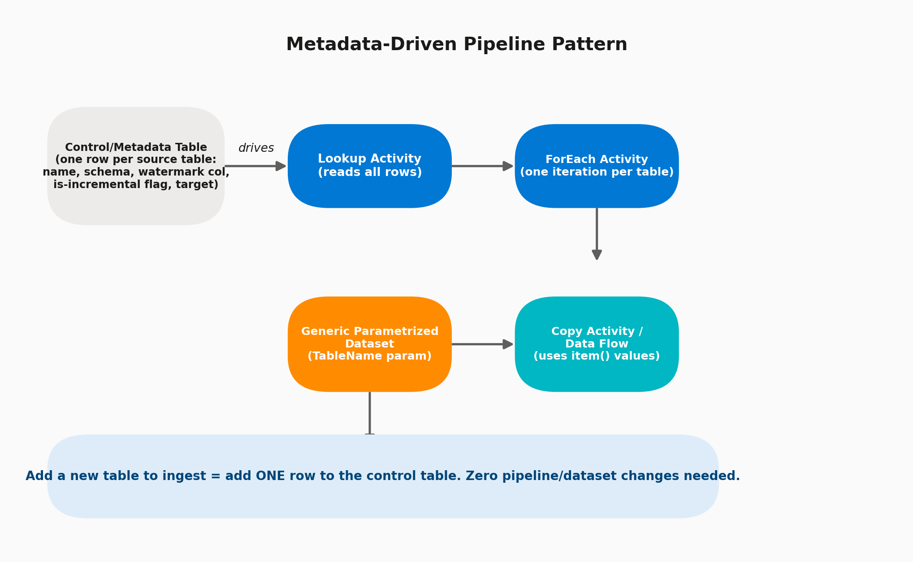

# 08 · Metadata-Driven (Parametrized) Pipelines

> **Module:** Core Scenarios · **Level:** Intermediate–Advanced · **Reading time:** ~9 min
> **Tags:** `#design-pattern` `#scalability` `#interview-must-know`

---

## 🎯 TL;DR

> "Instead of building one pipeline per table (which doesn't scale past a handful of tables), a metadata-driven pipeline reads a **control table** describing *what* to ingest, and drives one generic, parametrized pipeline + dataset through a **Lookup → ForEach** loop. Onboarding a new table becomes a one-row INSERT, not a deployment."

## 1. The Pattern



This is arguably the **single most important design pattern** for an ADF interview — it demonstrates you can design for scale, not just for one table.

## 2. Control Table Design

```sql
CREATE TABLE dbo.IngestionControl (
    SourceTableName   VARCHAR(100),
    SourceSchema      VARCHAR(50),
    TargetTableName   VARCHAR(100),
    IsIncremental     BIT,
    WatermarkColumn   VARCHAR(100),
    IsActive          BIT DEFAULT 1,
    LoadOrder         INT
);
```

Typical columns interviewers expect to see: source identity, target identity, load strategy flag, watermark column name, an active/inactive toggle (so you can pause a table without deleting config), and an ordering/priority column for dependency sequencing.

## 3. Pipeline Design

1. **Lookup Activity** — `SELECT * FROM dbo.IngestionControl WHERE IsActive = 1 ORDER BY LoadOrder` → returns an array.
2. **ForEach Activity** — iterate the array.
   - **Batch Count**: set >1 (e.g., 10–20) for parallel table processing, unless tables have dependencies.
3. Inside ForEach → **If Condition**: `@equals(item().IsIncremental, true)` branches to incremental vs full-load Copy Activity variants (see [Topic 06](01-incremental-load-patterns.md)).
4. **Copy Activity** uses a **generic parametrized Dataset** (see [Topic 03](../01-fundamentals/03-datasets.md)) — `SchemaName`/`TableName` come from `item().SourceSchema` / `item().SourceTableName`.
5. Sink Dataset similarly parametrized from `item().TargetTableName`.

## 4. Key Expressions You'll Actually Write

| Need | Expression |
|---|---|
| Reference current loop item's field | `@item().SourceTableName` |
| Pass Lookup output into ForEach items | `@activity('LookupControlTable').output.value` |
| Conditionally branch inside ForEach | `@equals(item().IsIncremental, true)` |
| Build a dynamic SQL query per table | `@concat('SELECT * FROM ', item().SourceSchema, '.', item().SourceTableName)` |
| Pass parent pipeline params into a child pipeline (Execute Pipeline) | Configure in the Execute Pipeline activity's Parameters tab, referencing `@item()` fields |

## 5. Scaling Further: Two-Level Orchestration

For very large table counts (100+), a common enterprise refinement:

- **Parent pipeline**: Lookup control table → ForEach → **Execute Pipeline** activity calling a **child pipeline**, passing `TableName` etc. as parameters.
- **Child pipeline**: does the actual Copy/Data Flow work for one table.

This avoids ForEach's activity-count limits and keeps monitoring per-table (each child pipeline run shows separately), and lets the child be reused/tested independently.

## 6. Interview Questions

**Q1. Why not just build 50 separate pipelines for 50 tables?**
Massive maintenance burden — any schema/logic change must be replicated 50 times. Metadata-driven design means one pipeline handles N tables, and change is centralized.

**Q2. How do you handle tables that need slightly different logic (e.g., one needs a custom transformation)?**
Add a `PipelineOverride` or `CustomQuery` column to the control table, and branch with an If/Switch condition, or route exceptional tables to their own dedicated pipeline while the rest flow through the generic one.

**Q3. What's the ForEach "Batch Count" for and why does it matter here?**
Controls parallelism — default sequential processing of 50 tables could take hours; setting Batch Count to e.g. 20 processes them in parallel batches, dramatically reducing wall-clock time (mind source DB connection limits though).

**Q4. How would you sequence tables that have dependencies (e.g., dimension before fact)?**
Use the `LoadOrder` column combined with either sequential ForEach per order-group, or split into multiple ForEach stages (Order=1 tables first, then Order=2), connected by pipeline dependency conditions.

## 7. Common Pitfalls

- ❌ Nesting ForEach inside ForEach — not supported; use Execute Pipeline for the inner loop instead.
- ❌ Setting Batch Count too high and overwhelming the source database's connection pool.
- ❌ No `IsActive` flag — forces deleting/re-adding control rows to pause a table instead of a simple toggle.
- ❌ Not centralizing error handling — each table's failure should be logged individually, not silently swallowed by the ForEach's default "continue on error" behavior.

---

⬅ [07 · Watermark-Based CDC](02-watermark-cdc.md) | ⬅ Back to [Core Scenarios index](README.md) | Next ➡ [09 · Error Handling & Retries](04-error-handling-and-retries.md)
