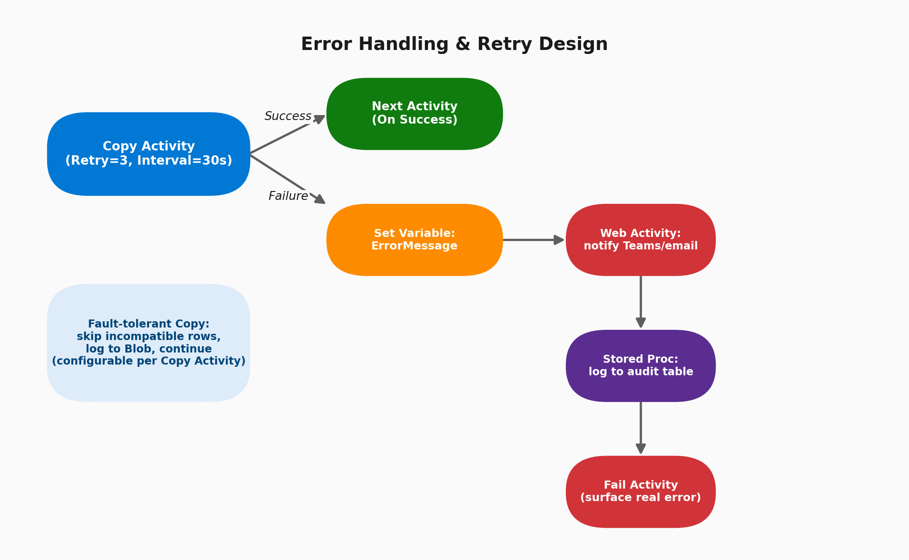

# 09 · Error Handling & Retries

> **Module:** Core Scenarios · **Level:** Intermediate · **Reading time:** ~8 min
> **Tags:** `#reliability` `#observability` `#interview-must-know`

---

## 🎯 TL;DR

> "ADF gives you retry/timeout settings at the activity level, dependency conditions (Success/Failure/Completion/Skipped) to branch pipeline flow on outcome, and a fault-tolerance mode inside Copy Activity to skip bad rows instead of failing the whole run. Production-grade pipelines combine all three plus explicit logging and alerting activities on the failure path."

## 1. Error-Handling Pipeline Design

## 2. Activity-Level Resilience Settings

| Setting | Location | Purpose |
|---|---|---|
| **Retry** | Activity → General tab | Number of automatic retries on transient failure (e.g., 3) |
| **Retry interval (seconds)** | Activity → General tab | Delay between retries (e.g., 30s) — use larger intervals for rate-limited APIs |
| **Timeout** | Activity → General tab | Max time before ADF force-fails a hung activity (default 7 days — usually way too long, tighten it) |
| **Secure output / Secure input** | Activity → General tab | Prevents sensitive data from being written to monitoring logs |
| **Fault tolerance (Copy Activity only)** | Copy Activity → Settings | Skip incompatible rows and log them to Blob instead of failing the entire copy |

## 3. Dependency Conditions — Branching on Outcome

Every arrow between two activities in ADF Studio carries a **dependency condition**:

| Condition | Fires when |
|---|---|
| **Succeeded** (green, default) | Upstream activity completed successfully |
| **Failed** (red) | Upstream activity failed (even after exhausting retries) |
| **Completed** (blue) | Upstream activity finished, regardless of outcome |
| **Skipped** (yellow) | Upstream activity was skipped because *its* upstream failed |

You can attach **multiple conditions from the same activity** to build proper try/catch-style logic — e.g., a Copy Activity with both a "Succeeded" arrow to the next step and a "Failed" arrow to an error-handling branch.

## 4. Building a "Try/Catch" Pattern in ADF

1. Main activity (e.g., Copy Activity) with Retry=3.
2. On **Failure** → `Set Variable` (capture `@activity('Copy').error.message`).
3. → `Web Activity` (POST to Teams/Slack/email webhook, or Logic App) to alert on-call.
4. → `Stored Procedure Activity` to log the failure (pipeline name, run ID, error, timestamp) into an audit table.
5. → `Fail Activity` (a dedicated activity type, GA since 2023) to force the pipeline run status to "Failed" with a custom, useful error message surfaced in monitoring — otherwise a pipeline with only a logging branch on failure can incorrectly show as "Succeeded".

## 5. Interview Questions

**Q1. Why would a pipeline show "Succeeded" even though an activity inside it failed?**
If a Failure-path branch exists and completes successfully (e.g., the logging/alert activities), and nothing forces a hard failure, ADF considers the *pipeline* run outcome based on whether all executed activities completed without an unhandled failure. Adding an explicit **Fail Activity** at the end of the error branch fixes this — it's the standard fix interviewers want to hear.

**Q2. When would you use Copy Activity's fault tolerance / "skip incompatible rows" instead of failing the whole run?**
When you're ingesting large, occasionally messy datasets (e.g., 10M rows where 12 have a malformed date) and you'd rather load the 99.9999% good rows and separately review the skipped ones than block the entire load on a handful of bad records.

**Q3. What's the danger of a very high Retry count on a Copy Activity hitting a rate-limited API?**
Can worsen the situation — repeated retries against an already-struggling/rate-limited endpoint amplify load. Combine a modest retry count with an increasing **retry interval** (and ideally respect `Retry-After` headers via a Web Activity + Until loop for true backoff).

**Q4. How do you make failure alerting centralized across dozens of pipelines instead of duplicating the alert logic in every pipeline?**
Build a small reusable **"ErrorHandler" child pipeline** (Web Activity + Stored Proc logging) and call it via **Execute Pipeline** on the failure path of every parent pipeline, passing pipeline name/run ID/error message as parameters — or use **Azure Monitor alert rules** on the ADF resource's diagnostic logs for a no-code, pipeline-agnostic option.

## 6. Common Pitfalls

- ❌ Leaving Timeout at the 7-day default — a hung activity silently blocks downstream SLAs for days before anyone notices.
- ❌ No explicit Fail Activity on the error branch — pipeline shows "Succeeded" despite a real failure.
- ❌ Retrying aggressively against rate-limited APIs without backoff, worsening throttling.
- ❌ Not enabling "Secure output" on activities handling PII/secrets, leaking sensitive data into ADF's monitoring blade/logs.

---

⬅ [08 · Metadata-Driven Pipelines](03-metadata-driven-pipelines.md) | ⬅ Back to [Core Scenarios index](README.md) | Next ➡ [10 · Triggers Deep-Dive](05-triggers-deep-dive.md)
