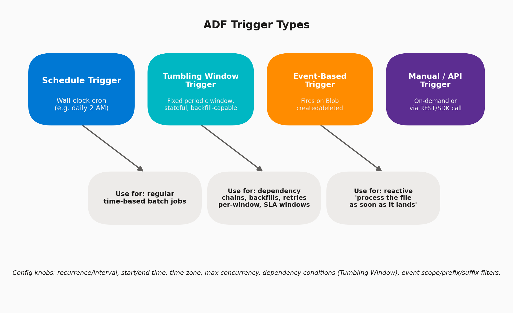

# 10 · Triggers Deep-Dive

> **Module:** Core Scenarios · **Level:** Intermediate · **Reading time:** ~9 min
> **Tags:** `#orchestration` `#scheduling` `#interview-must-know`

---

## 🎯 TL;DR

> "A trigger is *what causes a pipeline to run*. ADF has four types: **Schedule** (wall-clock cron), **Tumbling Window** (stateful, periodic, backfill-capable), **Event-based** (reacts to Blob create/delete), and **Manual/API** (on-demand). Picking the right one is a very common 'design this pipeline' interview question."

## 1. The Four Trigger Types

| Trigger | Fires On | Stateful? | Best For |
|---|---|---|---|
| **Schedule** | Recurring wall-clock time (cron-like) | No | Simple daily/hourly batch jobs |
| **Tumbling Window** | Fixed, contiguous, non-overlapping time windows | **Yes** | Backfills, dependency chains, exactly-once-per-window semantics |
| **Event-based** | Blob Storage/ADLS create or delete event | No | Reactive "process the file the moment it lands" scenarios |
| **Manual / API** | User click or REST/SDK call | No | Ad-hoc runs, testing, calling from an external orchestrator (e.g., Azure DevOps release, Function) |

## 2. Schedule Trigger — Configuration

| Setting | Options |
|---|---|
| **Start date / End date** | When the trigger becomes active/inactive |
| **Time zone** | Important! Avoid UTC-only assumptions if the business operates in local time (e.g., DST-aware "America/Chicago") |
| **Recurrence** | Every N minutes/hours/days/weeks/months |
| **Advanced recurrence options** | Specific days of week, specific hours/minutes (e.g., "every weekday at 6, 12, 18") |

## 3. Tumbling Window Trigger — Configuration (The Advanced One)

| Setting | Purpose |
|---|---|
| **Window size** | e.g., 1 hour — pipeline runs once per window |
| **Delay** | Wait period after window end before triggering (lets late data settle) |
| **Max concurrency** | How many windows can run in parallel (useful for backfilling historical windows fast) |
| **Retry policy** | Built-in retry count/interval *per window*, independent of activity-level retries |
| **Dependency (self/other trigger)** | Chain windows so Window N+1 only starts after Window N succeeds, or after a *different* tumbling trigger's matching window succeeds — enables robust DAG-like dependencies between pipelines |
| **`WindowStart` / `WindowEnd` system params** | Automatically available inside the pipeline (`@trigger().outputs.windowStartTime`) — perfect for exact-window filtering, no manual watermark needed |

**Why it matters for interviews:** Tumbling Window is the *only* native ADF trigger with built-in state and backfill support — you can right-click and "rerun" any historical window, and ADF guarantees no gaps/overlaps between windows. This is frequently the "correct" answer to "how do you guarantee exactly-once processing per hour."

## 4. Event-Based Trigger — Configuration

| Setting | Purpose |
|---|---|
| **Storage account** | ADLS Gen2/Blob account to monitor (requires Event Grid resource provider registered) |
| **Container / Blob path begins with / ends with** | Scope + filename filters, e.g., only `.csv` files landing under `/raw/sales/` |
| **Event type** | Blob Created / Blob Deleted |
| **Ignore empty blobs** | Prevents triggering on zero-byte placeholder files |

## 5. Interview Questions

**Q1. A finance team needs "process yesterday's transactions every day at 6 AM, and if it fails, be able to cleanly re-run just that day without duplicating other days." Which trigger?**
**Tumbling Window** — its window-based state and rerun-a-specific-window capability directly solves the "re-run just that day" requirement, which a plain Schedule Trigger cannot do cleanly (rerunning a Schedule Trigger run doesn't have the same window-scoped guarantees).

**Q2. A partner drops files into Blob Storage at unpredictable times throughout the day, and they need to be processed immediately. Which trigger?**
**Event-based Trigger** on Blob Created — avoids expensive polling (repeatedly checking "has the file landed yet") and processes near-instantly.

**Q3. Can one pipeline have multiple triggers, and can one trigger fire multiple pipelines?**
Both are supported — a pipeline can be associated with several triggers (e.g., both a Schedule and a Manual trigger), and a single trigger can kick off multiple pipelines.

**Q4. How do you prevent overlapping runs if a pipeline occasionally takes longer than its recurrence interval?**
For Schedule Trigger, there's no built-in concurrency control beyond what the pipeline itself enforces — commonly solved by adding a "Concurrency" limit on the pipeline (Settings tab) so a new run won't start while one is active. Tumbling Window has native **Max Concurrency** control for this exact problem.

**Q5. How do you backfill 30 days of missed historical Tumbling Window runs?**
Set the trigger's **Start Date** back 30 days and publish — ADF automatically creates and runs the missed historical windows (respecting Max Concurrency), no manual scripting required.

## 6. Common Pitfalls

- ❌ Using Schedule Trigger for scenarios that need exact-once-per-window guarantees or rerunability — should be Tumbling Window.
- ❌ Forgetting time zone settings, causing jobs to silently run an hour off after DST changes.
- ❌ Not setting "Ignore empty blobs" on Event triggers, causing spurious runs from placeholder/marker files.
- ❌ Assuming trigger recurrence alone prevents overlapping runs — it doesn't; set pipeline Concurrency explicitly.

---

⬅ [09 · Error Handling & Retries](04-error-handling-and-retries.md) | ⬅ Back to [Core Scenarios index](README.md) | Next ➡ *(Module 03 coming soon)*
