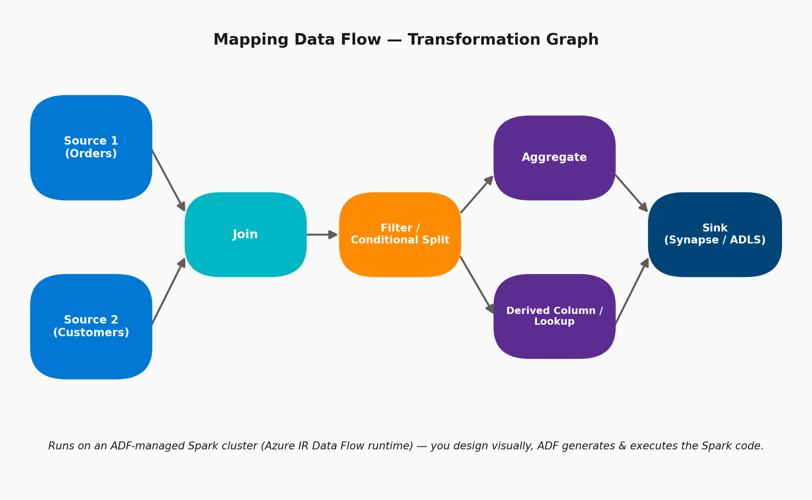

# 11 · Mapping Data Flows Overview

> **Module:** Data Transformation · **Level:** Intermediate · **Reading time:** ~9 min
> **Tags:** `#transformation` `#spark` `#interview-must-know`

---

## 🎯 TL;DR

> "Mapping Data Flow is ADF's **code-free, visual ETL transformation engine**. You design a graph of transformations (Join, Filter, Aggregate, Derived Column, Lookup, Alter Row, etc.); behind the scenes ADF compiles it to Spark and runs it on a cluster it manages for you — no cluster ops, no Scala/PySpark code required."

## 1. The Transformation Graph

A Data Flow is invoked from a pipeline via a **Data Flow Activity** — it's not runnable standalone; the pipeline provides the trigger, parameters, and monitoring wrapper.

## 2. Core Transformations You Must Know

| Transformation | Purpose |
|---|---|
| **Source / Sink** | Entry/exit points, each backed by a Dataset |
| **Join** | Inner/Left/Right/Outer/Cross joins between two streams |
| **Filter** | Row-level boolean filter expression |
| **Conditional Split** | Route rows to different downstream paths based on conditions (like a switch) |
| **Aggregate** | GROUP BY-style aggregation (SUM, COUNT, MAX, etc.) |
| **Derived Column** | Add/modify columns using ADF's expression language |
| **Lookup** | Enrich a stream with reference data from another source |
| **Exists** | Check whether rows exist in another stream (used for upsert/SCD logic) |
| **Alter Row** | Tag each row with Insert/Update/Upsert/Delete policy for the sink |
| **Window** | Rank/lead/lag/running-total style analytic functions |
| **Flatten** | Unnest JSON arrays into rows |
| **Pivot / Unpivot** | Reshape rows to columns or vice versa |

## 3. Key Configuration Options

| Setting | Where | Purpose |
|---|---|---|
| **Data Flow debug mode** | Top of Data Flow canvas | Spins up an interactive cluster to preview transformation results live while designing |
| **Compute type** | Pipeline's Data Flow Activity → Azure IR settings | General Purpose / Memory Optimized / Compute Optimized |
| **Core count** | Same location | 8–256+ cores; size for data volume + transformation complexity |
| **Time to live (TTL)** | Azure IR settings | Keeps cluster warm between runs to skip the ~5 min cold start |
| **Partitioning** | Optimize tab on each transformation | Round Robin / Hash / Dynamic Range / Fixed — controls Spark parallelism; wrong partitioning is the #1 performance killer |
| **Broadcast join** | Join transformation → Optimize tab | Broadcast the smaller side to avoid an expensive shuffle join |
| **Sink "Auto mapping" vs explicit** | Sink transformation | Auto-map adapts to schema drift; explicit gives precise control |

## 4. How Data Flows Fit With Copy Activity

| | Copy Activity | Mapping Data Flow |
|---|---|---|
| Transformation depth | Light (type conversion, column mapping) | Full (joins, aggregations, pivots, SCD logic) |
| Compute | DIU-based copy engine | ADF-managed Spark cluster |
| Best for | Simple E-L movement | Real ETL/ELT with business logic |
| Debug experience | Limited | Rich, interactive Data Preview during design |

## 5. Interview Questions

**Q1. Do you need to know Spark/Scala to use Mapping Data Flows?**
No — it's designed to be code-free. ADF translates the visual graph into a Spark job and manages the cluster; you only see Spark concepts indirectly (e.g., partitioning, broadcast joins) as performance tuning knobs.

**Q2. Why might a Data Flow run be slow even though the pipeline seems simple?**
Common causes: cold-start cluster (TTL=0), poor partitioning strategy causing skew, missing broadcast join hint on a large-small join, or an undersized cluster (core count too low for data volume).

**Q3. How do you handle a scenario needing both a big transformation AND tight cost control for infrequent runs?**
Set **TTL to 0** (no idle cost) and accept the cold-start latency if runs are infrequent (e.g., daily); set **TTL > 0** if runs are frequent (e.g., every 15 min) to avoid repeatedly paying the cold-start cost.

**Q4. What's the difference between the Exists transformation and a Join?**
`Exists` is a semi-join/anti-join check — it returns rows from the left stream based on whether a match exists in the right stream, without pulling in the right stream's columns; used heavily in incremental/SCD patterns to check "is this row new or already present."

## 6. Common Pitfalls

- ❌ Leaving default partitioning (Round Robin) on a large join, causing a heavy shuffle instead of using a broadcast join for a small lookup table.
- ❌ Forgetting Data Flow debug mode is billed separately — leaving it on idle burns cost.
- ❌ Not testing with representative data volume — a Data Flow that works fine on 1K test rows can behave very differently at 100M rows.
- ❌ Over-relying on Derived Column expressions for heavy logic instead of pushing filters upstream to the source query where possible.

---

⬅ [Module 02 · Core Scenarios](../02-core-scenarios/README.md) | ⬅ Back to [Data Transformation index](README.md) | Next ➡ [12 · Wrangling Data Flows](02-wrangling-data-flows.md)
