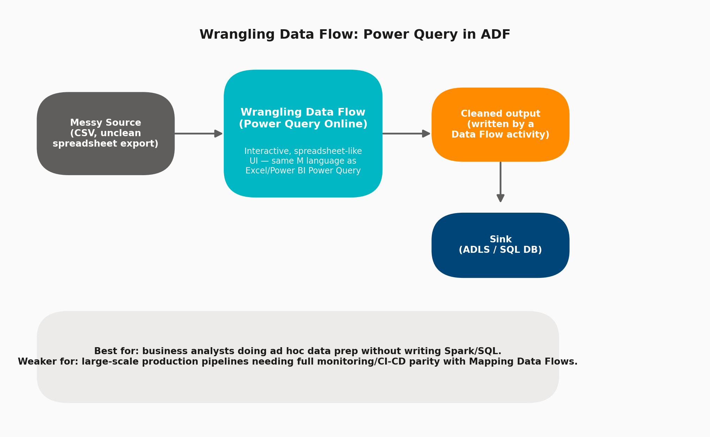

# 12 · Wrangling Data Flows

> **Module:** Data Transformation · **Level:** Intermediate · **Reading time:** ~7 min
> **Tags:** `#transformation` `#power-query` `#interview-nice-to-have`

---

## 🎯 TL;DR

> "Wrangling Data Flow embeds **Power Query Online** (the same engine behind Excel and Power BI's data prep) directly inside ADF, letting business analysts interactively clean/shape data in a spreadsheet-like UI, with ADF translating the M-language steps into a runnable Data Flow activity."

## 1. The Concept

Wrangling Data Flows exist for a different persona than Mapping Data Flows: they target **analysts comfortable with Power Query/Excel** who want to shape messy source data (spreadsheets, exports, ad hoc CSVs) without learning ADF's expression language or Spark concepts.

## 2. Wrangling vs. Mapping Data Flow (Interview Comparison)

| | Mapping Data Flow | Wrangling Data Flow |
|---|---|---|
| **Audience** | Data engineers | Business analysts / citizen integrators |
| **Interface** | Node-graph of transformations | Spreadsheet-like grid + step list (Power Query M) |
| **Power/flexibility** | Full — joins, aggregates, SCD, windowing | Lighter — best for shaping/cleaning, less for complex multi-stream joins |
| **CI/CD & monitoring maturity** | Strong, first-class ADF citizen | Weaker — less common in production-grade pipelines |
| **Underlying engine** | Spark (ADF-managed) | Power Query engine (Mashup engine), also Spark-backed at execution |

## 3. Configuration Options

| Setting | Purpose |
|---|---|
| **Source** | Any Wrangling-supported Dataset (subset of full connector list — check current support before designing) |
| **Power Query steps** | Filter rows, split/merge columns, change data types, remove duplicates, pivot/unpivot, fill down, group by — all recorded as discrete, reorderable steps |
| **Data Flow Activity (to run it)** | Wrangling Data Flow is still invoked from a pipeline via a Data Flow Activity, same as Mapping Data Flow |
| **Destination (sink)** | Configured back in ADF Studio once the Power Query steps are finalized |

## 4. When to Choose Wrangling Over Mapping

- ✅ An analyst — not an engineer — owns the transformation logic and needs a familiar, low-code UI.
- ✅ The task is primarily **data shaping/cleaning** (dedup, type fixes, unpivoting) rather than complex multi-source joins/aggregations.
- ✅ Fast iteration/prototyping is more valuable than production rigor at this stage.
- ❌ Avoid for high-throughput, mission-critical production pipelines requiring precise performance tuning and full CI/CD parity — use Mapping Data Flow there instead.

## 5. Interview Questions

**Q1. Who is the intended user of Wrangling Data Flows vs Mapping Data Flows?**
Wrangling targets business analysts already comfortable with Power Query (Excel/Power BI); Mapping targets data engineers who need precise control, performance tuning, and complex multi-stream logic.

**Q2. Can Wrangling Data Flows be scheduled and monitored like any other ADF activity?**
Yes — once designed, a Wrangling Data Flow is wrapped in a Data Flow Activity inside a pipeline, so it inherits standard ADF triggers, monitoring, and retry configuration.

**Q3. Would you recommend Wrangling Data Flow for a mission-critical, high-volume nightly load?**
Generally no — Mapping Data Flow is the more mature, performance-tunable, production-grade choice for that; Wrangling is better suited to ad hoc/analyst-driven prep work or lighter-weight scenarios.

## 6. Common Pitfalls

- ❌ Using Wrangling Data Flow for complex multi-table joins better suited to Mapping Data Flow's dedicated Join transformation.
- ❌ Assuming full connector parity with Mapping Data Flow — always verify the source/sink you need is supported before committing to this approach.
- ❌ Treating it as a long-term production solution when it was really meant for fast, analyst-led prototyping.

---

⬅ [11 · Mapping Data Flows](01-mapping-data-flows.md) | ⬅ Back to [Data Transformation index](README.md) | Next ➡ [13 · Databricks Integration](03-databricks-integration.md)
