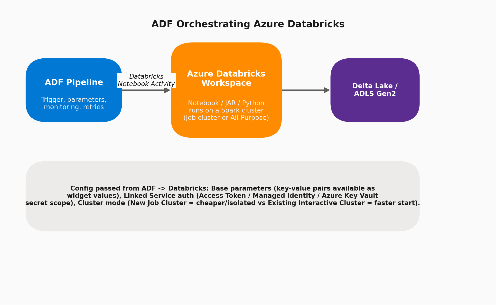

# 13 · Databricks Notebook Integration

> **Module:** Data Transformation · **Level:** Intermediate–Advanced · **Reading time:** ~9 min
> **Tags:** `#databricks` `#spark` `#interview-must-know`

---

## 🎯 TL;DR

> "For heavy, code-first Spark transformations beyond what Mapping Data Flows offer, ADF orchestrates **Azure Databricks** via a Notebook/JAR/Python Activity — ADF handles scheduling, parameters, monitoring and retries, while Databricks does the actual distributed compute on its own cluster."

## 1. The Integration Pattern

This is the classic **"ADF = orchestration, Databricks = compute"** separation of concerns that comes up constantly in system-design interviews.

## 2. Activity Types for Databricks

| Activity | Runs |
|---|---|
| **Databricks Notebook Activity** | An existing notebook (Python/Scala/SQL/R cells) |
| **Databricks JAR Activity** | A compiled Scala/Java JAR's main class |
| **Databricks Python Activity** | A standalone `.py` script |

## 3. Configuration Options

| Setting | Description |
|---|---|
| **Databricks Linked Service** | Workspace URL + auth (Access Token, or **Managed Identity** — best practice, avoids storing a PAT) |
| **Cluster mode: New Job Cluster** | Spins up a fresh cluster per run, terminates after — cheaper, isolated, but pays cold-start (~5–7 min) |
| **Cluster mode: Existing Interactive Cluster** | Reuses an always-on cluster — faster start, but higher idle cost and shared-resource contention risk |
| **Base parameters** | Key-value pairs passed to the notebook, accessible via `dbutils.widgets.get("paramName")` |
| **Library dependencies** | Attach Maven/PyPI/JAR/wheel libraries needed by the notebook, managed either on the cluster or per-job |
| **Cluster autoscaling / node type / Spark version** | Set on the Job Cluster spec (min/max workers, VM SKU, Databricks Runtime version) |
| **Secret scope integration** | Databricks-backed or **Azure Key Vault-backed** secret scopes so notebooks pull credentials securely instead of hardcoding them |

## 4. Passing Data Between ADF and Databricks

- **ADF → Databricks:** Base parameters (simple values: dates, table names, environment flags).
- **Databricks → ADF:** A notebook can call `dbutils.notebook.exit(jsonString)`; ADF's Databricks Activity exposes this as `@activity('NotebookActivity').output.runOutput`, usable in downstream activities (e.g., branch an If Condition on a returned status).

## 5. Step-by-Step: Wiring Up a Databricks Notebook Activity

1. Create an **Azure Databricks Linked Service** — choose "New Job Cluster" for cost control, set node type/count and Databricks Runtime version.
2. Authenticate via **Managed Identity** (grant ADF's identity the *Contributor* role on the Databricks workspace, or configure Azure AD passthrough) instead of a long-lived PAT where possible.
3. Add a **Databricks Notebook Activity** to the pipeline, point it at the notebook path in the workspace.
4. Under **Settings → Base Parameters**, add pipeline-parameter-driven values (e.g., `runDate`, `sourceTable`).
5. In the notebook: `run_date = dbutils.widgets.get("runDate")`.
6. On success, capture any needed output via `dbutils.notebook.exit(...)` and consume it downstream in ADF.

## 6. Interview Questions

**Q1. Why use ADF + Databricks instead of just Mapping Data Flows for everything?**
Databricks gives full Spark/Python/Scala code flexibility, access to MLflow/ML libraries, Delta Lake advanced features, and finer performance control — needed for complex transformations, machine learning, or logic that doesn't fit ADF's visual transformation set. Mapping Data Flows are faster to build for standard ETL but less flexible for custom code.

**Q2. New Job Cluster vs. Existing Interactive Cluster — which for a nightly batch job?**
**New Job Cluster** — isolated per run (no noisy-neighbor risk from other workloads), and since it's a once-daily run, the cold-start cost is negligible relative to overall savings from not running an idle cluster all day.

**Q3. How do you avoid storing a Databricks Personal Access Token in the Linked Service?**
Use **Azure AD / Managed Identity authentication** for the Databricks Linked Service instead of a PAT — eliminates a long-lived secret to rotate and manage.

**Q4. How would you make a downstream ADF activity behave differently based on what the Databricks notebook did?**
Have the notebook call `dbutils.notebook.exit(json.dumps({"status": "ok", "rowCount": n}))`, then reference `@activity('MyNotebook').output.runOutput.status` in an If Condition or Set Variable activity downstream.

## 7. Common Pitfalls

- ❌ Using an always-on Interactive Cluster for infrequent batch jobs — wastes money on idle compute.
- ❌ Storing a Databricks PAT directly in the Linked Service instead of Key Vault/Managed Identity.
- ❌ Not pinning the Databricks Runtime version — an auto-upgrade can silently break notebook behavior.
- ❌ Forgetting that `dbutils` widgets need explicit default values or the notebook fails on manual (non-ADF) runs.

---

⬅ [12 · Wrangling Data Flows](02-wrangling-data-flows.md) | ⬅ Back to [Data Transformation index](README.md) | Next ➡ [14 · Schema Drift Handling](04-schema-drift.md)
