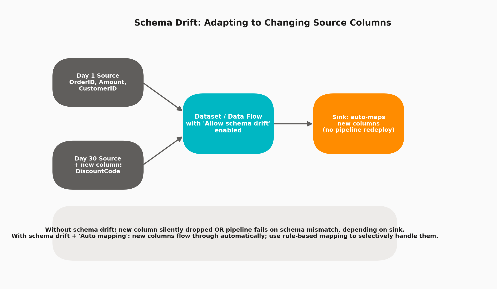

# 14 · Schema Drift Handling

> **Module:** Data Transformation · **Level:** Intermediate · **Reading time:** ~8 min
> **Tags:** `#resilience` `#data-modeling` `#interview-must-know`

---

## 🎯 TL;DR

> "Schema drift is when source columns are added, removed, or renamed over time without notice. ADF handles this via **'Allow schema drift'** on Datasets/Data Flow sources, combined with **Auto Mapping** or **rule-based column patterns** on the sink — so pipelines keep running instead of breaking on every upstream schema change."

## 1. The Problem & The Fix

Without schema drift handling, a strict schema-bound pipeline typically does one of two bad things when the source adds a column: **silently drops it** (data loss) or **fails outright** (pipeline breaks in production at 2 AM).

## 2. Configuration Options

| Setting | Where | Effect |
|---|---|---|
| **Allow schema drift** | Data Flow → Source transformation → Settings | Lets the source accept columns not defined in its projected schema |
| **Infer drifted column types** | Same location | Auto-detects data types for new/undeclared columns instead of treating everything as string |
| **Auto mapping (sink)** | Data Flow → Sink transformation → Mapping tab | Maps all incoming columns (including drifted ones) automatically to the sink by name |
| **Rule-based mapping** | Sink → Mapping tab → switch to rule-based | Pattern-match columns (e.g., `startsWith('Discount')`) to selectively route drifted columns rather than blanket auto-map everything |
| **Dataset schema import** | Dataset definition | Leave partially/fully unimported (schema-less) to avoid the Dataset itself rejecting new columns |

## 3. The Two Layers Where Drift Must Be Handled

1. **Read side (Source):** must not choke on unexpected extra columns coming from upstream.
2. **Write side (Sink):** must decide what to do with those extra columns — pass through, ignore, or route to a specific target column via rules.

Both layers need schema drift enabled together; enabling only on the source but not handling it on the sink just moves the failure point downstream.

## 4. Interview Questions

**Q1. What's the practical risk of NOT enabling schema drift on a Bronze/raw ingestion layer?**
A silent upstream schema change (new column added, or a rename) either breaks the pipeline (best case — you notice) or silently drops/loses the new data (worst case — you don't notice until a business user asks "where's the new field").

**Q2. How do you selectively handle only certain new columns instead of blindly passing all drifted columns through?**
Use **rule-based mapping** on the sink with pattern matching (e.g., name starts with a prefix, or matches a regex) instead of blanket Auto Mapping — this lets you route specific drifted columns to specific targets while ignoring or quarantining the rest.

**Q3. Does enabling schema drift mean you lose all type safety?**
Not necessarily — "Infer drifted column types" attempts to detect proper types for new columns rather than treating everything as raw string, though it's still less rigid than an explicitly declared schema.

**Q4. Where in a Medallion architecture is schema drift most valuable to enable?**
**Bronze (raw ingestion) layer** — you want raw data landed as-is, resilient to upstream changes. By the time you get to Silver/Gold, you typically want a **stricter, curated schema** with explicit validation, so schema drift is less appropriate there.

## 5. Common Pitfalls

- ❌ Enabling schema drift on the source but leaving the sink with a rigid explicit mapping — drifted columns get silently dropped at the sink anyway.
- ❌ Using blanket Auto Mapping everywhere without any validation, letting genuinely unexpected/garbage columns flow all the way to Gold-layer reporting tables.
- ❌ Assuming schema drift replaces data quality validation — it solves "don't break," not "is this data correct."
- ❌ Forgetting that a truly *removed* source column also needs handling (downstream logic referencing it will fail/return null) — schema drift only smooths *additions*, not removals.

---

⬅ [13 · Databricks Integration](03-databricks-integration.md) | ⬅ Back to [Data Transformation index](README.md) | Next ➡ [15 · SCD Patterns in Data Flows](05-scd-patterns.md)
