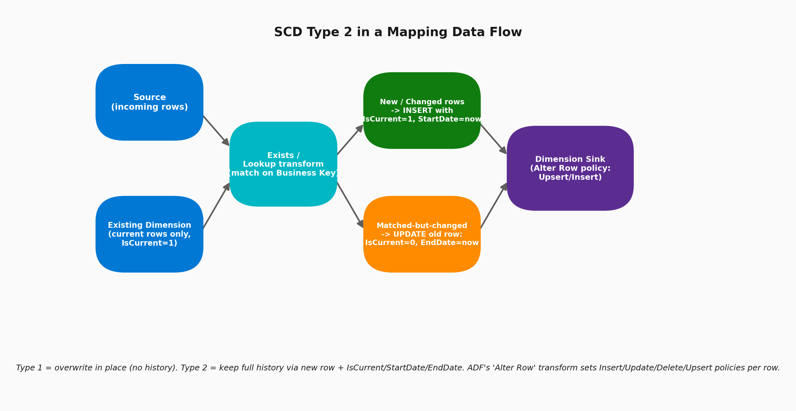

# 15 · Slowly Changing Dimensions (SCD) in Data Flows

> **Module:** Data Transformation · **Level:** Advanced · **Reading time:** ~10 min
> **Tags:** `#dimensional-modeling` `#data-flows` `#interview-must-know`

---

## 🎯 TL;DR

> "SCD Type 1 overwrites dimension attributes in place (no history). SCD Type 2 keeps full history by inserting a new row for every change and marking the old row inactive, using **IsCurrent/StartDate/EndDate** columns. ADF's Mapping Data Flow implements this with **Exists/Lookup** transformations to detect changes and an **Alter Row** transformation to tag each row's Insert/Update policy."

## 1. SCD Type 2 Flow

## 2. SCD Types — Quick Reference

| Type | Behavior | History kept? | Typical use |
|---|---|---|---|
| **Type 0** | Never update (write once) | N/A | Immutable attributes (e.g., original signup date) |
| **Type 1** | Overwrite in place | No | Correcting typos, non-analytically-significant attributes |
| **Type 2** | New row per change + IsCurrent/StartDate/EndDate | **Yes — full history** | Attributes analysts need to track "as of a point in time" (e.g., customer's address, product's category) |
| **Type 3** | Add a "previous value" column | Limited (only last value) | Rare — only need to compare current vs. immediately-prior value |

Type 2 is the one interviewers dig into most, since it requires real design decisions.

## 3. Building SCD Type 2 in a Mapping Data Flow — Step by Step

1. **Source**: incoming dimension rows (e.g., daily customer extract).
2. **Second Source**: existing dimension table, filtered to `IsCurrent = 1` (only current rows, for efficient matching).
3. **Exists transformation**: match incoming rows against existing-current rows on the **business key** (e.g., `CustomerID`, not the surrogate key).
   - Rows that **don't exist** → brand new dimension members → route to INSERT.
   - Rows that **exist but have changed attributes** (compare tracked columns) → route to the "changed" branch.
4. **Derived Column** (new/changed branch): set `IsCurrent = 1`, `StartDate = currentTimestamp()`, `EndDate = '9999-12-31'`, and generate a new surrogate key.
5. **Derived Column** (existing row being closed out): set `IsCurrent = 0`, `EndDate = currentTimestamp()` — this updates the *old* row, it does not touch the new one.
6. **Alter Row transformation**: tag rows explicitly — `Insert If` for new/changed rows, `Update If` for the old row being closed out.
7. **Sink**: with **Allow Insert** and **Allow Update** enabled, keyed on the surrogate key so Update only touches the specific old row.

## 4. Key Configuration Options

| Setting | Purpose |
|---|---|
| **Alter Row policies** (Insert If / Update If / Delete If / Upsert If) | Per-row conditional expressions controlling sink write behavior |
| **Sink "Allow insert/update/upsert/delete"** | Must match the policies set upstream in Alter Row — sink silently ignores unallowed operations otherwise |
| **Sink key columns** | Must be the **surrogate key** (not business key) so Update targets exactly the intended historical row |
| **Change detection method** | Compare all tracked columns explicitly, or use a hash column (`sha2(concat_ws('|', col1, col2, ...))`) computed on both sides for a cheap single-column comparison |

## 5. Interview Questions

**Q1. Why compare a hash of tracked columns instead of comparing each column individually?**
Simplifies the Data Flow logic to a single equality check and scales better as the number of tracked columns grows — compute a hash column on ingest and store it in the dimension table, then just compare hashes to detect any change.

**Q2. Why use the business key for matching but the surrogate key for the sink's update target?**
The business key (e.g., `CustomerID`) is what identifies "the same real-world entity" across time; the surrogate key uniquely identifies *one version/row* of that entity — since Type 2 can have multiple rows per business key (one per historical version), only the surrogate key safely targets the exact row to close out.

**Q3. What happens if you forget to set an EndDate/IsCurrent flag correctly and a row has two "current" versions?**
Any downstream join to the dimension using the naive `IsCurrent = 1` filter would return **duplicate rows** for that entity, silently double-counting facts joined against it — a classic, hard-to-detect data quality bug.

**Q4. How would you extend this pattern to also handle SCD Type 1 columns mixed with Type 2 columns on the same dimension (hybrid SCD)?**
Split attribute handling: Type 2-tracked columns drive the Exists/change-detection and new-row logic as above; Type 1-tracked columns (e.g., a corrected typo) get updated **in place across all historical rows for that business key** via a separate Update branch that doesn't create a new row.

## 6. Common Pitfalls

- ❌ Matching/joining on the surrogate key instead of the business key when detecting "does this entity already exist."
- ❌ Forgetting to disable the Update policy on the sink for the "new row" branch, or the Insert policy for the "close-out old row" branch — leads to duplicate or overwritten history.
- ❌ Not filtering the existing-dimension source to `IsCurrent = 1` before the Exists comparison — matching against ALL historical rows makes change detection ambiguous.
- ❌ Comparing every column manually when a single hash comparison would be simpler, cheaper, and easier to maintain as columns are added.

---

⬅ [14 · Schema Drift Handling](04-schema-drift.md) | ⬅ Back to [Data Transformation index](README.md) | Next ➡ *(Module 04 coming soon)*
