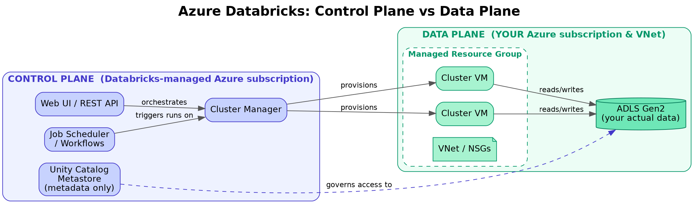
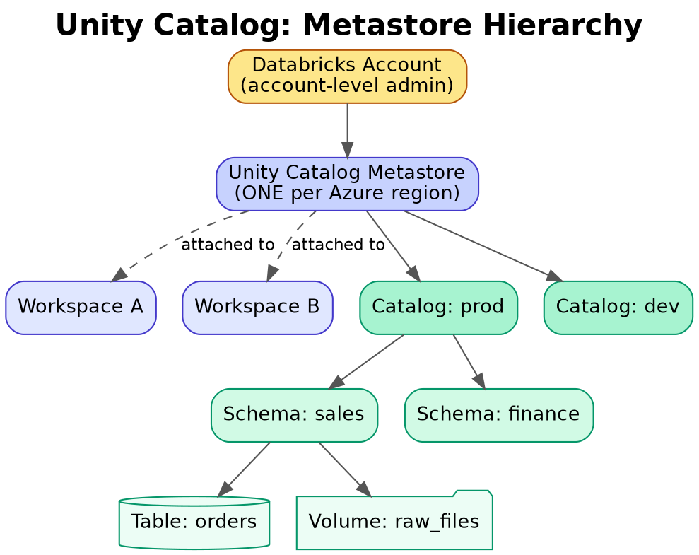

# 01. Databricks Architecture & Workspace Fundamentals

## 1. What is Azure Databricks?

Azure Databricks is a first-party, jointly engineered Apache Spark–based analytics platform on Azure, built around the **Lakehouse** paradigm — combining the low-cost, flexible storage of a data lake with the transactional reliability and performance of a data warehouse (via Delta Lake).

Key idea: one platform for data engineering, data science/ML, and SQL analytics, all reading/writing the same governed data instead of copying it into separate silos.

## 2. The Control Plane / Data Plane split

This is the single most important architectural fact to know cold for interviews.

| | Control Plane | Data Plane |
|---|---|---|
| Owned & managed by | Databricks (in Databricks' own Azure subscription) | Customer's Azure subscription |
| Contains | Web UI, notebooks (source), job scheduler, cluster manager, REST APIs, Unity Catalog metastore | VMs (clusters), VNet, the actual data in ADLS Gen2 |
| Your data lives here? | No — only metadata, notebook source, queries | Yes — your data never leaves your subscription/region by default |

*Diagram: notebook source, job definitions, and query text live in Databricks' control plane. Cluster VMs and your actual data live inside your own subscription/VNet — that's the whole basis for the data-residency argument in Scenario 1.*

- When you create a cluster, Databricks' control plane orchestrates the *creation* of VMs, but those VMs run inside a managed resource group in **your** Azure subscription (`databricks-rg-<workspace>-<random>`).
- This split is why Databricks can claim strong data residency/compliance — your actual data and compute never cross into Databricks' infrastructure.
- **Serverless compute** (SQL warehouses, serverless jobs) is the exception — that compute runs in Databricks-managed infrastructure, trading some data-plane isolation for zero cluster-management overhead.

## 3. Workspace components

- **Workspace** — the top-level container: notebooks, folders, Repos (git-integrated), dashboards, DLT pipelines, jobs.
- **Managed Resource Group** — auto-created in your Azure subscription; contains the VNet, NSGs, storage account for DBFS root, and cluster VMs. You typically shouldn't hand-edit resources here.
- **DBFS (Databricks File System)** — a distributed file abstraction layered over ADLS/Blob storage, mounted at `/dbfs`. Historically used for the workspace's default storage; now considered legacy in favor of **Unity Catalog Volumes** for governed file access.
- **Metastore** — metadata about databases/tables/schemas. Legacy: Hive metastore, per-workspace. Modern: **Unity Catalog metastore**, one per Azure region, shared across workspaces, account-level.

*Diagram: one Unity Catalog metastore per region is shared across every workspace attached to it — this is why a table governed in Unity Catalog is visible/consistent from any workspace, unlike the old per-workspace Hive metastore.*

## 4. Compute types

- **All-Purpose Clusters** — interactive, notebook-driven, multiple users can attach; billed while running regardless of idle (unless auto-terminate configured).
- **Job Clusters** — spun up for a scheduled job run, torn down automatically at completion; cheaper DBU rate than all-purpose.
- **SQL Warehouses (formerly SQL Endpoints)** — optimized for BI/SQL workloads (Photon-accelerated), classic or serverless.
- **Serverless Compute** (jobs & notebooks) — Databricks manages the infrastructure entirely; fast startup, no cluster config, billed per-second of actual usage.

## 5. Photon

Databricks' native vectorized query engine (written in C++), a drop-in replacement for the Spark execution engine for SQL and DataFrame operations. It doesn't change your code — it accelerates execution transparently for supported operators. Big wins on scans, joins, aggregations; not all operators are Photon-eligible (e.g. some UDFs fall back to JVM Spark).

## 6. Cluster access modes (important for governance)

- **Single User** — one user/service principal, full language support, supports Unity Catalog.
- **Shared** — multiple users on one cluster with per-user credential isolation and Unity Catalog enforcement; some restrictions (e.g. certain RDD APIs disallowed).
- **No Isolation Shared (legacy)** — no UC enforcement, deprecated pattern.

## 7. Why this matters in interviews

Interviewers use this section to check whether you actually understand Databricks vs. "just knows PySpark." Be ready to explain: why data residency claims hold up (control/data plane split), why clusters are billed in DBUs on top of Azure VM cost, and when you'd choose job clusters vs. all-purpose vs. serverless for cost reasons.
