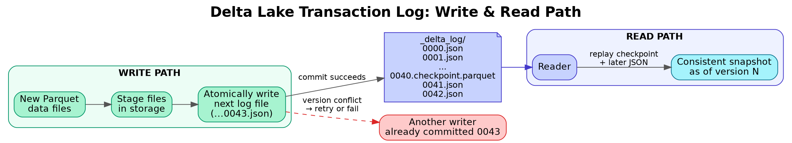
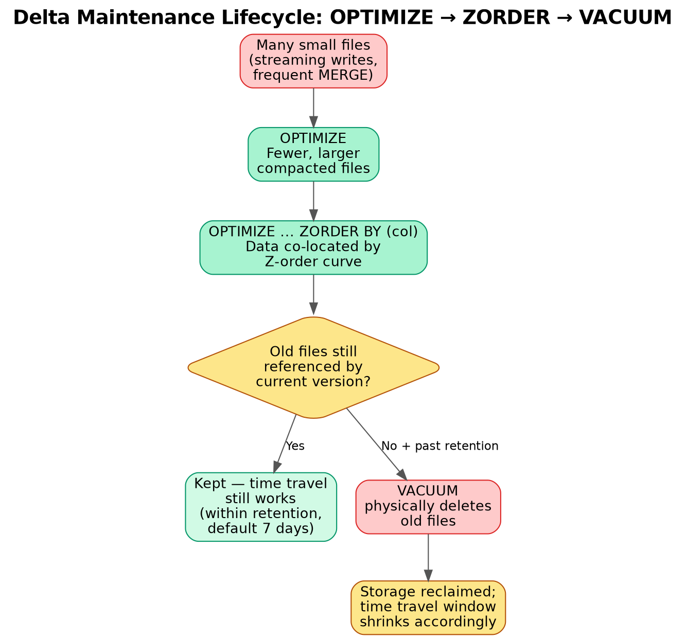

# 02. Delta Lake Fundamentals

## 1. What problem does Delta Lake solve?

Plain Parquet files on a data lake give you cheap, columnar storage but none of: ACID transactions, schema enforcement, safe concurrent writes, or the ability to see a consistent snapshot while a write is in progress. Delta Lake adds a **transaction log** on top of Parquet files to give data lakes warehouse-grade reliability without moving the data anywhere.

Delta Lake = **Parquet data files** + **`_delta_log/` transaction log (JSON + Parquet checkpoints)**.

## 2. The transaction log (`_delta_log`)

Every write to a Delta table creates a new JSON commit file in `_delta_log/`, numbered sequentially (`00000000000000000000.json`, `...0001.json`, ...). Each commit records **actions**: `add` (new file added), `remove` (file logically removed — not necessarily physically deleted yet), `metaData` (schema/partitioning changes), `protocol` (feature version requirements), `commitInfo`.

- The **current state of the table** = replay of all commits from the start (or from the last checkpoint) — i.e., a Delta table is really a materialized view over its log.
- Every 10 commits (by default), Databricks writes a **checkpoint** — a Parquet snapshot of the log state — so readers don't have to replay thousands of JSON files from scratch.
- This log is what makes **ACID transactions** possible: a writer only "commits" by successfully writing the next sequential log file, which uses the underlying storage's atomic put-if-absent (or a Databricks-managed commit coordinator on Unity Catalog-enabled storage) to prevent two writers from claiming the same version number — this is how Delta gets **optimistic concurrency control**.



*Diagram: a write only counts once its JSON commit file lands in `_delta_log/` — this single atomic step is where Delta gets atomicity and optimistic concurrency (see Scenario 1: two writers racing for the same version number).*

## 3. ACID guarantees, explained concretely

- **Atomicity** — a write either fully appears in the log (all its `add` actions) or not at all; readers never see a half-written batch.
- **Consistency** — schema enforcement and constraints keep the table in a valid state.
- **Isolation** — readers always see a consistent **snapshot** as of a specific log version, even while a writer is mid-write. Concurrent writers use optimistic concurrency: both proceed assuming no conflict, and if they'd conflict (e.g. both trying to write commit version 43), one wins and the other retries against the new state or fails.
- **Durability** — once committed, the log entry (and its Parquet files) persist in cloud storage same as any other object.

## 4. Time Travel

Because the log records every version, you can query historical state:

```sql
SELECT * FROM sales VERSION AS OF 12;
SELECT * FROM sales TIMESTAMP AS OF '2026-08-01T00:00:00Z';
```

```python
df = spark.read.format("delta").option("versionAsOf", 12).load("/path/to/sales")
```

Time travel depth is limited by the log retention (`delta.logRetentionDuration`, default 30 days) and the underlying data file retention, which is what `VACUUM` cleans up (see below) — so time travel windows shrink after aggressive VACUUM.

## 5. Schema Enforcement & Schema Evolution

- **Schema enforcement (default):** a write with mismatched columns/types is rejected outright — protects against silently corrupting a table with a malformed upstream feed.
- **Schema evolution (opt-in):** `.option("mergeSchema", "true")` on write, or `spark.databricks.delta.schema.autoMerge.enabled` — allows new columns to be added automatically. Use deliberately, not by default, or you lose the protection schema enforcement gives you.

## 6. MERGE INTO (upserts)

The core primitive for incremental/CDC-style loading:

```sql
MERGE INTO target t
USING updates u
ON t.id = u.id
WHEN MATCHED THEN UPDATE SET *
WHEN NOT MATCHED THEN INSERT *
WHEN NOT MATCHED BY SOURCE THEN DELETE;
```

This is how you implement upserts, SCD Type 1/2, and streaming CDC merges without manually diffing datasets.

## 7. OPTIMIZE, Z-ORDER, and VACUUM (the maintenance trio)

- **`OPTIMIZE table`** — compacts many small files into fewer, larger files (small-file problem is Delta's #1 real-world performance killer, especially from streaming writes or frequent MERGE).
- **`OPTIMIZE table ZORDER BY (col)`** — co-locates related data within files by the Z-order curve on the given column(s), so predicate pushdown / data skipping via file statistics can skip far more files for filters on that column.
- **`VACUUM table [RETAIN n HOURS]`** — physically deletes data files no longer referenced by the current log (i.e., files marked `remove` and older than the retention threshold, default 7 days). This is what actually frees storage — until VACUUM runs, "deleted" data is still sitting in cloud storage (which is also *why* time travel works).

⚠️ Interview trap: running `VACUUM` with a very short retention (or `RETAIN 0 HOURS`) while a long-running query or streaming job is still reading old files can break that job — always know the retention implications before vacuuming aggressively.



*Diagram: OPTIMIZE and ZORDER are performance operations (compaction + data skipping); VACUUM is the separate, storage-reclaiming operation that trades away time-travel depth once it runs — see Scenario 2 for the cost/retention tradeoff.*

## 8. Delta table types

- **Managed table** — Databricks manages both metadata and the underlying data files; `DROP TABLE` deletes the data too.
- **External (unmanaged) table** — Databricks manages only metadata; data lives at a path you specify and survives `DROP TABLE`.

## 9. Why Delta over plain Parquet — the interview one-liner

"Parquet gives you columnar storage; Delta gives you a transaction log on top of Parquet, which is what turns a folder of files into something you can safely write to concurrently, evolve the schema of, time-travel through, and upsert into — all guarantees a data warehouse gives you, but on cheap object storage."
