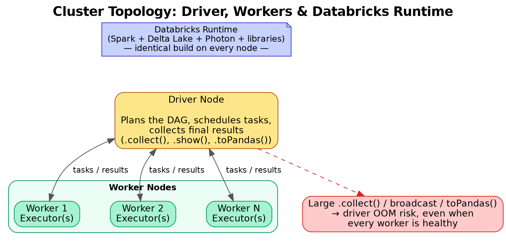

# 03. Clusters, Compute & Databricks Runtime

## 1. What a "cluster" actually is

A Databricks cluster is a set of Azure VMs (one **driver** + zero or more **workers**) running a coordinated Spark application, provisioned and torn down by the Databricks control plane but billed as VMs in *your* Azure subscription (see Topic 01 for the control/data plane split). Every cluster runs a specific **Databricks Runtime (DBR)** version — a curated, performance-tuned distribution of Apache Spark plus Delta Lake, common libraries, and (optionally) GPU drivers, all pre-integrated and regression-tested by Databricks.

## 2. Driver vs. Worker

- **Driver node** — runs the Spark driver process: parses your code, builds the DAG of stages/tasks, schedules work onto executors, and collects final results (e.g. `.collect()`, `.show()`). Under-sizing the driver is a very common, very avoidable production failure — anything that pulls large amounts of data back to the driver (broad `.collect()`, huge broadcast joins, driver-side pandas conversion) can OOM the driver even when workers are healthy.
- **Worker nodes** — each runs one or more **executors**, JVM processes that actually execute tasks and hold cached/shuffled data in memory/disk.

*Diagram: the driver coordinates the job graph; workers execute tasks. Databricks Runtime is the software layer (Spark + Delta + Photon + libraries) that ships identically to every node in the cluster.*

## 3. Databricks Runtime (DBR) variants

- **Standard DBR** — Spark + Delta Lake + common connectors, general-purpose data engineering.
- **DBR for ML** — adds pre-installed ML frameworks (scikit-learn, TensorFlow, PyTorch, XGBoost), MLflow, Horovod for distributed training.
- **Photon-enabled runtime** — enables the native vectorized engine (see Topic 01) for eligible SQL/DataFrame operators.
- **LTS (Long-Term Support) releases** — the versions Databricks recommends for production; get extended maintenance/security patches, so you're not forced to upgrade every few months.

Rule of thumb for interviews: pin production jobs to a specific **LTS** DBR version rather than "latest," and upgrade deliberately through a lower environment first — a runtime bump can subtly change shuffle/AQE default behavior.

## 4. Cluster sizing & autoscaling

- **Fixed-size cluster** — you specify worker count explicitly; predictable cost, but wastes money if the workload is bursty or fails if it's under-provisioned for a spike.
- **Autoscaling cluster** — you set a min/max worker range; Databricks adds/removes workers based on pending task backlog. Scale-up is generally fast; scale-down is conservative (Databricks waits to confirm a worker is truly idle before removing it, to avoid losing shuffle data needed by another task).
- **Autoscaling and shuffle**: removing a worker mid-job risks losing shuffle files that worker held, forcing recomputation — this is why autoscaling is more effective for read-heavy/ETL-with-natural-stage-boundaries workloads than for jobs with one enormous, tightly-coupled shuffle stage.

## 5. Node types & VM family choice

Pick the underlying Azure VM SKU based on workload shape:

- **Memory-optimized (`E-series`)** — wide joins, large shuffles, caching-heavy workloads.
- **Compute-optimized (`F-series`)** — CPU-bound transformations, less memory pressure.
- **General purpose (`D-series`)** — default/balanced choice for mixed ETL.
- **GPU-enabled (`NC`/`ND`-series)** — deep learning training/inference.
- **Storage-optimized** — workloads needing large local NVMe for shuffle spill or Delta caching.

## 6. Cluster policies

Admin-defined JSON templates that constrain what users can configure when creating a cluster (max node count, allowed VM types, forced auto-termination, enforced tags for cost allocation). This is the standard governance lever for controlling cost sprawl across a team — instead of trusting every engineer to remember to set auto-termination, the policy enforces it.

## 7. Auto-termination & pools

- **Auto-termination** — an idle timeout (e.g., 30-60 min) after which an all-purpose cluster shuts down automatically; the single biggest lever against "someone left a cluster running over the weekend" cost bleed.
- **Instance/Cluster Pools** — a set of pre-warmed, idle VMs Databricks keeps ready so a new cluster can attach to already-running instances instead of provisioning fresh Azure VMs — cuts cluster startup from minutes to seconds, at the cost of paying for the idle pool capacity.

## 8. Spark configuration essentials you should be able to speak to

- **`spark.sql.shuffle.partitions`** — controls parallelism after a shuffle (default 200); too low under-utilizes a big cluster, too high creates excessive small tasks/files. Adaptive Query Execution (AQE) can auto-coalesce this at runtime in modern DBR.
- **Adaptive Query Execution (AQE)** — dynamically re-optimizes the query plan mid-execution based on actual runtime statistics: coalescing shuffle partitions, converting sort-merge joins to broadcast joins when a table turns out smaller than expected, and handling skewed joins by splitting oversized partitions.
- **Dynamic allocation** — lets Spark request/release executors within a cluster based on workload, distinct from cluster-level autoscaling (which adds/removes whole VMs).
