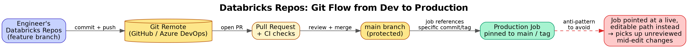

# 04. Notebooks, Languages, Repos & Databricks CLI

## 1. Notebooks as the primary dev surface

A Databricks notebook is a sequence of cells (code or markdown) attached to a cluster at runtime. Key properties that come up in interviews:

- **Multi-language per notebook** — the notebook has a default language, but any cell can override it with a magic command: `%python`, `%sql`, `%scala`, `%r`, `%sh` (shell on the driver node), `%fs` (DBFS filesystem shorthand), `%md` (markdown).
- **Notebook-scoped variables and the `spark`/`dbutils` globals** — Databricks auto-injects a `SparkSession` as `spark` and a helper API as `dbutils` (widgets, secrets, filesystem operations, notebook chaining via `dbutils.notebook.run`).
- **REPL state persists per attached cluster** — variables/imports survive across cell re-runs until the cluster is detached/restarted, which is a common source of "works in notebook, fails in job" bugs (stale state a fresh job run wouldn't have).

## 2. `dbutils` — what it's actually for

- `dbutils.widgets` — parameterize a notebook (e.g., a `run_date` text widget) so the same notebook can be triggered by a job with different inputs.
- `dbutils.secrets.get(scope, key)` — pull a secret from a Databricks-backed secret scope or an Azure Key Vault-backed scope, without ever hardcoding credentials in notebook source.
- `dbutils.fs` — filesystem operations against DBFS/mounted storage (`ls`, `cp`, `mv`, `rm`, `mounts`).
- `dbutils.notebook.run(path, timeout, params)` — invoke another notebook as a sub-step and get its return value; the historical way to "chain" notebooks before Workflows/Jobs became the standard orchestration primitive.

## 3. Repos — git integration

Databricks Repos clones a git repository (GitHub/Azure DevOps/GitLab/Bitbucket) directly into the workspace, so notebooks and supporting `.py` files can be version-controlled like normal source code rather than living only inside the proprietary notebook format.

*Diagram: a developer's local git workflow and Databricks Repos both point at the same remote — Repos is a checked-out working copy inside the workspace, not a separate source of truth.*

- Enables **branching workflows** — a data engineer creates a feature branch inside Repos, edits notebooks, commits, opens a PR, same as any other codebase.
- **Arbitrary files support** — Repos can contain non-notebook files (`.py` modules, `requirements.txt`, `.yml` configs), enabling notebooks to `import` shared Python modules checked into the same repo instead of duplicating logic across notebooks with `%run`.
- Production jobs should reference a **specific commit/tag/branch** of a Repo rather than a live-editable path, so a mid-edit save by a developer can't silently change what a running production job executes.

## 4. `%run` vs. modular imports vs. Workflow task dependencies

- **`%run ./helpers`** — textually includes another notebook's cells into the current notebook's context; simplest but couples notebooks tightly and doesn't version cleanly as "real" code.
- **Python module imports from a Repo** — treat shared logic as an installable/importable package; the interview-favored answer for "how do you avoid code duplication across notebooks" in a mature setup.
- **Workflow multi-task jobs with task dependencies** — the orchestration-level way to chain notebooks/scripts as separate, independently retryable steps (see Topic 10), as opposed to `dbutils.notebook.run` calls buried inside a single notebook.

## 5. Databricks CLI & REST API

The CLI (`databricks configure --token`, then commands like `databricks workspace`, `databricks clusters`, `databricks jobs`, `databricks fs`) wraps the same REST API the UI uses — this is what enables automation: scripting workspace imports/exports, triggering jobs from external schedulers, or driving cluster lifecycle from CI/CD pipelines. Modern tooling increasingly wraps this further with **Databricks Asset Bundles (DABs)** — a declarative YAML way to define jobs/pipelines/clusters as code and deploy them via CLI (`databricks bundle deploy`), which is where CLI usage intersects with CI/CD (see Topic 15).

## 6. Authentication basics worth knowing

- **Personal Access Tokens (PAT)** — simplest, tied to a user identity; not ideal for production automation since it inherits that user's permissions and expires/rotates with their account lifecycle.
- **Service Principals (Azure AD / Entra ID)** — the recommended identity for CI/CD pipelines, scheduled jobs, and any non-interactive automation; permissions are scoped and managed independently of any individual's account.
- **OAuth (U2M / M2M)** — modern token flows Databricks supports for both user-to-machine (CLI login) and machine-to-machine (service-to-service) authentication, reducing reliance on long-lived static PATs.
