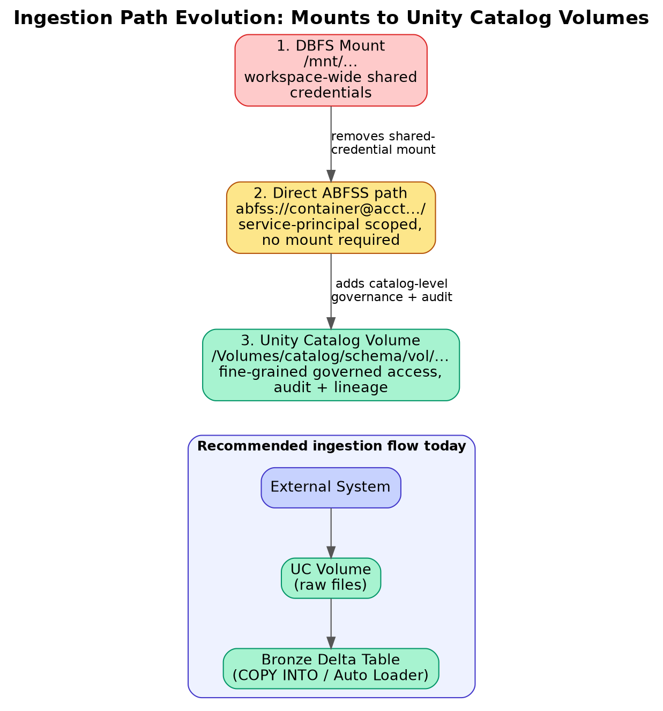

# 05. Data Ingestion Basics — DBFS, Mounts, Volumes, COPY INTO

## 1. The three generations of "how do I get files into Databricks"

Azure Databricks ingestion patterns have evolved through three generations, and interviewers often want you to know *why* the industry moved between them, not just the syntax of the current one.

1. **DBFS mounts (legacy)** — `dbutils.fs.mount()` attaches an ADLS Gen2 container to a path under `/mnt/...`, making cloud storage look like a local path. Simple, but credentials for the mount are often workspace-wide and not governed per-user — a well-known governance gap.
2. **Direct ABFSS paths** — reading directly via `abfss://container@account.dfs.core.windows.net/path` with credentials scoped through a service principal or (better) Unity Catalog storage credentials — no mount required, avoids the shared-mount governance problem.
3. **Unity Catalog Volumes (current best practice)** — governed, catalog-registered file paths (`/Volumes/catalog/schema/volume/...`) with the same fine-grained access control, audit logging, and lineage as UC-governed tables, but for non-tabular files (images, PDFs, arbitrary raw files, ML model artifacts).



*Diagram: each generation solves a governance gap in the previous one — mounts have workspace-wide shared credentials, direct ABFSS paths still bypass catalog-level governance, Volumes bring file access under the same UC permission model as tables.*

## 2. Batch ingestion: `COPY INTO`

`COPY INTO` is Databricks' idempotent, SQL-native bulk-load command — the simplest way to load new files from cloud storage into a Delta table without hand-rolling incremental logic:

```sql
COPY INTO my_catalog.my_schema.orders
FROM 'abfss://raw@mystorageacct.dfs.core.windows.net/orders/'
FILEFORMAT = JSON
COPY_OPTIONS ('mergeSchema' = 'true');
```

Key property: `COPY INTO` tracks which files it has already loaded (via internal metadata), so re-running the same command doesn't reload or duplicate previously-ingested files — this idempotency is what makes it safe to schedule on a simple recurring basis rather than needing custom "have I seen this file" bookkeeping.

`COPY INTO` is best suited for periodic batch loads from a relatively small/bounded number of new files per run; it doesn't scale as gracefully to very high-frequency, high-file-count streaming-style ingestion — that's where Auto Loader (below, and covered in depth in Topic 09) takes over.

## 3. Auto Loader — the modern default for file-based ingestion

`cloudFiles` (Auto Loader) is Databricks' structured-streaming-based ingestion source purpose-built for incrementally and efficiently processing new files landing in cloud storage:

```python
df = (spark.readStream
      .format("cloudFiles")
      .option("cloudFiles.format", "json")
      .option("cloudFiles.schemaLocation", "/Volumes/catalog/schema/checkpoints/orders_schema")
      .load("abfss://raw@mystorageacct.dfs.core.windows.net/orders/"))

(df.writeStream
   .option("checkpointLocation", "/Volumes/catalog/schema/checkpoints/orders_ckpt")
   .trigger(availableNow=True)
   .toTable("my_catalog.my_schema.orders_bronze"))
```

- **File discovery**: Auto Loader can use either directory listing (simple, fine for lower file volumes) or **file notification mode** (subscribes to Azure Event Grid/Queue Storage notifications for new blob arrivals) — the latter scales far better for very high file-arrival-rate scenarios since it avoids repeatedly re-listing a large directory tree.
- **`trigger(availableNow=True)`** runs it as a batch-like job that processes everything currently available then stops — a common pattern for scheduling Auto Loader inside a Workflow rather than running it as an always-on streaming job, when near-real-time latency isn't required.
- **Schema inference & evolution**: Auto Loader can infer schema from sample files and evolve it automatically as new columns appear, tracking schema history in the `cloudFiles.schemaLocation` path — this is genuinely one of its biggest practical advantages over hand-rolled ingestion.

## 4. `COPY INTO` vs. Auto Loader — the interview decision table

| | `COPY INTO` | Auto Loader (`cloudFiles`) |
|---|---|---|
| Best for | Periodic batch loads, smaller/bounded file counts | Continuous or high-volume/high-frequency file arrival |
| Interface | Pure SQL | Structured Streaming (Python/Scala/SQL via DLT) |
| File tracking | Internal metadata, simple | Checkpoint-based, supports file notification mode at scale |
| Schema evolution | Supported via `mergeSchema` option | Native, more robust, with schema history tracking |
| Typical use | Ad hoc/simple recurring loads, smaller teams/pipelines | Production bronze-layer ingestion at scale |

## 5. Where Unity Catalog Volumes fit into ingestion design

Land raw files into a Volume (governed, auditable) rather than an ungoverned mount or ad hoc storage path, then have Auto Loader or `COPY INTO` read from that Volume into a bronze Delta table. This gives a clean, fully-governed lineage: **external system → Volume (raw files, access-controlled) → bronze Delta table (Auto Loader/COPY INTO) → silver/gold** — every hop auditable through Unity Catalog rather than only the final table being governed while the raw landing zone is a free-for-all.
