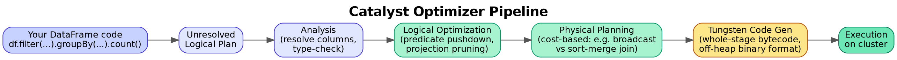

# 06. Apache Spark Core — RDDs, DataFrames, Catalyst & Tungsten

## 1. The layers: RDD → DataFrame/Dataset → SQL

Spark exposes three APIs over the same underlying execution engine, from lowest-level to highest:

- **RDD (Resilient Distributed Dataset)** — the original abstraction: an immutable, partitioned collection of objects distributed across the cluster, with no built-in schema awareness. You write imperative transformations (`map`, `filter`, `reduceByKey`); Spark has no idea what's *inside* the objects, so it can't optimize based on structure.
- **DataFrame** — a distributed collection of rows with a known **schema** (column names + types). Because Spark knows the structure, it can apply the **Catalyst optimizer** to your query before ever running it.
- **Dataset** (Scala/Java only, not really used in PySpark) — adds compile-time type safety on top of DataFrames.

Interview framing: DataFrames aren't "RDDs with extra syntax" — the schema awareness is what unlocks an entire optimization layer (Catalyst) that plain RDDs structurally cannot benefit from, which is why virtually all modern PySpark code should be DataFrame-based, reaching for RDDs only for rare low-level control needs.

## 2. Catalyst optimizer — what happens between your code and execution

```python
df.filter(df.status == "active").groupBy("region").count()
```

This line doesn't execute immediately (Spark is **lazy**) — it builds a **logical plan**, which Catalyst then transforms through four phases:

1. **Analysis** — resolve column/table references against the catalog, check types.
2. **Logical optimization** — apply rule-based rewrites: predicate pushdown (push the `filter` as close to the data source as possible so less data is read), constant folding, projection pruning (only read columns actually needed downstream).
3. **Physical planning** — generate one or more physical plans (e.g., choosing a join strategy: broadcast hash join vs. sort-merge join) and pick the cheapest based on cost estimates.
4. **Code generation** — Catalyst generates optimized JVM bytecode directly for the chosen physical plan (whole-stage code generation), avoiding the overhead of generic interpreted execution.



*Diagram: your DataFrame code becomes an unresolved logical plan, gets resolved and rule-optimized, then cost-based physical planning picks an execution strategy before Tungsten-generated bytecode actually runs.*

## 3. Tungsten — the memory/CPU efficiency layer underneath Catalyst

Tungsten is Spark's engine for efficient in-memory data representation and CPU-efficient execution: it stores data in a compact binary format (off-heap where possible) instead of as JVM objects, avoiding garbage-collection overhead and enabling cache-friendly, whole-stage code-generated execution. Photon (Topic 01) can be thought of as Databricks' further evolution of this idea — a native-code (not JVM) execution engine for the same optimized physical plans.

## 4. Transformations vs. Actions, and why laziness matters

- **Transformations** (`select`, `filter`, `join`, `groupBy`, `withColumn`) — lazily build up the logical plan; nothing actually runs.
- **Actions** (`.collect()`, `.count()`, `.show()`, `.write`) — trigger actual execution of the accumulated plan.

Why this matters practically: because nothing executes until an action, Spark can see your *entire* chain of transformations at once and optimize globally (e.g., pushing a late filter earlier) — this is fundamentally different from an eager, row-by-row processing model, and it's why inserting `.count()` calls "just to check progress" in the middle of a pipeline is a real anti-pattern — each one forces a full, separate execution of everything before it.

## 5. Wide vs. narrow transformations, and why it matters for performance

- **Narrow transformation** (`filter`, `map`, `select`) — each output partition depends on only one input partition; no data movement across the cluster required.
- **Wide transformation** (`groupBy`, `join`, `distinct`, `repartition`) — output partitions depend on data from multiple input partitions, requiring a **shuffle**: data physically moves across the network between executors.

Shuffles are the single most expensive operation category in Spark (network I/O + disk I/O for spilled data + serialization overhead) — nearly every serious Spark performance question eventually traces back to "how do we reduce or better manage a shuffle," which is exactly what Topic 13 (Performance Tuning) goes deep on.

## 6. Partitions — the actual unit of parallelism

A DataFrame is split into partitions distributed across executors; the number of partitions determines the maximum parallelism available for a stage. Too few partitions underutilizes a large cluster (some executors sit idle); too many creates excessive small-task scheduling overhead. This is the same underlying concept behind `spark.sql.shuffle.partitions` (Topic 03) and behind the small-file problem in Delta (Topic 02) — file count on disk and in-memory partition count are related but distinct ideas worth being able to clearly separate in an interview answer.
