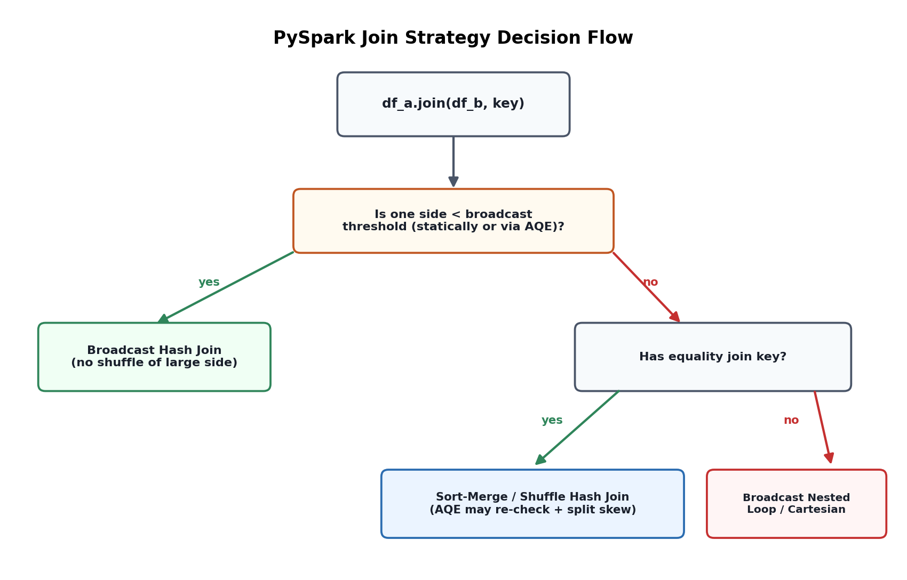

# 07. PySpark Transformations, Joins & Partitioning Strategy

## 1. Transformations, revisited with an eye on cost

Topic 06 drew the line between narrow transformations (`select`, `filter`, `withColumn`) and wide transformations (`groupBy`, `join`, `distinct`, `repartition`) based on whether they require a shuffle. This topic goes one level deeper: given that shuffles are unavoidable for most real pipelines, how do you choose *which* wide operation, *how* to partition before it, and *which join strategy* Spark should use — because these choices routinely produce 10x+ runtime differences on the same data and cluster.

## 2. Join strategies Spark can pick

Spark's Catalyst optimizer chooses among several physical join implementations based on data size, join keys, and configuration:

- **Broadcast Hash Join** — the smaller side is fully copied to every executor, so the larger side is scanned once with zero shuffle. This is the fastest option whenever one side genuinely fits in memory (default threshold `spark.sql.autoBroadcastJoinThreshold`, 10MB by default, commonly raised to 100MB+ for dimension tables).
- **Sort-Merge Join (SMJ)** — the default fallback for large-large joins: both sides are shuffled on the join key, sorted within each partition, then merged. Reliable but pays full shuffle cost on both sides.
- **Shuffle Hash Join** — builds an in-memory hash table per partition instead of sorting; can beat SMJ when one side is moderately smaller but still too large to broadcast, though it's more memory-sensitive and less commonly forced explicitly.
- **Broadcast Nested Loop / Cartesian Join** — the fallback when there's no equality join key (e.g., range joins, `<`/`>` conditions); expensive and usually a sign the query should be restructured.

Interview framing: the question "why is my join slow" almost always reduces to "which of these four is actually running, and is that the right one for this data shape" — check the physical plan (`df.explain()`) rather than guessing.

## 3. `repartition()` vs `coalesce()` — not interchangeable

- **`repartition(n)`** — triggers a full shuffle to redistribute data into exactly `n` partitions, evenly. Use when you need to *increase* partition count, or need an even distribution before a downstream wide operation (e.g., repartitioning by join key before a large join to avoid skew).
- **`coalesce(n)`** — merges existing partitions without a full shuffle (no network round-trip for most cases), only able to *decrease* partition count. Use after a heavy filter that leaves many small partitions, or before a write to control output file count cheaply.
- Calling `coalesce()` to reduce to very few partitions on a large dataset can create its own bottleneck: fewer partitions means fewer concurrent write tasks, so an aggressive `coalesce(1)` on a large DataFrame trades parallelism for a single huge output file — usually the wrong trade unless a downstream system genuinely needs one file.

## 4. Partitioning strategy: in-memory partitions vs. on-disk partitioning

These are two related but distinct concepts that are easy to conflate in an interview answer:

- **In-memory/shuffle partitioning** — controlled by `spark.sql.shuffle.partitions` (200 by default) and `repartition()`/`coalesce()`; determines task parallelism during a job.
- **On-disk partitioning** — `df.write.partitionBy("year", "month")` physically splits output into a directory hierarchy (`year=2026/month=08/...`), enabling partition pruning on read (a query filtering `WHERE year = 2026` skips reading other years' files entirely).

Choosing a disk partition column is a design decision with real consequences: partition by a column with too many distinct values (e.g., `customer_id`) and you create the small-file problem — thousands of tiny partition directories, each with a handful of rows, which kills read performance from file-open overhead alone. The standard guidance is to partition by low-to-medium cardinality columns that match common filter predicates (date is the classic choice), and to keep target file size roughly in the 128MB–1GB range regardless of partition scheme.

## 5. Skew-aware repartitioning

When one join key or group-by key dominates (Topic 06, Scenario 2), pre-emptively repartitioning by that key doesn't fix skew — it just moves the same imbalance earlier. Two practical techniques instead:

- **Key salting** — append a random integer suffix (e.g., `0`–`9`) to the skewed key on both sides of a join, effectively splitting one hot key into ten synthetic sub-keys processed by different tasks, then aggregating the partial results back together.
- **AQE skew join optimization** (`spark.sql.adaptive.skewJoin.enabled`, on by default on current DBR) — Spark detects oversized shuffle partitions at runtime and automatically splits them into smaller sub-partitions before the join, handling the common case without manual salting.

## 6. `explain()` — reading the plan instead of guessing

`df.explain(True)` (or `mode="formatted"`) prints the logical and physical plan. The two things worth scanning for first in almost any performance question: which join type appears (`BroadcastHashJoin` vs `SortMergeJoin`), and how many `Exchange` (shuffle) nodes appear in the physical plan — each `Exchange` is a shuffle boundary and a candidate for elimination or reduction.

*Diagram: how Spark's optimizer chooses a join strategy based on table size relative to the broadcast threshold, and where AQE re-evaluates that choice at runtime using actual shuffle statistics instead of only static estimates.*
