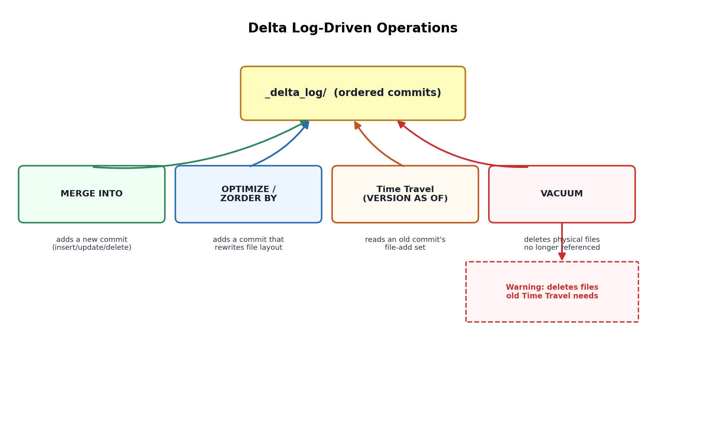

# 08. Delta Lake Advanced — Time Travel, MERGE, OPTIMIZE, VACUUM, Z-Ordering

## 1. Recap: why any of this is possible

Topic 02 established that a Delta table is a set of Parquet files plus a transaction log (`_delta_log/`) of ordered, atomic JSON/checkpoint commits, each describing which files were added or removed. Every feature in this topic is really just a different query or operation *over that log*, which is worth stating explicitly in an interview — it reframes "advanced Delta features" as consequences of one design decision rather than a list of unrelated tricks.

## 2. Time Travel — querying a previous version

Because the log records every version as an immutable set of file-add/remove operations, and old data files aren't deleted until `VACUUM` runs, Delta can reconstruct the table exactly as it existed at any past version or timestamp:

```sql
SELECT * FROM sales VERSION AS OF 12;
SELECT * FROM sales TIMESTAMP AS OF '2026-08-01';
```

```python
spark.read.format("delta").option("versionAsOf", 12).load(path)
```

Practical uses: auditing what changed and when, recovering from a bad write (`RESTORE TABLE sales TO VERSION AS OF 12`), and reproducing an ML training run against the exact data snapshot it was trained on. The retention window is bounded by `delta.logRetentionDuration` (log metadata, default 30 days) and, critically, by whether the underlying data files still exist — which is exactly what `VACUUM` threatens (Section 5).

## 3. MERGE — upsert semantics as a single atomic operation

`MERGE INTO` is Delta's mechanism for combining insert/update/delete logic against a target table based on a join condition with a source, in one atomic transaction:

```sql
MERGE INTO target t
USING source s
ON t.id = s.id
WHEN MATCHED AND s.is_deleted THEN DELETE
WHEN MATCHED THEN UPDATE SET *
WHEN NOT MATCHED THEN INSERT *
```

This single statement replaces what would otherwise require reading the target, computing a diff, and issuing separate insert/update/delete operations non-atomically — MERGE is what makes SCD Type 2 patterns (ADF Topic 15 covers this from the pipeline side) and CDC-based upserts practical at scale. Interview point worth making: MERGE still triggers a shuffle/join under the hood (it's matching source against target rows), so it inherits every join-performance concern from Topic 07 — an unpartitioned or poorly-clustered target table makes MERGE scan far more data than necessary.

## 4. OPTIMIZE — compacting small files

Frequent small writes (streaming micro-batches, frequent MERGE operations) leave a table with many small files, which hurts read performance (Topic 07, Scenario 1). `OPTIMIZE table_name` runs bin-packing compaction: it rewrites a set of small files into fewer, well-sized ones (target ~1GB by default, tunable), without changing the table's logical content — it's purely a physical layout operation, recorded as its own commit in the log.

```sql
OPTIMIZE sales WHERE event_date >= '2026-08-01';
```

Scoping with a `WHERE` clause (when the table is partitioned) avoids paying to re-compact old, already-optimized partitions on every run.

## 5. Z-Ordering — multi-dimensional data clustering

`OPTIMIZE ... ZORDER BY (col1, col2)` goes further than plain compaction: it colocates related values within the same files using a space-filling curve technique, so that files can be more effectively skipped (via Delta's file-level min/max statistics) when a query filters on the Z-ordered columns. Z-ordering is most valuable on high-cardinality columns that are frequently filtered but *not* used as the on-disk partition column (partitioning already handles the low-cardinality, coarse-grained case; Z-order handles finer-grained skipping within partitions).

```sql
OPTIMIZE sales ZORDER BY (customer_id);
```

Trade-off to state clearly: Z-ordering is a write-heavy operation (it rewrites data), so it's run periodically (e.g., nightly) rather than after every micro-batch — it's a maintenance operation, not a per-write step.

## 6. VACUUM — reclaiming space, and the danger it introduces

`VACUUM table_name [RETAIN n HOURS]` physically deletes data files no longer referenced by the current table version *and* older than the retention threshold (default 7 days, enforced by a safety check that blocks shorter retention unless explicitly overridden). This is necessary because Delta never overwrites files in place — every write, MERGE, and OPTIMIZE creates new files and marks old ones as removed in the log, but the actual bytes stay on disk until VACUUM runs.

The direct trade-off with Section 2: VACUUM deletes exactly the files that Time Travel depends on for versions older than the retention window. Running `VACUUM ... RETAIN 0 HOURS` (bypassing the safety check) or setting an aggressively short retention period can silently break Time Travel queries and any concurrent long-running read that started against an older snapshot — this is one of the most commonly tested "what could go wrong" Delta questions.



*Diagram: all five operations read from or write to the same transaction log — MERGE and OPTIMIZE add new commits, Time Travel reads old commits, and VACUUM is the one operation that removes the physical files those old commits depend on.*
