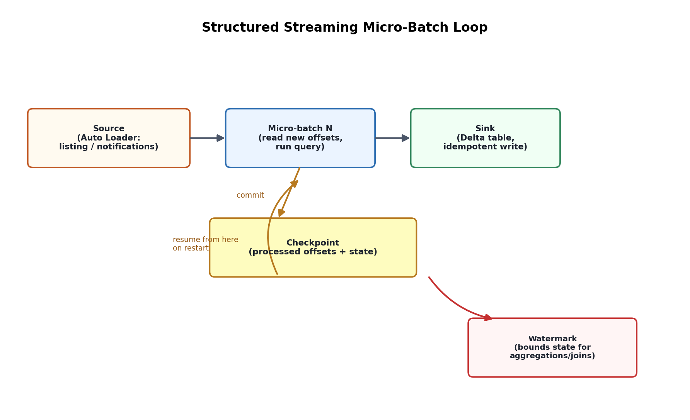

# 09. Structured Streaming & Auto Loader

## 1. The core model: a stream is an unbounded table

Structured Streaming's foundational idea is that a streaming DataFrame is conceptually the same as a batch DataFrame — an unbounded table that new rows keep getting appended to — and the *same* DataFrame/SQL operations (`select`, `filter`, `groupBy`, joins) apply to both. Spark internally processes a stream as a series of small batch jobs (**micro-batches**) or, since Spark 3.x, optionally with **Continuous Processing** for sub-millisecond latency on a narrower set of supported operations. Micro-batch is the default and by far the most commonly used mode in practice, including on Databricks.

```python
stream_df = spark.readStream.format("delta").load(source_path)
query = (stream_df.groupBy("region").count()
         .writeStream.format("delta")
         .outputMode("complete")
         .option("checkpointLocation", checkpoint_path)
         .start(sink_path))
```

## 2. Checkpointing — how Structured Streaming achieves exactly-once

Every streaming query writes a **checkpoint** (offsets processed so far, plus operator state for stateful operations) to a durable location. On restart after a failure, Spark reads the checkpoint and resumes exactly where it left off, re-processing only what wasn't yet committed — this is what makes Structured Streaming exactly-once *end-to-end* when paired with an idempotent, transactional sink like Delta (Delta's own transaction log deduplicates against the checkpoint's tracked offsets). Losing or corrupting the checkpoint directory is one of the most operationally serious mistakes possible with a streaming job — it forces either reprocessing from the beginning (if the source retains full history) or manually resetting to a chosen starting offset, and in the interim the pipeline is down.

## 3. Output modes

- **Append** — only new rows since the last trigger are written to the sink; used for simple ingestion/transformation pipelines with no aggregation, or aggregations with watermarking (Section 5).
- **Complete** — the entire updated result table is rewritten to the sink every trigger; only feasible for aggregations small enough to fully materialize each time (e.g., a dashboard-sized rollup).
- **Update** — only rows that changed since the last trigger are written; common for aggregations where you want incremental updates without rewriting the full result.

## 4. Auto Loader (`cloudFiles`) — incremental file ingestion at scale

Auto Loader is Databricks' purpose-built source for incrementally ingesting new files landing in cloud storage (ADLS Gen2, S3, GCS), solving a problem that plain directory-listing-based streaming handles poorly at scale:

```python
df = (spark.readStream.format("cloudFiles")
      .option("cloudFiles.format", "json")
      .option("cloudFiles.schemaLocation", schema_path)
      .load(landing_path))
```

Two file-discovery modes:
- **Directory listing** — periodically lists the source directory for new files; simple but its cost grows with the number of files already present, and it can miss the "which files are actually new" distinction efficiently at very large scale.
- **File notification mode** — subscribes to cloud-native event notifications (e.g., ADLS Gen2 Event Grid) so new files are discovered via events rather than repeated listing; scales far better for landing zones with millions of files, at the cost of needing the cloud-side event infrastructure provisioned (Auto Loader can set this up automatically given the right permissions).

Auto Loader also provides **schema inference and evolution**: it infers a starting schema from a sample of files, persists it to the schema location, and can be configured (`cloudFiles.schemaEvolutionMode`) to handle new columns appearing in later files — either failing the stream so a human notices (`failOnNewColumns`, forcing a deliberate schema update) or adding new columns automatically (`addNewColumns`), which is the direct streaming analogue of ADF's schema drift handling (ADF Topic 14).

## 5. Watermarking — bounding state for streaming aggregations

Stateful streaming operations (aggregations, deduplication, stream-stream joins) need to keep some amount of state in memory/disk (via the state store) to handle late-arriving data correctly. Without a bound, that state would grow unboundedly forever. A **watermark** declares how late data is allowed to arrive before Spark gives up waiting and finalizes results for a given time window:

```python
stream_df.withWatermark("event_time", "10 minutes") \
    .groupBy(window("event_time", "5 minutes")) \
    .count()
```

This says: "once event time has advanced past a window's end by more than 10 minutes, that window's state can be dropped and its result considered final." Setting the watermark threshold is a real business trade-off — too short and genuinely late (but valid) data gets dropped from aggregations; too long and state grows large, increasing memory pressure and checkpoint size.

## 6. Trigger types — controlling how often micro-batches run

- **Default (as-fast-as-possible)** — starts a new micro-batch immediately after the previous one finishes.
- **Fixed interval** (`trigger(processingTime="1 minute")`) — runs a micro-batch on a schedule, useful for smoothing load.
- **`trigger(availableNow=True)`** — processes all currently available data as a series of micro-batches, then stops, behaving like an incremental batch job rather than an always-on stream; this is the standard pattern for scheduled (e.g., hourly, via Workflows — Topic 10) "streaming-style" incremental ingestion that doesn't need a 24/7 running cluster.
- **`trigger(once=True)`** — the older, single-micro-batch equivalent, largely superseded by `availableNow` which handles large backlogs more efficiently by splitting them into multiple micro-batches instead of one giant one.



*Diagram: each micro-batch reads new offsets from the source (Auto Loader tracking new files via listing or notifications), applies the query, writes to the sink, and commits the new offset plus any operator state to the checkpoint before the next trigger fires.*
