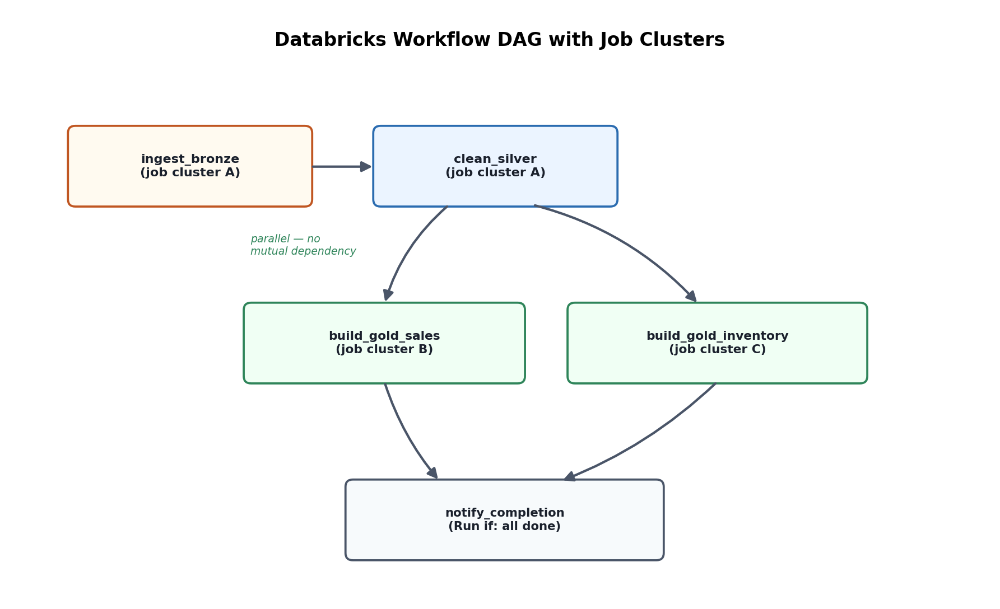

# 10. Databricks Workflows & Job Orchestration

## 1. What Workflows is, and where it sits relative to ADF

Databricks Workflows (formerly "Jobs") is Databricks' native orchestrator for scheduling and chaining tasks — notebooks, JARs, Python scripts, SQL queries, dbt projects, and `dlt` pipelines (Topic 20) — into multi-step, dependency-aware pipelines, with built-in retry, alerting, and cluster management. It's worth being precise in an interview about how this relates to Azure Data Factory: ADF is typically the orchestrator *across* systems (triggering a Databricks job as one activity alongside copy activities, other Azure services, and cross-system dependencies — see ADF Topic 13 on Databricks integration), while Workflows is the natural choice for orchestration *within* Databricks itself, especially when every step is Spark/SQL work that benefits from tight integration with cluster reuse, Unity Catalog lineage, and Databricks-native monitoring. Many real architectures use both: ADF as the top-level enterprise orchestrator, calling into a Databricks Workflow that internally manages a multi-task Spark pipeline.

## 2. Jobs, Tasks, and dependency graphs

A **Job** is the top-level scheduled unit; it contains one or more **Tasks**, each an individually configured unit of work (a notebook, a Python wheel, a SQL file, another job as a "job task", etc.). Tasks declare dependencies on other tasks within the same job, forming a DAG:

```
ingest_bronze  →  clean_silver  →  build_gold_sales
                                 →  build_gold_inventory
```

`build_gold_sales` and `build_gold_inventory` both depend only on `clean_silver` and have no dependency on each other, so Workflows runs them in parallel once `clean_silver` succeeds — this is the same DAG-based parallelism concept as ADF pipeline dependencies (ADF Topic 09), just expressed natively for Databricks tasks.

## 3. Job clusters vs. all-purpose clusters (cost and isolation)

- **Job cluster** — created fresh when the job run starts and terminated automatically when it finishes; billed at the lower Jobs Compute rate (vs. All-Purpose Compute), and each run gets a clean, isolated environment with no risk of leftover state or library conflicts from a previous run.
- **All-purpose (interactive) cluster** — a long-running, shared cluster typically used for ad-hoc notebook development; can be attached to a scheduled job too, but at the higher interactive compute rate and with shared-state risk (another user's notebook running on the same cluster).

The standard production guidance: use job clusters for scheduled production Workflows (cost efficiency + isolation), reserve all-purpose clusters for interactive development. Within a single multi-task job, tasks can also be configured to **share a job cluster** across tasks (avoiding per-task cluster startup latency) or use **separate clusters per task** (better isolation, useful when tasks have very different compute needs — e.g., a lightweight ingestion task vs. a memory-heavy ML training task).

## 4. Retries, timeouts, and conditional execution

Each task supports configurable retry policies (max retries, retry interval, exponential backoff) for transient failures — network blips, temporary source unavailability — without needing custom retry logic inside the notebook itself. Tasks can also be configured with **"Run if" conditions** (e.g., run only if all dependencies succeeded, or run even if a specific upstream task failed — useful for a cleanup/notification task that should fire regardless of pipeline outcome), which is the Workflows equivalent of ADF's activity dependency conditions (Success/Failure/Completion/Skipped, ADF Topic 09).

## 5. Parameters and reusable jobs

Jobs and tasks accept parameters (widget values passed into a notebook, or command-line arguments for a script), enabling the same metadata-driven pattern covered in ADF Topic 08: one parameterized job definition, triggered multiple times with different parameter sets (e.g., once per source table, per business unit, or per environment), rather than duplicating job definitions per variant. Databricks Asset Bundles (Topic 15) build on this further by making job definitions themselves version-controlled, parameterized-per-environment code rather than UI-configured objects.

## 6. Triggers and monitoring

Jobs can be triggered on a **cron schedule**, on **file arrival** (a new file landing in a specified storage location — the job-trigger analogue of Auto Loader's continuous ingestion, but for scheduled rather than always-on processing), on **another job's completion** (chaining jobs across teams/domains), or via the **REST API** (for external orchestrators, like an ADF pipeline, to kick off a Databricks Workflow and poll for completion). Run history, per-task duration, and failure alerts (email, Slack, PagerDuty webhook) are built in, giving basic observability without needing a separate orchestration/monitoring tool bolted on — though larger organizations often still centralize alerting through a broader observability stack (Topic 21).



*Diagram: a multi-task job DAG where two Gold-layer tasks fan out in parallel from a shared Silver dependency, each task optionally running on its own job cluster sized for its specific workload.*
