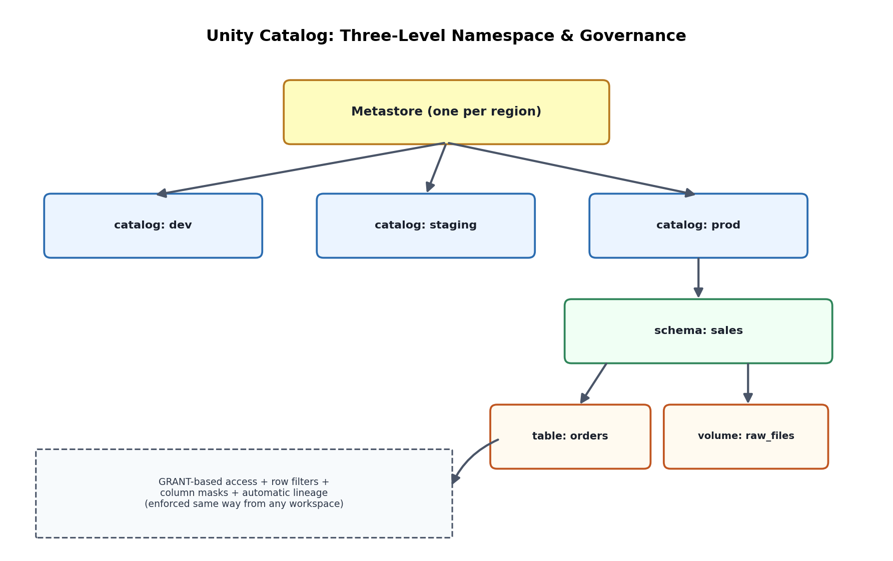

# 11. Unity Catalog & Data Governance

## 1. Why Unity Catalog exists — the problem before it

Before Unity Catalog, Databricks workspaces each had their own isolated metastore — permissions, table definitions, and access controls were scoped per-workspace, so an organization with multiple workspaces (dev/staging/prod, or per-business-unit workspaces) had no single place to define "who can read this table" consistently, no cross-workspace data lineage, and inconsistent audit logging. Unity Catalog is Databricks' centralized governance layer that solves this: one metastore per region (typically), shared across all workspaces attached to it, providing a single source of truth for access control, lineage, and auditing across the entire Databricks estate.

## 2. The object hierarchy

Unity Catalog introduces a three-level namespace, one level deeper than the traditional two-level `database.table`:

```
metastore
 └── catalog          (e.g., "prod", "dev", or per-business-unit: "finance", "marketing")
      └── schema       (formerly "database" — e.g., "sales", "inventory")
           └── table / view / volume / function
```

A fully qualified name is `catalog.schema.table` (e.g., `prod.sales.orders`). The **catalog** level is the key addition over classic Hive-style metastores — it gives a natural boundary for environment separation (dev/staging/prod as separate catalogs) or business-unit separation, with permissions and even physical storage location configurable per catalog.

## 3. Access control model

Unity Catalog uses **GRANT-based, SQL-standard access control** rather than the older cluster-level ACLs or IAM-passthrough approaches Databricks previously relied on:

```sql
GRANT SELECT ON TABLE prod.sales.orders TO `analytics-team`;
GRANT USAGE ON CATALOG prod TO `analytics-team`;
GRANT CREATE TABLE ON SCHEMA prod.sales TO `data-engineers`;
```

Permissions are checked centrally by Unity Catalog regardless of which cluster or SQL warehouse the query runs on — a meaningful shift from older models where effective access could vary depending on cluster configuration. Access can be granted to individual users, but the standard practice (and the one worth stating explicitly in an interview) is to grant to **groups** and manage group membership externally (via Azure AD/Entra ID sync), so access changes are a group-membership operation rather than a per-table GRANT statement per person.

## 4. Row-level and column-level security

Beyond table-level GRANT/REVOKE, Unity Catalog supports finer-grained controls:

- **Row filters** — a SQL function applied to every query against a table that restricts which rows a given user/group can see (e.g., a regional sales rep only sees rows where `region = current_user_region()`), enforced consistently regardless of query tool.
- **Column masks** — a function applied to a specific column's values based on the querying user's group membership (e.g., non-privileged users see a masked/hashed `ssn` column, while an authorized compliance group sees the real value).

Both are defined once at the table level and apply automatically to every query, which is the key advantage over historical approaches where masking had to be re-implemented in every downstream view or reporting tool.

## 5. Data lineage — automatic, column-level

Unity Catalog automatically captures lineage for every query it processes — which tables and columns a given table/view/dashboard was derived from, tracked at the column level, without any manual annotation. This directly answers two of the most common real-world governance questions: "if I change this upstream column, what breaks downstream" (impact analysis before a schema change) and "where did this number in this dashboard actually come from" (audit/debugging). Lineage is visible in the Catalog Explorer UI and queryable via system tables for programmatic use (e.g., feeding a custom impact-analysis tool or CI check that blocks a schema change if it would break tracked downstream consumers).

## 6. Volumes and External Locations — governing non-tabular data too

Unity Catalog isn't limited to tables — **Volumes** are a governed abstraction over a directory of files (models, images, raw unstructured data, arbitrary files that don't fit a table) with the same GRANT-based access control as tables. **External Locations** and **Storage Credentials** define, centrally and once, which cloud storage paths Unity Catalog can access and with what managed identity/credential, replacing the older pattern of secrets/mount points configured ad hoc per-cluster or per-notebook — a meaningful security improvement, since storage credentials are no longer something individual notebooks need direct access to.



*Diagram: one Unity Catalog metastore governs multiple catalogs (dev/staging/prod or per business unit) shared across workspaces, with GRANT-based access control, row/column security, and automatic lineage applied consistently regardless of which workspace or compute a query runs from.*
