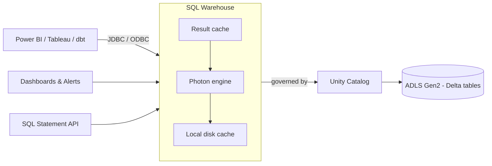

# 12. Databricks SQL & SQL Warehouses

## 1. What Databricks SQL is — and why it is not "just another cluster"

Databricks SQL (DBSQL) is the SQL-first, BI-facing side of the lakehouse: SQL editor, dashboards, alerts, query history, and JDBC/ODBC/REST endpoints for tools like Power BI, Tableau, and dbt. Queries do not run on all-purpose or job clusters; they run on a **SQL warehouse**, a compute resource tuned for SQL concurrency and low latency rather than for arbitrary Spark code (no notebooks, no custom libraries, no RDD/PySpark logic).

The mental model worth stating in an interview: **all-purpose clusters are for developing, job clusters are for batch pipelines, SQL warehouses are for serving SQL** — to analysts, dashboards, and downstream applications — with elasticity, caching, and workload management built for that access pattern.

## 2. Warehouse types

| Type | Where compute runs | Startup | Notable capabilities | Typical use |
|---|---|---|---|---|
| **Serverless** | Databricks-managed compute plane (not your subscription) | Seconds | Photon, Predictive I/O, Intelligent Workload Management, fastest scaling | Default choice for BI/ad-hoc where available |
| **Pro** | Your Azure subscription (classic compute plane) | Minutes | Photon, Predictive I/O, materialized views / streaming tables, query federation | When serverless is not available in the region or network policy blocks it |
| **Classic** | Your Azure subscription | Minutes | Photon, basic SQL engine feature set | Entry-level / cost-sensitive, light workloads |

The practical trade-off: serverless removes the idle-startup penalty and shifts infrastructure management (and its cost) to Databricks, billed as a single DBU rate; Pro/Classic keep compute inside your VNet and subscription, which can matter for strict network-isolation requirements but means slower starts and you pay Azure VM costs separately.

## 3. Sizing: scale up vs scale out

Two independent knobs, solving two different problems:

- **Cluster size (T-shirt size, 2X-Small up to 4X-Large)** — more resources *per cluster*. Scale **up** when a **single query is slow** (large scans, big joins, heavy aggregations) or the query profile shows **spill to disk**.
- **Min / max clusters** — number of identical clusters behind the warehouse. Scale **out** when **many concurrent users cause queueing**; the warehouse adds clusters as queued/concurrent queries grow and removes them when load drops.

A common mistake is raising the size to fix a concurrency problem (expensive, no help to queueing) or raising max clusters to fix a slow single query (no help; the query still runs on one cluster). Diagnose first: *is one query slow, or are many queries waiting?*

**Auto stop** (minutes of inactivity before the warehouse shuts down) is the main cost lever on Pro/Classic; serverless warehouses can use very short values because restart is fast.

## 4. Caching layers

1. **Query result cache** — if an identical query is re-run and the underlying data has not changed, the previously computed result is returned immediately. This is why a dashboard refreshed by many users is cheap after the first run.
2. **Disk (local SSD) cache** — file data read from cloud storage is cached on the warehouse's local disks, so repeated reads of hot tables skip object-store latency.
3. **Photon / Predictive I/O** — vectorized engine and I/O optimizations that reduce the work a scan has to do (data skipping, file pruning).

Implication: warm caches are lost when a warehouse stops, so aggressive auto-stop trades cost for first-query latency on Pro/Classic.

## 5. Materialized views and streaming tables in DBSQL

- **Materialized view** — a precomputed query result stored as a Delta-backed object and incrementally refreshed (`REFRESH MATERIALIZED VIEW`). Right for expensive aggregations that many dashboards share.
- **Streaming table** — a table that incrementally ingests append-only sources (Auto Loader / Kafka) declaratively with `CREATE OR REFRESH STREAMING TABLE`, giving SQL-only users an ingestion path without writing Structured Streaming code.

Both require Unity Catalog and a Pro or serverless warehouse.

```sql
CREATE OR REFRESH STREAMING TABLE prod.bronze.orders_raw
AS SELECT * FROM STREAM read_files(
  'abfss://landing@mystorage.dfs.core.windows.net/orders/',
  format => 'json'
);

CREATE MATERIALIZED VIEW prod.gold.daily_revenue AS
SELECT order_date, SUM(amount) AS revenue
FROM prod.silver.orders
GROUP BY order_date;
```

## 6. Diagnosing a slow query — Query History and Query Profile

Query History lists every statement with duration, rows read, bytes read, and the user/warehouse. The **Query Profile** shows the operator DAG with time per node. What to look for:

- **Large scan with few rows returned** → missing filter on a partition/clustering column, small-file problem, or stale statistics; fix with `OPTIMIZE`, liquid clustering/Z-ORDER, or better predicates.
- **Spill to disk** on a join/aggregate → warehouse too small for the working set; scale up.
- **Big shuffle / skewed join** → rewrite join order or filter earlier; see topic 13.
- **Queued time** high but execution time low → concurrency problem; raise max clusters.

## 7. Governance, connectivity, and operating it

- **Permissions:** `CAN USE` (run queries), `CAN MANAGE` (edit/start/stop), per warehouse — separate from data permissions in Unity Catalog.
- **Connectivity:** JDBC/ODBC drivers, Databricks SQL connectors (Python/Go/Node), and the **SQL Statement Execution API** for service-to-service calls.
- **Lakehouse Federation:** query external systems (e.g., Azure SQL, PostgreSQL) from a warehouse through foreign catalogs, governed by Unity Catalog.
- **Cost visibility:** tag warehouses, and use billing system tables to attribute DBUs per warehouse/team.



*Diagram: clients reach a SQL warehouse through standard connectors; the warehouse layers result cache, Photon, and local disk cache over Delta tables in ADLS, with Unity Catalog enforcing access.*
