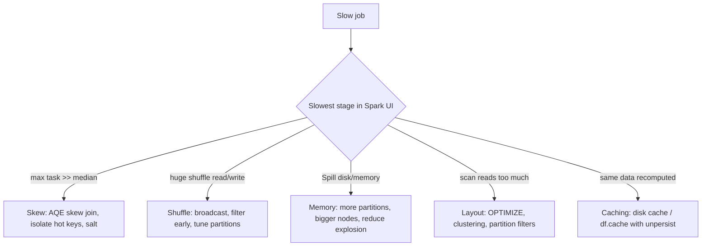

# 13. Performance Tuning — Shuffle, Skew, Caching, AQE, Spill

## 1. Start from the mental model: where does time actually go?

Spark job time is dominated by a small number of causes: **moving data (shuffle)**, **uneven work (skew)**, **too little memory (spill)**, **reading too much data (poor pruning / small files)**, and **doing work twice (missing or misused caching)**. Tuning is diagnosis first: open the Spark UI, find the slowest stage, and decide which of these it is before changing any configuration.

## 2. Shuffle

A shuffle redistributes data across the cluster (over the network and through disk) so that rows with the same key land together. It is triggered by **wide transformations**: `join`, `groupBy`/aggregations, `distinct`, `repartition`, window functions with partitioning, `orderBy`.

Why it hurts: serialization, disk writes of shuffle files, network transfer, and a **stage boundary** (every task must finish before the next stage starts).

Levers:
- **Avoid it:** filter and project columns *before* the shuffle; use **broadcast joins** for small-vs-large joins (small table sent to every executor, no shuffle of the large side). Default broadcast threshold is 10 MB (`spark.sql.autoBroadcastJoinThreshold`); explicit hint: `/*+ BROADCAST(dim) */`.
- **Right-size it:** `spark.sql.shuffle.partitions` defaults to 200. Too few → huge partitions that spill; too many → tiny tasks with scheduling overhead. A common target is roughly 100–200 MB per shuffle partition. With AQE enabled, partitions are coalesced automatically.
- **Reduce volume:** pre-aggregate before joining; select only needed columns.

## 3. Data skew

Skew means a few keys hold a disproportionate share of rows (e.g., `customer_id = NULL`, a default value, or one very large customer), so one task processes far more data than its peers. Signature in the Spark UI: **stage with 199 tasks done in seconds and 1 task running for many minutes**; max task duration and shuffle read are many times the median.

Fixes, in order of preference:
1. **AQE skew join handling** (`spark.sql.adaptive.skewJoin.enabled`, on by default in modern runtimes): splits oversized shuffle partitions of a sort-merge join into smaller sub-partitions at runtime.
2. **Filter or isolate hot keys:** handle `NULL`/sentinel keys separately instead of joining on them.
3. **Broadcast** the smaller side if it fits.
4. **Salting:** append a random suffix to the hot key on the large side and replicate the small side across suffix values, spreading one key over N tasks (also works for skewed aggregations via two-phase aggregation). Costs extra complexity and data replication, so use it when AQE cannot help.

```python
from pyspark.sql import functions as F

SALT_BUCKETS = 16
large = large.withColumn("salt", (F.rand() * SALT_BUCKETS).cast("int"))
small = small.withColumn("salt", F.explode(F.array(*[F.lit(i) for i in range(SALT_BUCKETS)])))
joined = large.join(small, ["join_key", "salt"]).drop("salt")
```

## 4. Adaptive Query Execution (AQE)

AQE re-optimizes the plan **at runtime** using actual statistics collected at shuffle boundaries (enabled by default in Spark 3.2+ and Databricks Runtime). Three main behaviors:

| Feature | What it does | Problem it solves |
|---|---|---|
| **Coalesce shuffle partitions** | Merges many small post-shuffle partitions | Over-partitioned shuffles / small tasks |
| **Dynamic join strategy switching** | Converts a sort-merge join to a broadcast join if a side turns out small after filtering | Bad static size estimates |
| **Skew join optimization** | Splits skewed partitions | Straggler tasks from hot keys |

AQE is not magic: it cannot fix skew in aggregations the same way, cannot undo a bad data layout, and relies on the shuffle having happened to learn real sizes.

## 5. Caching — two different mechanisms

| | **Disk cache (Delta/IO cache)** | **Spark cache** (`df.cache()` / `persist()`) |
|---|---|---|
| What is cached | Raw file data (Parquet/Delta) on local NVMe/SSD of workers | A DataFrame's computed partitions in executor memory/disk |
| Population | Automatic on read, on cache-enabled worker types | Lazy — only after the first action |
| Invalidation | Automatic when underlying files change | Manual — can serve stale data; call `unpersist()` |
| Memory pressure | None (uses local disk) | Competes with execution memory; can cause spill/eviction |
| Best for | Repeated reads of the same hot tables across queries/jobs | A **reused intermediate result** within one job (e.g., a DataFrame feeding several actions) |

Rule of thumb: let the disk cache handle repeated table reads; use `df.cache()` sparingly, only for expensive intermediates reused multiple times in the same application, and always `unpersist()` afterward. Caching a DataFrame that is used once is pure overhead.

## 6. Spill

When an operator (sort, shuffle, hash aggregation, join) cannot hold its working set in execution memory, Spark **spills** intermediate data to disk and reads it back. It is visible in the Spark UI stage page as **"Spill (Memory)"** and **"Spill (Disk)"** columns. Spill is not an error — it makes the job slower, sometimes drastically.

Typical causes and fixes:
- **Partitions too large** → increase shuffle partitions (or let AQE handle it), repartition before the heavy operation.
- **Skewed partition** → fix skew (section 3); spill is often a skew symptom on one task.
- **Insufficient executor memory** → use memory-optimized worker types or fewer cores per executor equivalent (more memory per task).
- **Row explosion** (`explode`, many-to-many join) → filter or deduplicate before expanding.

## 7. Reading less data

- **Data skipping & pruning:** filter on partition/clustering columns; Delta collects min/max statistics per file.
- **`OPTIMIZE`** (compaction) fixes the small-files problem; **liquid clustering** or **Z-ORDER** co-locates data by commonly filtered columns.
- **Avoid Python UDFs** where built-in functions exist (serialization overhead, opaque to Catalyst); prefer built-ins, SQL expressions, or pandas UDFs when a UDF is unavoidable.
- **Photon** accelerates scans, joins, and aggregations on supported operations.

## 8. A repeatable diagnosis workflow

1. Spark UI → **Jobs/Stages**: which stage dominates wall-clock time?
2. In that stage, compare **median vs max task duration** → large gap = skew.
3. Check **Shuffle Read/Write size** → huge shuffle = restructure joins/aggregations.
4. Check **Spill (Memory/Disk)** and **GC time** → memory pressure.
5. Check **input size vs rows needed** in the scan → poor pruning / small files.
6. Change **one thing at a time** and re-measure.



*Diagram: map the symptom visible in the Spark UI to the corresponding class of fix.*
