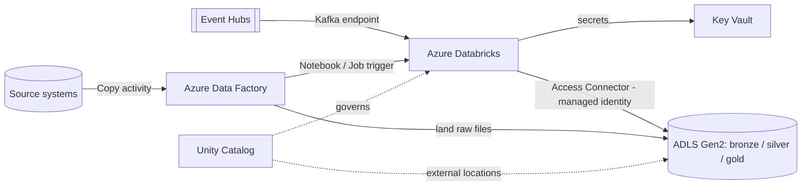

# 14. Azure Ecosystem Integration — ADF, Key Vault, ADLS Gen2, Event Hub

## 1. Why this topic matters

Azure Databricks rarely stands alone. A production platform wires it to **ADLS Gen2** (storage), **Azure Key Vault** (secrets), **Azure Data Factory** (orchestration and ingestion), and **Azure Event Hubs** (streaming). Interviewers use this topic to test whether you can design a *secure, credential-free, end-to-end* path rather than only write Spark code.

## 2. ADLS Gen2 — storage access done properly

ADLS Gen2 is Blob Storage with a **hierarchical namespace** (real directories, atomic renames, POSIX-style ACLs), which is why it is the standard lakehouse store; Delta's commit protocol and directory operations are efficient on it. Paths use the `abfss://<container>@<account>.dfs.core.windows.net/<path>` scheme.

Access patterns, from preferred to legacy:

1. **Unity Catalog External Locations + Storage Credentials** *(preferred)* — an **Access Connector for Azure Databricks** (a managed identity) is granted `Storage Blob Data Contributor` on the storage account. A **Storage Credential** wraps that identity; an **External Location** binds the credential to a path. Access is then governed by UC GRANTs (`READ FILES`, `WRITE FILES`, `CREATE EXTERNAL TABLE`) for users/groups. No secrets in code.
2. **Service principal with OAuth 2.0** configured in Spark conf (using a Key Vault-backed secret for the client secret) — works but credentials are cluster-scoped and harder to audit.
3. **Mounts (`dbutils.fs.mount`)** — legacy, workspace-wide shared access that bypasses Unity Catalog governance; avoid for new work.

```sql
CREATE EXTERNAL LOCATION IF NOT EXISTS landing
URL 'abfss://landing@mystorageacct.dfs.core.windows.net/'
WITH (STORAGE CREDENTIAL uc_access_connector_cred);

GRANT READ FILES ON EXTERNAL LOCATION landing TO `data-engineers`;
```

Design guidance: separate containers (or accounts) per zone (landing/bronze/silver/gold) or per environment, grant least privilege to the managed identity, and keep **managed tables** in the catalog's managed storage while using **external locations** for raw landing data you do not want UC to own.

## 3. Azure Key Vault and secret scopes

Secrets (API keys, JDBC passwords, SAS tokens, SP client secrets) must never be hardcoded or stored in notebooks. Databricks provides **secret scopes**:

- **Key Vault-backed scope** — the scope is a read-only view over an Azure Key Vault; secrets are managed (created/rotated) in Key Vault, and Databricks reads them at runtime. Rotation in Key Vault takes effect without changing the workspace.
- **Databricks-backed scope** — secrets stored in Databricks itself; simpler but outside your central vault governance.

```python
password = dbutils.secrets.get(scope="kv-prod", key="sqlserver-password")
# Value is redacted ([REDACTED]) if printed in notebook output.
```

Permissions are granted on the scope (`READ`, `WRITE`, `MANAGE`) to users/groups, and the workspace needs access to the vault via an access policy or Azure RBAC role (`Key Vault Secrets User`). Redaction in output is a convenience, not a security boundary — anyone with scope read access can still obtain the value programmatically, so scope-level least privilege matters.

## 4. Azure Data Factory + Databricks

ADF is the orchestrator and ingestion layer (90+ connectors, Copy activity, scheduling/triggers); Databricks is the transformation engine. Integration points:

- **Databricks Notebook / Jar / Python activities** — run code on a new job cluster, an existing cluster, or an instance pool, defined in the **Databricks linked service**.
- **Authentication options for the linked service:** Access token (store in Key Vault, not inline), **managed identity** of the data factory, or a service principal. Prefer managed identity/service principal over long-lived personal tokens.
- **Parameters in, values out:** pass parameters via `baseParameters` (read with `dbutils.widgets.get`); return a value with `dbutils.notebook.exit("...")` and read it in ADF as `@activity('RunNotebook').output.runOutput`.
- **Job cluster per run** is the cost-efficient default for scheduled ETL (spins up, runs, terminates), versus an always-on existing cluster.
- **ADF vs Databricks Workflows:** use ADF when orchestrating across many heterogeneous systems (SQL, REST, SAP, on-prem via self-hosted IR) with business-friendly monitoring; use Workflows when logic is Databricks-centric and you want native task dependencies, repair/re-run of failed tasks, and tight lakehouse integration. Many teams use ADF as the outer scheduler that triggers a Databricks job.

## 5. Azure Event Hubs for streaming

Event Hubs is a managed, partitioned event-ingestion service. Two ways to consume it from Databricks:

1. **Kafka-compatible endpoint** *(common choice)* — Event Hubs Standard tier and above exposes a Kafka protocol endpoint (`<namespace>.servicebus.windows.net:9093`). Use Spark's built-in Kafka source with `SASL_SSL` and the connection string as the password.
2. **Native Event Hubs connector** (`azure-event-hubs-spark`) — Event Hubs-specific features, requires installing the library.

```python
conn = dbutils.secrets.get("kv-prod", "eventhub-conn-string")

raw = (spark.readStream.format("kafka")
  .option("kafka.bootstrap.servers", "mynamespace.servicebus.windows.net:9093")
  .option("subscribe", "orders")
  .option("kafka.security.protocol", "SASL_SSL")
  .option("kafka.sasl.mechanism", "PLAIN")
  .option("kafka.sasl.jaas.config",
          'kafkashaded.org.apache.kafka.common.security.plain.PlainLoginModule required '
          f'username="$ConnectionString" password="{conn}";')
  .option("startingOffsets", "earliest")
  .load())
```

Key design points: **partition count bounds parallelism** (Spark tasks ≈ partitions, and partitions cannot be reduced later on most tiers), use a dedicated **consumer group** per consuming application, rely on Structured Streaming **checkpoints** for exactly-once sink semantics with Delta, and consider **Event Hubs Capture** (automatic Avro files to ADLS) plus Auto Loader when you need cheap, replayable batch-style ingestion instead of a continuously running stream.

## 6. Networking and identity (preview of topic 18)

Production deployments commonly use **VNet injection**, **Private Endpoints** for ADLS/Key Vault/Event Hubs, and Entra ID (Azure AD) groups synced to Databricks for access control. The consistent theme: **managed identities and group-based RBAC over secrets and per-user grants**.



*Diagram: ADF lands and orchestrates, Event Hubs streams in, Databricks transforms using a managed identity to reach ADLS Gen2 and secrets from Key Vault, with Unity Catalog governing access.*
