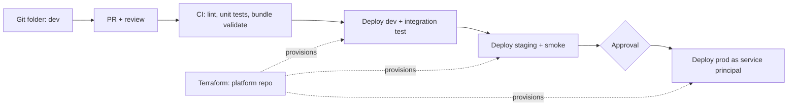

# 15. CI/CD for Databricks — Repos, Databricks Asset Bundles, Terraform

## 1. The problem CI/CD solves

Without it, notebooks and jobs are edited directly in the workspace: no review, no tests, no history of what changed, and a "works in dev" change can break production. CI/CD makes every change **versioned, reviewed, tested and reproducible**, and makes production changeable only through an automated pipeline.

## 2. The building blocks

| Building block | What it is | Role in CI/CD |
|---|---|---|
| **Git folders (Repos)** | Git-backed folders in the workspace (GitHub, Azure DevOps, GitLab, etc.) | Developer inner loop: branch, edit, commit, push, open PR from the workspace |
| **Databricks Asset Bundles (DABs)** | Declarative project definition (`databricks.yml` + resource YAML) deployed with the CLI | Define jobs, pipelines, notebooks, libraries, permissions as code and deploy to many environments |
| **Databricks CLI** | Command-line tool (`databricks bundle ...`) | Used locally and in CI to validate, deploy and run bundles |
| **Terraform provider** | `databricks/databricks` provider (with AzureRM) | Platform infrastructure: workspaces, Unity Catalog objects, cluster policies, groups, secret scopes |
| **Databricks Connect** | Run Spark code from an IDE/CI against a remote cluster or serverless compute | Test PySpark logic without copying notebooks around |

## 3. Databricks Asset Bundles in practice

A bundle is a folder with a `databricks.yml` at the root:

```yaml
bundle:
  name: orders_pipeline

include:
  - resources/*.yml

artifacts:
  orders_wheel:
    type: whl
    build: python -m build --wheel
    path: .

targets:
  dev:
    mode: development          # prefixes resource names with the user, pauses schedules
    default: true
    workspace:
      host: https://adb-1111111111111111.1.azuredatabricks.net
  staging:
    workspace:
      host: https://adb-2222222222222222.2.azuredatabricks.net
  prod:
    mode: production
    workspace:
      host: https://adb-3333333333333333.3.azuredatabricks.net
    run_as:
      service_principal_name: "<sp-application-id>"
```

```yaml
# resources/orders_job.yml
resources:
  jobs:
    orders_daily:
      name: orders-daily-${bundle.target}
      schedule:
        quartz_cron_expression: "0 0 5 * * ?"
        timezone_id: Asia/Kolkata
      tasks:
        - task_key: ingest
          python_wheel_task:
            package_name: orders_pipeline
            entry_point: ingest
          libraries:
            - whl: ./dist/*.whl
          job_cluster_key: main
      job_clusters:
        - job_cluster_key: main
          new_cluster:
            spark_version: 15.4.x-scala2.12
            node_type_id: Standard_DS3_v2
            num_workers: 2
```

Core commands:

```bash
databricks bundle validate -t dev      # check config
databricks bundle deploy   -t dev      # deploy resources + artifacts
databricks bundle run orders_daily -t dev
databricks bundle destroy  -t dev      # clean up
```

`mode: development` is built for safe experimentation (resources are prefixed with the deploying user and schedules are paused), while `mode: production` enforces stricter checks (for example requiring a deliberate `run_as` identity and workspace path).

## 4. Terraform vs Asset Bundles — who owns what

- **Terraform** is best for **shared, slow-changing platform resources** with central ownership: workspaces, VNet injection, Unity Catalog metastore/catalogs/external locations, storage credentials, cluster policies, groups and permissions, secret scopes.
- **Bundles** are best for **fast-changing, team-owned workloads**: jobs, pipelines, notebooks and the code they run.
- **Rule:** every resource has exactly one owner tool. Managing the same job from both causes drift and conflicting applies.

## 5. Environments and promotion

- **Separate workspaces and catalogs per environment** (dev/staging/prod) to isolate data and blast radius.
- **Build once, promote the same artifact:** build the wheel in CI, version it, and deploy that exact artifact to each environment; configuration (cluster size, catalog, schedule) differs per target, code does not.
- **Approval gates** (GitHub Environments / Azure DevOps) before production.

## 6. Authentication

- CI authenticates as a **service principal** using OAuth machine-to-machine credentials, or **OIDC federation** (GitHub/Azure DevOps workload identity with Entra ID) so no long-lived secret is stored.
- **Avoid personal access tokens** in pipelines: they are tied to a person, long-lived and hard to audit.
- Production jobs `run_as` a service principal so they keep working when people leave.

## 7. A reference GitHub Actions pipeline

```yaml
name: ci-cd
on:
  pull_request:
  push:
    branches: [main]

jobs:
  test:
    runs-on: ubuntu-latest
    steps:
      - uses: actions/checkout@v4
      - uses: actions/setup-python@v5
        with: { python-version: "3.11" }
      - run: pip install -e ".[dev]"
      - run: ruff check . && mypy src
      - run: pytest tests/unit --cov=src
      - uses: databricks/setup-cli@main
      - run: databricks bundle validate -t staging
        env:
          DATABRICKS_HOST: ${{ vars.STAGING_HOST }}
          DATABRICKS_CLIENT_ID: ${{ secrets.STAGING_SP_ID }}
          DATABRICKS_CLIENT_SECRET: ${{ secrets.STAGING_SP_SECRET }}

  deploy-staging:
    if: github.ref == 'refs/heads/main'
    needs: test
    runs-on: ubuntu-latest
    environment: staging
    steps:
      - uses: actions/checkout@v4
      - uses: databricks/setup-cli@main
      - run: databricks bundle deploy -t staging
        env:
          DATABRICKS_HOST: ${{ vars.STAGING_HOST }}
          DATABRICKS_CLIENT_ID: ${{ secrets.STAGING_SP_ID }}
          DATABRICKS_CLIENT_SECRET: ${{ secrets.STAGING_SP_SECRET }}

  deploy-prod:
    needs: deploy-staging
    runs-on: ubuntu-latest
    environment: production        # configured with required reviewers
    steps:
      - uses: actions/checkout@v4
      - uses: databricks/setup-cli@main
      - run: databricks bundle deploy -t prod
        env:
          DATABRICKS_HOST: ${{ vars.PROD_HOST }}
          DATABRICKS_CLIENT_ID: ${{ secrets.PROD_SP_ID }}
          DATABRICKS_CLIENT_SECRET: ${{ secrets.PROD_SP_SECRET }}
```

## 8. Testing layers

| Layer | What | Where it runs |
|---|---|---|
| Unit | Pure Python and PySpark transformations on small DataFrames | CI runner (local Spark) or Databricks Connect |
| Integration | Deploy bundle to dev, run the job on seeded data, assert on output tables | Dev workspace |
| Data quality | Expectations/assertions on outputs (nulls, duplicates, referential integrity) | Dev and staging |
| Smoke | Short end-to-end check after each deployment | Staging, then prod |

Design for testability: keep business logic in importable Python modules and use notebooks only as thin entry points.

## 9. Operational concerns

- **Rollback:** redeploy the previous tagged version of the bundle; for bad data, use Delta `RESTORE`/time travel as a separate, deliberate decision.
- **Schema changes:** expand-contract (add, migrate, remove later), never destructive DDL straight to production.
- **Drift:** limit human edit rights in production and run scheduled `bundle validate` / `terraform plan` checks.



*Diagram: Terraform provisions the platform in every environment; bundles carry workload changes through the same gated pipeline.*
