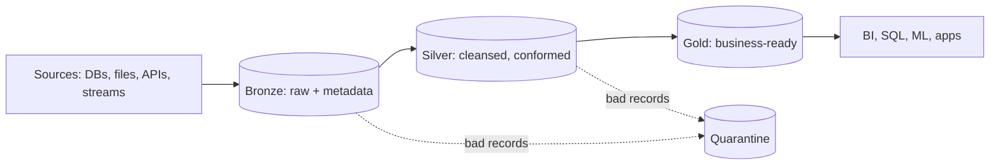

# 16. Medallion Architecture Design Patterns (Bronze / Silver / Gold)

## 1. What the medallion architecture is

A data design pattern that organizes lakehouse tables into layers of **progressively improving quality and structure**. Its value is not the colors; it is that each layer has a **defined contract**, a clear **owner**, and a predictable place in the reprocessing story.



## 2. Layer contracts

| Layer | Purpose | Typical operations | Consumers |
|---|---|---|---|
| **Bronze** | Faithful, replayable copy of source data | Append-only ingest; add `_ingest_ts`, `_source_file`, `_batch_id`; keep unknown fields | Data engineers, reprocessing jobs |
| **Silver** | Validated, deduplicated, typed, integrated entities | Schema enforcement, dedup, MERGE/upserts, SCD2, conforming keys, quality gates | Data engineers, data scientists, analysts |
| **Gold** | Business-level, query-optimized data products | Aggregations, star schemas, KPIs, feature tables | Dashboards, BI tools, applications, ML |

## 3. Bronze patterns

- **Append-only and immutable:** never update or delete (except for compliance), so Bronze can always be replayed.
- **Schema-tolerant:** store the payload even if parsing fails (rescued data column or raw string), so bad input never causes data loss.
- **Metadata columns** for lineage and debugging.

```python
(spark.readStream.format("cloudFiles")
  .option("cloudFiles.format", "json")
  .option("cloudFiles.schemaLocation", "/Volumes/prod/bronze/_schemas/orders")
  .option("cloudFiles.schemaEvolutionMode", "rescue")
  .load("abfss://landing@acct.dfs.core.windows.net/orders/")
  .selectExpr("*", "current_timestamp() AS _ingest_ts", "_metadata.file_path AS _source_file")
  .writeStream
  .option("checkpointLocation", "/Volumes/prod/bronze/_checkpoints/orders")
  .trigger(availableNow=True)
  .toTable("prod.bronze.orders"))
```

## 4. Silver patterns

- **Deduplication and upsert with MERGE:** keep the latest record per business key.

```sql
MERGE INTO prod.silver.orders AS t
USING (
  SELECT * FROM (
    SELECT *, ROW_NUMBER() OVER (PARTITION BY order_id ORDER BY updated_at DESC) AS rn
    FROM prod.bronze.orders_batch
  ) WHERE rn = 1
) AS s
ON t.order_id = s.order_id
WHEN MATCHED AND s.updated_at > t.updated_at THEN UPDATE SET *
WHEN NOT MATCHED THEN INSERT *;
```

- **CDC handling:** apply inserts/updates/deletes from a change feed; Delta Live Tables offers `APPLY CHANGES INTO` for this, including SCD type 1 and 2.
- **SCD Type 2** when history matters (`valid_from`, `valid_to`, `is_current`).
- **Quality gate with quarantine:** rows failing rules are written to a quarantine table with the failed rule and batch id so good data keeps flowing and bad data stays visible.

```python
import dlt

@dlt.table
@dlt.expect_or_drop("valid_order_id", "order_id IS NOT NULL")
@dlt.expect("positive_amount", "amount >= 0")
def orders_silver():
    return dlt.read_stream("orders_bronze").dropDuplicates(["order_id"])
```

## 5. Gold patterns

- **Dimensional models** (star schema: facts + conformed dimensions) for BI.
- **Pre-aggregated tables or materialized views** for expensive, shared metrics.
- **Domain-owned data products** with named owners, documented schemas and freshness SLAs.
- **Physical optimization:** liquid clustering or Z-ORDER on filter columns, scheduled `OPTIMIZE`.

## 6. Batch, streaming and incremental

Layers can be **streaming** (Structured Streaming between Delta tables), **triggered incremental** (`availableNow`) or **batch**; Delta supports all three over the same tables. Choose by freshness requirement and cost, not by habit: many "real-time" requirements are satisfied by 5 to 15 minute incremental runs at a fraction of the cost.

## 7. Governance and operations

- **Unity Catalog layout:** catalog per environment/domain, schema per layer; grants to groups. Typically analysts read only Gold, engineers read Silver, and only pipelines write.
- **Retention:** Bronze keeps raw history for replay (with a retention policy); manage `VACUUM` and log retention to balance time travel with storage cost.
- **Reprocessing:** a logic bug in Silver or Gold is fixed by rebuilding from Bronze.
- **Monitoring:** per-layer freshness, row counts and quality metrics.

## 8. Common anti-patterns

- **Business logic in Bronze,** which destroys replayability.
- **Too many layers** (Bronze/Silver/Silver2/Gold/Platinum) with unclear contracts and extra latency and cost.
- **Gold tables copied per team** with slightly different metric definitions; instead publish one governed definition.
- **Dropping bad records silently** instead of quarantining them.
- **No ownership:** a layer without an owner decays quickly.
- **Full reloads everywhere** when incremental processing would do.
