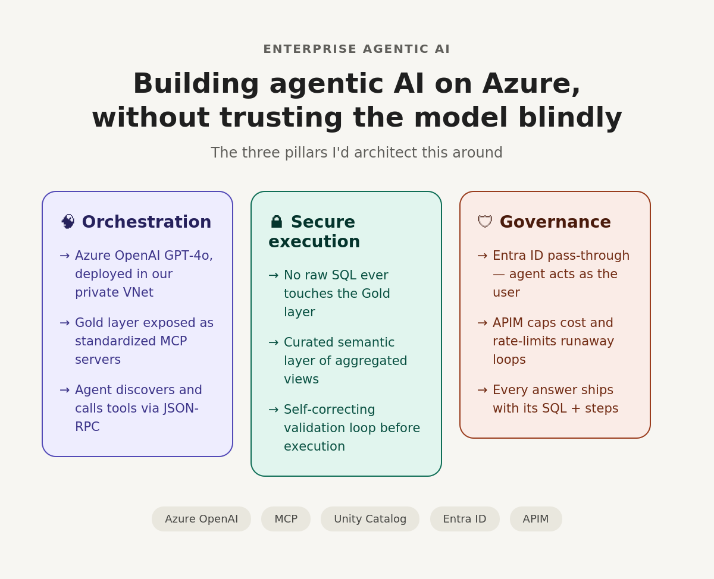
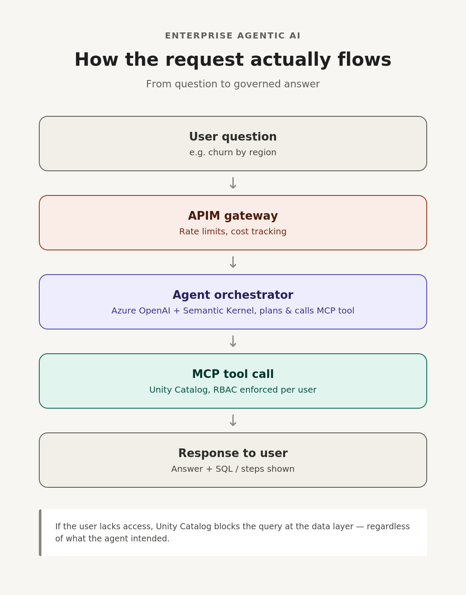

# Architecting enterprise-grade Agentic AI on Azure

To build an enterprise-grade Agentic AI system on Azure, I would architect a solution that strictly separates the LLM's reasoning engine from the data execution environment. We cannot allow an LLM to generate unchecked SQL directly against our Gold layer. Here is my three-pillar approach.

## 1. Orchestration & the Model Context Protocol (MCP)

- **The AI engine:** Azure OpenAI (e.g. GPT-4o) for the core reasoning and planning engine, deployed within our private Azure VNet so data never leaves our tenant.
- **The agent framework:** Microsoft's Semantic Kernel, or a custom agentic loop built around the Model Context Protocol (MCP). MCP is critical here — instead of writing custom integration code for every data source, we expose our Gold layer and metadata APIs as standardized MCP servers. The LLM acts as the MCP client, dynamically discovering which tools it has available (e.g. `query_sales_data`, `get_customer_churn_metric`) and calling them safely via standard JSON-RPC.

## 2. Secure data interaction (the execution layer)

- **No raw SQL on Gold:** the agent never writes raw SQL directly to our primary Databricks or Synapse tables. Instead, a semantic layer — a set of highly curated, aggregated views in our Gold layer — sits between the agent and the data.
- **Databricks Unity Catalog integration:** the tools exposed to the agent execute queries against Databricks SQL Warehouses. We provide the agent with a strict data dictionary (metadata) in its system prompt so it understands the schema perfectly, minimizing hallucinations.
- **The validation loop:** if a generated query fails syntax validation, the agent catches the error and self-corrects before showing anything to the user.

## 3. Governance, security, and guardrails

- **Identity & RBAC:** Azure Entra ID pass-through authentication. The agent executes tool calls on behalf of the user. If a marketing user asks for HR salary data, Unity Catalog blocks the query at the data layer because that user lacks the RBAC permissions — the agent is bound by the user's access, not its own.
- **Cost & rate limiting:** LLM agents can get stuck in autonomous loops, burning through tokens. Azure API Management (APIM) sits in front of the Azure OpenAI endpoints to enforce token rate limits, track cost per user, and automatically cut off runaway agent loops.
- **Explainability:** the UI never returns just a single number. The agent always returns its answer alongside the SQL query it generated or the steps it took, ensuring human-in-the-loop verification.

---

### Why this answer lands well

1. **Cutting-edge architecture (MCP):** mentioning the Model Context Protocol shows engagement with the latest AI integration standards, moving past basic RAG architectures.
2. **Solves the security problem:** Entra ID pass-through + Unity Catalog RBAC shows you think like a manager protecting enterprise data, not just a developer shipping a feature.
3. **Manages operational risk (APIM):** noting that agents can get stuck in loops and burn cost — and solving it with API Management — shows mature operational foresight.
