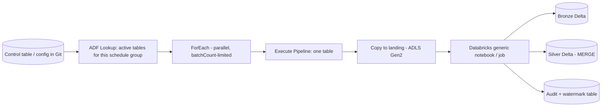

# Metadata-driven ingestion framework on ADF + Databricks

I would build one generic, parameterized pipeline driven by a **control table**, so that adding a source table means inserting a row and opening a pull request on a config file, not writing a new pipeline. The framework has four parts: metadata, orchestration, execution, and audit.

## 1. Metadata layer

A control table (Delta or Azure SQL) with one row per source object:

| Column | Purpose |
|---|---|
| `source_system`, `source_object`, `connection_ref` | What to read and which Key Vault-backed linked service to use |
| `load_type` | `full`, `incremental_watermark`, `cdc` |
| `watermark_column`, `last_watermark` | Incremental boundary |
| `primary_keys`, `scd_type` | Merge keys and history handling |
| `target_catalog.schema.table` | Unity Catalog destination |
| `dq_rules_ref` | Link to data quality rules |
| `schedule_group`, `is_active`, `priority` | Which run picks it up |

The source of truth for the config lives in **Git** (YAML/JSON), validated by CI (schema check, duplicate target check, key column exists) and synced into the control table by the release pipeline. That gives review, history and rollback for every onboarding.

## 2. Orchestration (ADF)

- A parent pipeline does a **Lookup** of active tables for the schedule group, then a **ForEach** over them with a bounded `batchCount` (maximum 50) to control parallelism against source systems.
- ADF does not allow a ForEach nested directly inside a ForEach, and Lookup returns at most 5,000 rows / 4 MB, so each iteration calls a child pipeline via **Execute Pipeline**, and large config sets are split by `schedule_group`.
- Connections are parameterized linked services whose secrets come from **Azure Key Vault**; nothing is hardcoded.

## 3. Execution

- **Copy activity** lands raw data into ADLS Gen2 (Parquet) for databases and REST sources, or a Databricks job reads the source directly where that is cheaper.
- A **single generic Databricks notebook/job** reads the config row, ingests to Bronze (Auto Loader or `COPY INTO` for files), and applies Silver logic: dedup on primary keys, **MERGE** for upserts, SCD2 where `scd_type = 2`.
- **Idempotency:** every load is keyed by a batch/run id and written with MERGE or partition overwrite, so a retry cannot duplicate rows.
- **Watermark safety:** the watermark is advanced only after the target write commits, in the same run, so a failure never skips data.
- **Schema drift:** policy is configured per table: `evolve` (add columns), `quarantine` (rescue unknown columns), or `fail`.

## 4. Audit and operability

- An **audit table** records run id, table, rows read/written, start/end, status and error; it feeds a monitoring dashboard and alerts.
- **Failure isolation:** one table failing must not stop the others; the ForEach continues, and failures are retried by a re-run of only failed tables.
- **Backfill** is a parameter (`override_watermark`) on the same pipeline, not a separate code path.

## Trade-offs and scalability

- Generic code is harder to special-case. I keep an **escape hatch**: a table can point to a custom notebook, but it must still emit the same audit contract.
- A very large table (billions of rows) should get its own partitioned/parallel-read configuration instead of sharing the default.
- At 300+ tables, the bottleneck is usually the source system's connection limits, not Databricks, so parallelism is a per-source setting.
- Maintainability: the framework is a versioned Python package with unit tests; ADF only orchestrates.

### Why this answer lands well

1. Shows you think in **platforms and leverage**: one framework serving hundreds of tables.
2. Names real ADF constraints (ForEach nesting, Lookup limits), which signals hands-on experience.
3. Covers idempotency, watermark safety and auditability, the things that fail in production.
