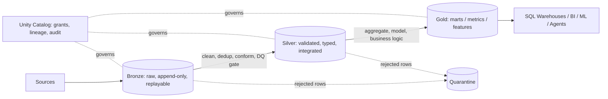

# Medallion lakehouse with Unity Catalog on Azure

The medallion pattern is a way to **raise data quality and trust progressively**, with a clear owner and contract at every boundary. I would design it around three questions: what lives where, who owns it, and what must be true before data moves forward.

## 1. Layer responsibilities

| Layer | Contents | Rules |
|---|---|---|
| **Bronze** | Raw data exactly as received plus ingestion metadata (`_ingest_ts`, `_source_file`, `_batch_id`) | Append-only, no business logic, schema-tolerant (keep unknown fields), fully replayable |
| **Silver** | Cleansed, deduplicated, typed, conformed entities (customer, order, product) | DQ gate, MERGE for upserts, SCD2 where history matters, one definition per entity |
| **Gold** | Business-ready marts, KPIs, feature tables | Aggregations and metric logic, optimized for query patterns, owned by domain teams |

I resist adding layers for their own sake: each extra hop costs storage, latency and ownership overhead, so a layer must earn its place with a distinct contract.

## 2. Unity Catalog layout

- **Catalog per environment and domain boundary**, e.g. `prod_finance`, `prod_marketing`, `prod_supplychain`, plus `prod_shared` for conformed reference data (calendar, currency, product dimension). Dev/test mirror this with separate catalogs and storage.
- **Schema per layer** inside the catalog: `bronze`, `silver`, `gold` (plus `quarantine`). Naming is `catalog.schema.table`.
- **Managed storage per catalog** on separate ADLS Gen2 containers/accounts, reached through an **Access Connector (managed identity)**, **Storage Credentials** and **External Locations**; no account keys or mounts.
- **Grants to Entra ID groups, never individuals.** Engineers get write on Bronze/Silver, analysts get `SELECT` on Gold, sensitive columns get **column masks** and regional restrictions get **row filters**.

## 3. Quality gates between layers

- **Bronze → Silver:** schema/type validation, null and key checks, deduplication, referential checks. Failing rows go to a `quarantine` table with the failed rule and batch id instead of silently disappearing or blocking the pipeline; severity decides whether a rule *warns*, *drops* or *fails* the run.
- **Silver → Gold:** reconciliation checks (row counts, sums versus source), freshness checks, and metric definitions reviewed as code.
- Rules are declarative (Delta Live Tables expectations or a rules table) so the same definitions are tested and monitored.

## 4. Data contracts and ownership

Each Gold table has a named owner, a documented schema, an SLA (freshness and availability) and a deprecation policy. Producers of Silver entities agree to a contract; breaking changes go through versioning (`orders_v2`) rather than in-place edits. **Unity Catalog lineage** shows downstream impact before a change is made.

## 5. Operational concerns

- **Performance:** liquid clustering or Z-ORDER on common filters, scheduled `OPTIMIZE`/`VACUUM`, Photon on heavy transformations.
- **Cost:** job clusters for pipelines, SQL warehouses sized per workload, lifecycle rules on Bronze for old raw data.
- **Reprocessing:** because Bronze is immutable and replayable, Silver and Gold can be rebuilt after a logic fix; Delta time travel supports audit and rollback.

## Trade-offs

- Domain catalogs give autonomy and clean permissions but risk duplicated entities; the shared catalog and contracts counter that.
- Strict gates slow time-to-data; quarantine-and-continue keeps pipelines flowing while protecting Gold.

### Why this answer lands well

1. Treats medallion as **contracts and ownership**, not folder names.
2. Shows concrete Unity Catalog structure (catalog/schema/location/grants) tied to Entra groups.
3. Handles bad data pragmatically (quarantine) instead of "fail everything".
