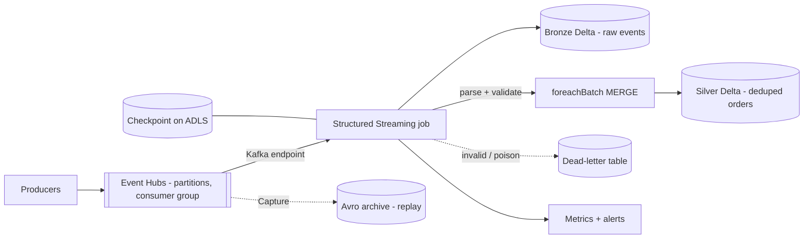

# Streaming from Event Hubs to Delta with correctness guarantees

I would treat correctness as a property of the **whole path**: a replayable source, durable checkpoints, and idempotent writes. Speed comes second; a fast pipeline that double-counts orders is a bug.

## 1. Ingestion and capacity

- Read through the **Kafka-compatible endpoint** (Standard tier or above) with credentials from a Key Vault-backed secret scope.
- **Event Hub partition count caps parallelism**, so I size partitions for peak throughput up front. At 50k events/s of ~1 KB (~50 MB/s) I would provision enough throughput units/processing units and partitions with headroom, then confirm Spark can keep up with a matching number of cores.
- A **dedicated consumer group** per application, and `maxOffsetsPerTrigger` to bound batch size and smooth load after a restart.

## 2. Exactly-once, honestly

End-to-end exactly-once needs three things:
1. **Replayable source:** Event Hubs retains events, so offsets can be re-read.
2. **Checkpointing:** offsets and state are stored on durable ADLS storage, so a restart resumes from the last committed batch.
3. **Idempotent sink:** the Delta sink commits each micro-batch atomically; for upserts into Silver I use `foreachBatch` with a **MERGE on the business key (`order_id`)**, so reprocessing a batch after a failure cannot create duplicates.

Without the third piece, the guarantee is at-least-once.

## 3. Late and duplicate events

- **Watermark** (`withWatermark("event_time", "15 minutes")`) bounds how long state is kept and defines how late is too late for windowed aggregations.
- **Deduplication:** producers can retry, so Silver dedupes on `order_id` (plus event version/timestamp). Streaming dedup with a watermark keeps the state bounded; MERGE handles late updates to existing keys.
- Events later than the watermark are not dropped silently: they are routed to a **late-arrivals table** for reconciliation.

## 4. Schema changes and bad data

- Bronze stores the **raw payload** (as string/binary) plus metadata, so parsing bugs never lose data.
- Silver parses with an explicit schema; unknown or malformed fields are captured (rescued data column), and unparseable records go to a **dead-letter table** with the error reason, source offset and timestamp.
- Additive schema changes follow a controlled path (updated schema in code, reviewed via CI); breaking changes use versioned topics or event types.

## 5. Failure handling and operations

- **Restart policy:** run as a Databricks job with automatic retry; the checkpoint makes restarts safe.
- **Backpressure:** watch input rate vs. processing rate and batch duration with a `StreamingQueryListener` or the streaming metrics; alert when lag grows or batch duration exceeds the trigger interval.
- **Small files:** frequent micro-batches create small Delta files; use optimized writes/auto-compaction and scheduled `OPTIMIZE`.
- **Replay and backfill:** Event Hubs Capture archives to ADLS as Avro, so older history can be reprocessed with Auto Loader instead of re-reading the stream.
- **Cost:** a 24x7 stream needs always-on compute; if minute-level latency is acceptable I would use a triggered (available-now) schedule instead.

## Trade-offs

- Lower latency means more small files and more cost; I choose the trigger interval from the business SLA, not from what is technically possible.
- Longer watermarks catch more late data but hold more state in memory.

### Why this answer lands well

1. States exactly what makes exactly-once true, rather than just claiming it.
2. Covers the unglamorous parts: dead-letter handling, small files, lag alerting.
3. Frames latency as a **cost/SLA decision**, which is what a manager is expected to do.
