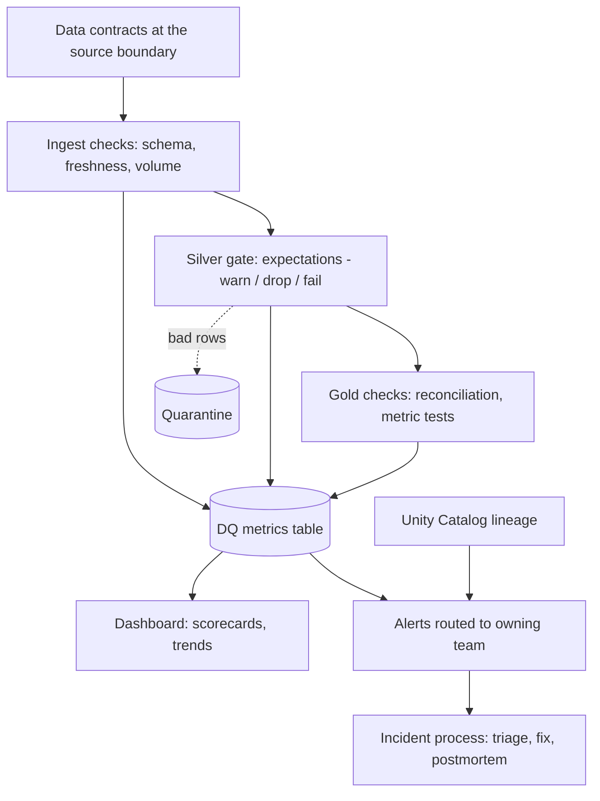

# Data quality and observability framework

Trust is lost fast and rebuilt slowly, so I would handle this as both a **technical system** and an **operating model**. The technical part detects problems before consumers do; the operating model makes sure someone owns each problem.

## 1. Define quality in terms users care about

I would agree on a small set of dimensions with business owners: **freshness, completeness, validity, uniqueness, consistency, accuracy**. Each critical dataset gets an **SLO** (for example "Gold sales mart is refreshed by 7:00 AM, 99% of days") instead of a vague promise to be accurate.

## 2. Checks at every boundary (defense in depth)

| Stage | Checks | Failure behavior |
|---|---|---|
| Source / contract | Schema, types, required fields, allowed values | Reject or quarantine; notify producer |
| Ingest (Bronze) | Freshness, row-count vs expected, duplicate batch detection | Alert; block downstream if the batch is incomplete |
| Silver | Not-null keys, uniqueness, referential integrity, range/format rules | Severity-based: **warn** (log), **drop** (quarantine), **fail** (stop the run) |
| Gold | Reconciliation to source totals, metric sanity (week-over-week bounds), freshness | Block publish; keep the last good version visible |

Implementation options: **Delta Live Tables expectations** for declarative in-pipeline rules, or a rules-table-driven framework (Great Expectations/Soda-style) for non-DLT jobs. Whichever is chosen, rules live in version control and run in CI against sample data.

## 3. Observability beyond rules

- **Metrics table:** every run writes check name, dataset, result, failing row count, run id and timestamp, which powers trends and scorecards.
- **Anomaly detection** for the things nobody wrote a rule for: sudden volume drops, null-rate spikes, distribution shifts, late arrivals.
- **Lineage (Unity Catalog)** turns an alert into an impact list: which Gold tables and dashboards are affected, and who owns them.
- **Audit logs and query history** show who changed what, which shortens root-cause analysis.

## 4. Fail safe for consumers

Wrong data that is *visible* is worse than data that is *late and labeled*. Gold publishing is gated: if checks fail, consumers keep the **last known good snapshot** and the dashboard shows a data-delay banner. That single decision prevents most embarrassing incidents.

## 5. Operating model

- **Ownership:** every dataset has a named owner and an on-call rotation; alerts route to the owner, not a shared channel.
- **Data contracts** with producing teams: schema, semantics, SLAs and a change process, so upstream changes are announced instead of discovered.
- **Incident process:** severity levels, a short postmortem (blameless) with a prevention action, and a tracked backlog of recurring failures.
- **Adoption:** start with the 10 to 20 datasets behind executive dashboards, show the scorecard improving, then expand. Mandating coverage everywhere on day one makes teams game the rules.

## Trade-offs

- More checks mean more runtime and more alert noise; I tier rules by criticality and review alert precision monthly.
- Blocking publishes protects trust but can delay reports; the SLO and severity levels make that trade-off explicit.

### Why this answer lands well

1. Connects quality to **business trust and SLOs**, not just tooling.
2. Shows layered controls plus a **fail-safe** for consumers.
3. Includes the people side: ownership, contracts, incident process, phased adoption.
