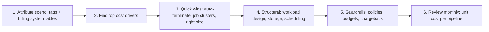

# Reducing Databricks cost by 30% without breaking SLAs

I would not start by cutting clusters. I would start by **making spend visible and attributable**, then remove waste in order of size, and put guardrails in place so the savings stay.

## 1. Measure first

- Enforce **tags** (team, project, environment, cost center) through **cluster policies** so every DBU and VM is attributable.
- Query the **billing system tables** (usage by SKU, cluster, job, warehouse, tag) to build a cost dashboard. The goal is a ranked list: usually a small number of jobs, warehouses and idle interactive clusters make up most of the bill (the Pareto effect).
- Define a **unit cost** (cost per pipeline run, per TB processed, per dashboard refresh), because total spend rises legitimately when the business grows; unit cost tells you whether you are getting less efficient.

## 2. Quick wins (typically the largest and safest)

| Lever | What I change | Risk |
|---|---|---|
| Idle compute | Auto-termination on all-purpose clusters (e.g. 20 to 30 minutes), shut down unused clusters and warehouses | Low |
| Wrong compute type | Move scheduled work from **all-purpose** to **job clusters**, which are billed at a lower DBU rate and terminate after the run | Low |
| Over-provisioning | Right-size from Spark UI metrics (CPU/memory utilization, spill); enable autoscaling with sensible min/max | Medium: validate against SLA |
| Spot capacity | Use spot VMs for fault-tolerant workers with **on-demand driver** and fallback to on-demand | Medium: interruptions can lengthen runs |
| SQL warehouses | Separate by workload, right-size, short auto-stop, cap max clusters; consider serverless to cut idle cost | Low to medium |
| Duplicate work | Consolidate overlapping jobs and dashboards recomputing the same aggregation (materialized views / shared Gold tables) | Low |

## 3. Structural improvements

- **Efficient code:** fix skew, spills and unnecessary shuffles; replace Python UDFs with built-ins; broadcast small dimensions; filter early. A 3x faster job is a 3x cheaper job.
- **Storage layout:** `OPTIMIZE` and clustering reduce scan cost; `VACUUM` removes obsolete files; lifecycle policies move cold raw data to cheaper storage tiers.
- **Incremental over full:** replace full reloads with incremental processing or change data feed where sources allow.
- **Scheduling:** run batch jobs together to share pooled clusters, avoid hourly runs when consumers only need daily data, and use triggered streaming instead of 24x7 streams if minutes of latency are acceptable.
- **Photon and runtime:** Photon costs a higher DBU rate but often finishes SQL-heavy jobs faster; I measure total cost per job with and without it rather than assuming.
- **Commitments:** once usage is stable, consider pre-purchased Databricks commit plans and Azure reservations for the steady baseline.

## 4. Guardrails so costs do not creep back

- **Cluster policies:** allowed node types, max workers, mandatory auto-termination, mandatory tags.
- **Budgets and alerts** per team/workspace, with anomaly alerts for sudden spikes.
- **Chargeback or showback:** teams see their own cost, which changes behavior more than any central mandate.
- **Review cadence:** a monthly FinOps review of top jobs by cost and unit-cost trends.

## 5. Protecting SLAs

Every change is rolled out on one workload first, with before/after measurements of runtime, cost and failure rate. I do not cut resources on SLA-critical pipelines without evidence, and I keep a rollback path.

## Trade-offs

- Spot and aggressive autoscaling save money but add variability; reserve on-demand capacity for the most time-critical pipelines.
- Central policies reduce waste but can slow teams down; I give approved "power" policies with a documented justification path.

### Why this answer lands well

1. **Measure before cutting**: shows discipline and avoids breaking SLAs.
2. Names concrete levers with their risks, not generic advice.
3. Includes governance and chargeback, so the savings are sustainable.
