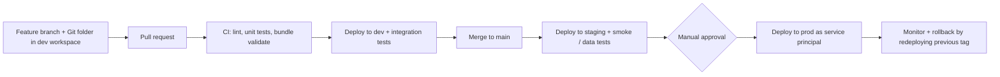

# CI/CD for Azure Databricks

The principle is simple: **production is changed only by an automated pipeline running as a service principal, never by a person editing in the UI.** Everything that defines the platform or a workload lives in Git, is reviewed, tested, and deployed the same way in every environment.



## 1. Split the problem in two: platform vs workloads

| Concern | Tool | Examples |
|---|---|---|
| **Platform / infrastructure** | **Terraform** (Databricks + AzureRM providers) | Workspaces, VNet, Unity Catalog metastore, catalogs, external locations, storage credentials, cluster policies, groups, secret scopes |
| **Workloads / application** | **Databricks Asset Bundles (DABs)** | Jobs/Workflows, notebooks and Python packages, DLT pipelines, SQL warehouses, permissions per environment |

Platform changes are rare, high-blast-radius and owned by the platform team (separate repo, plan/apply with approvals). Workload changes are frequent and owned by delivery teams (bundle in each project repo).

## 2. Repository and environments

- **Trunk-based development** with short-lived feature branches and mandatory PR review (CODEOWNERS for platform-critical paths).
- Developers work in a **Git folder (Repos)** in a personal or dev workspace; the bundle's `development` target deploys prefixed copies of jobs so engineers do not collide.
- **Separate workspaces and Unity Catalog catalogs per environment** (`dev`, `staging`, `prod`), so a bug in dev cannot touch production data.
- One `databricks.yml` defines resources once and overrides per **target** (cluster size, schedule, catalog, permissions, `run_as`).

```yaml
bundle:
  name: orders_pipeline

targets:
  dev:
    mode: development
    workspace: { host: https://adb-dev.azuredatabricks.net }
  prod:
    mode: production
    workspace: { host: https://adb-prod.azuredatabricks.net }
    run_as: { service_principal_name: sp-orders-prod }
```

## 3. The pipeline (GitHub Actions or Azure DevOps)

1. **On pull request:** lint and type-check (ruff, mypy), **unit tests** with pytest (pure-Python logic and PySpark transformations on a local Spark session or Databricks Connect), `databricks bundle validate`.
2. **Deploy to dev and run integration tests:** `databricks bundle deploy -t dev` then `bundle run` against a small, representative dataset; assert on output tables (row counts, schema, key uniqueness).
3. **On merge to main:** build the Python wheel **once**, version it, and deploy that same artifact to **staging**; run smoke and data-quality tests.
4. **Production:** deploy behind a **manual approval** (GitHub Environments / Azure DevOps approvals) using the same artifact, as a service principal.
5. **Post-deploy:** health checks and alerts on the first scheduled runs.

Key rule: **build once, promote the same artifact**. Rebuilding per environment means production runs code that was never tested.

## 4. Testing strategy

- **Unit tests:** transformation functions with small DataFrames; fast, run on every commit.
- **Integration tests:** end-to-end job in the dev workspace on seeded test data.
- **Data quality tests:** expectations or assertions on outputs (nulls, duplicates, referential integrity).
- **Contract/schema tests:** fail CI if a change breaks a downstream table's schema.
- Notebooks hold orchestration only; business logic lives in tested Python modules, which is what makes unit testing possible.

## 5. Identity and secrets

- CI authenticates with a **service principal** using OAuth (or GitHub OIDC federated credentials with Entra ID), **not personal access tokens**.
- Separate service principals per environment with least privilege; production jobs `run_as` a service principal so they do not depend on any individual's account.
- Secrets come from **Azure Key Vault-backed secret scopes** and GitHub encrypted secrets; nothing in the repo.

## 6. Data changes, rollback and drift

- **Schema changes** follow **expand-contract**: add columns/tables first, migrate consumers, remove old structures later. Destructive DDL is never auto-applied to production without review.
- **Rollback of code** is redeploying the previous tagged version; Delta **time travel/RESTORE** helps with bad data writes, but data rollback is a deliberate, separate decision.
- **Drift control:** restrict edit permissions in prod so the UI is read-only for humans; scheduled `bundle validate`/Terraform plan jobs detect out-of-band changes.

## Trade-offs

- Strict promotion adds time to each change; trunk-based development with fast CI keeps that cost small.
- Full integration tests on every PR cost compute; I run a small dataset on PRs and the larger regression suite nightly or before release.
- DABs versus Terraform for jobs: DABs fit the developer workflow and per-project ownership; Terraform keeps shared platform resources centrally governed. Mixing both for the same resource causes conflicts, so each resource has exactly one owner.

### Why this answer lands well

1. Separates **platform** (Terraform) from **workload** (bundles), showing real operating experience.
2. "Build once, promote the artifact" and "prod changed only by a service principal" are the principles interviewers look for.
3. Covers the hard parts people skip: schema migrations, rollback and drift.
